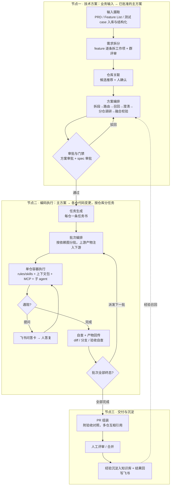

# 【方案】Coding Agent 实现方案

| 字段 | 内容 |
|------|------|
| 版本 | V1.2 |
| 日期 | 2026-07-21 |
| 状态 | 提案（待评审，未启动） |
| 技术基座 | Claude Code（claude-agent-sdk，无头模式运行于容器） |

一句话：搭一条「需求 → 技术方案 → AI 编码 → 可核查的 PR」的自动化流水线。输入是 PRD、Feature List 和测试 case；编码由容器里的 Claude Code agent 完成，它开工前拿到一个组织好的上下文包，运行中通过 MCP 按需查代码、查历史、查项目状态；产出的每个 PR 附一份验收对照表，人按清单评审。整个方案的重心不在"让 AI 写代码"——这一步模型已经能做——而在把上下文和规矩组织好，让它写对。

---

## 背景

### 现状问题

需求到代码的链路今天靠人串：PRD 评审、技术方案、排期、编码、提测、代码评审，每一环都是人对人的信息传递。AI 编码工具（IDE 里的补全和对话）已经普及，但它只加速了"手写代码"这一小段，且有两个明显的天花板：

1. **AI 拿不到该拿的上下文。** PRD 里的业务规则、feature list 里的验收项、历史方案里的决策，都躺在文档里，没有系统性地供给 AI。结果是 AI 写出的代码"能跑但不对"，返工消耗掉了它省下的时间。
2. **产出不可核查。** AI 生成的改动越多，评审越难。评审者只能通读 diff，看不出"这个改动对应哪条需求、验收项过了几条"，把关成本随 AI 产量线性上涨。

这两个问题不解决，AI 编码的收益会停在"个人提效工具"的水平，进不了交付流程。

### 为什么现在做

三个条件最近才同时成熟：

- **Claude Code 提供了可工程化的 agent 基座。** 它不只是个 CLI：rules（常驻规范）、skills（按需加载的过程知识）、subagents（隔离上下文的子任务）、hooks（硬约束）、MCP（外部数据接入）是一套完整的扩展机制，且支持无头模式跑在容器里。基于它搭流水线，这些机制全部免费拿到；自研 agent 循环则要把这一切重造一遍。
- **MCP 成了上下文供给的事实标准。** 我们只要把内部系统（代码检索、需求库、项目状态）包成 MCP 工具，agent 就能在运行中按需取用，IDE 里的人和容器里的 agent 用同一套。
- **业界的工程化实践已经蹚出路来。** 我们调研了三个有代表性的开源体系和 Claude Code 官方指引，核心结论可以直接借鉴：

| 来源 | 核心思路 | 我们打算怎么用 |
|------|----------|----------------|
| GSD（get-shit-done） | 把任务拆成计划文件，每个计划用全新上下文的 executor 执行，按依赖分批（wave）并行；用 STATE 文件做跨会话记忆；执行后有独立 verifier 核对目标 | 多仓任务按依赖分批执行；项目级 State/Memory 文件；"执行完要核对"落成我们的验收对照 |
| OpenSpec | spec 与代码分离维护，先提案（delta：新增/修改/删除）、人审批、再实现、最后归档合并——"先对齐再动手" | 对采用 spec 管理的仓库设审批门禁：spec 未批准不允许编码 |
| oh-my-opencode | 主 agent 保持轻上下文，把找文件、查文档这类脏活扔给后台并行的专职子 agent，只收结论 | 容器内定义只读的 explore 子 agent；跨仓深查交给独立的云端调研容器 |
| Claude Code 官方 | 常驻事实放 rules（越少越好），过程知识放 skills（用时才加载），隔离任务放 subagents，外部数据走 MCP | 我们的上下文编排完全按这个分工落位，不发明新机制 |

### 核心判断

编码 agent 的效果约等于：模型能力 × 上下文质量 × 规范约束。模型是买来的，各家都能买到，拉不开差距；差距在后两项，而后两项恰恰是我们自己的东西——需求文档、代码资产、项目历史、工程规范。所以本方案的主要篇幅不在模型，在回答两个问题：**上下文怎么组织、规矩怎么立**。

---

## 目的

1. 三件输入（PRD / Feature List / 测试 case）标准化后直达编码 agent：任务描述里带着业务规则和验收标准开工，而不是只有一句需求标题。
2. agent 运行中能按需拉取更多上下文：代码语义检索、跨仓库 grep、从代码位置反查历史需求、项目 State 与团队记忆、相似历史任务的经验。
3. 工程规范以 rules 形态进入 agent 运行环境，与 IDE 里给人的规范同源——人和 AI 遵守同一套规矩。
4. 每个 PR 附验收对照表：验收项逐条标注状态，评审从"通读 diff"变成"按清单抽查"，把关成本不随 AI 产量上涨。
5. 沉淀一份可执行的 SOP：每一步谁做、人在哪里介入、卡住了怎么办，新项目照着跑。

明确不在一期目的内：编码中全自动重规划（遇阻先问人）、替代人工评审（AI 自评只是核对起点）、测试 case 自动执行判分（一期只做对照，执行留二期评估）。

---

## 前置

### 技术前置

| 项 | 说明 |
|----|------|
| 模型供应商 | Anthropic 兼容端点即可，支持接入国产模型（Claude Code 允许覆盖 base_url 与模型映射），不锁死单一供应商 |
| 容器运行环境 | Docker 或 k8s，编码任务一次一容器，跑完即销毁 |
| 代码仓库索引 | 目标仓库需要先建代码索引（向量化 + 结构分析），这是检索类工具的地基 |
| MCP 服务端 | 自建，把代码检索、需求库、项目状态包成一组只读工具，统一鉴权 |
| 凭证 | 飞书开放平台（读需求、发审批卡片）、Git 平台（克隆、建 PR）、模型 API key，全部服务端加密保管，不进配置文件 |

### 数据与输入前置

| 输入 | 提供方 | 格式约定 |
|------|--------|----------|
| PRD | 产品 | 飞书文档，无需改变现有写法，系统负责摄取与结构化 |
| Feature List | 产品/项目经理 | 模块 → 功能点 → 验收项的层级结构（详见"输入契约"），可由 PRD 半自动生成后人工确认 |
| 测试 case | 测试 | 格式宽松（文档/表格/粘贴均可），系统做结构化抽取，抽不动就原文附带，不卡流程 |

### 组织前置

- 定四类责任人：技术方案评审人、spec 审批人（采用 spec 流程的仓库）、agent 提问的接单人（遇阻时答疑）、PR 评审人。
- 选一个试点项目（建议 1 个项目、1–2 个仓库、输入三件套齐全的中等规模需求），MVP 在试点上验证后再推开。

---

## 流程与实现

### 设计原则

先讲思路，再讲流程。六条原则贯穿整个设计，也是我们与"把需求直接丢给 AI"做法的本质区别：

1. **上下文分层：静态注入少而准，其余按需拉取。** 把所有资料塞进 prompt 是最直觉的做法，也是错的——任务本身会被稀释，成本还高。我们只在开工时注入一个有 token 预算的分层上下文包，更多的信息让 agent 运行中自己通过 MCP 查。
2. **规矩先于生成。** 技术方案先审后码；采用 spec 流程的仓库，spec 未批准不允许编码；工程规范以 rules 进容器。质量问题在生成之前拦，比生成之后修便宜。
3. **人只在关键点出现。** 全流程设固定介入点：回答澄清、审批方案、答疑解困、评审 PR。除此之外全自动。反过来说，我们不做编码中的全自动重规划——agent 遇阻就停下来问人，这比让它自作主张便宜且可控，等积累了足够的问答数据再评估自动化。介入不限于这四个固定点：澄清与打回在每个节点内部都可用，统一机制见「贯穿机制：澄清与打回」。
4. **一切产出可核查。** 每个 PR 带验收对照；每次模型调用、每次检索、每个容器运行全程留痕，成本和质量都能归因到具体需求。
5. **经验回流。** 每次执行完的结论（什么方案、踩了什么坑、怎么解的）自动沉淀进知识库，下次同类任务开工前召回。用得越多越聪明，这是自建相对于买现成工具的长期壁垒。
6. **以仓库为最小执行单元。** 方案是全局的，执行是仓库的：每个仓库一条任务、一个分支、一个独立容器。这个决定的完整论证见「为什么以仓库为最小执行单元」一节。

### 输入契约

**PRD。** 不要求产品改变写法。系统摄取全文入知识库（支持语义检索），并在方案审批通过后自动生成一份"面向编码的摘要"——目标模块的业务规则、边界条件、术语表——随任务下发。摘要而非全文，是因为编码 agent 需要的是规则，不是四十页原文。

**Feature List。** 约定层级结构，可由 PRD 半自动抽取后人工确认：

```json
{
  "modules": [{
    "name": "模块名",
    "features": [{
      "name": "功能点名",
      "description": "功能点描述",
      "acceptance": ["验收项 1", "验收项 2"]
    }]
  }]
}
```

`acceptance` 是整个方案的关键字段：它既是编码 agent 的目标清单，也是最后 PR 验收对照的依据。派发任务时验收项原文直达 agent，不做转写。

**测试 case。** 格式宽松（文档 / 表格 / 粘贴文本），系统做结构化抽取，目标形态：

```json
{
  "feature_ref": "模块2/功能点D",
  "cases": [{
    "title": "无标签时隐藏标签区域",
    "preconditions": "未配置标签的条目",
    "steps": ["进入主页", "查看该条目卡片"],
    "expected": "标签区域隐藏，其余正常",
    "data": "条目 ID xxx"
  }]
}
```

抽取失败就整段降级为纯文本附带并打上标记，绝不因为格式问题卡住流程。

### 整体流程（SOP）与 MVP 落地

全流程收敛为三个节点：技术方案节点、编码执行节点、交付与沉淀节点。节点是流程的调度与验收单位——每个节点有明确的输入、输出和人的介入点，节点之间只通过结构化产物衔接（主方案、任务书、PR），不靠口口相传。MVP 的范围也按节点切，见本节末尾。



三个节点的边界：节点一吃业务输入，吐一份「已批准的主方案」；节点二吃主方案，吐各仓的代码变更；节点三把变更变成可核查的 PR，并把经验沉淀回知识库。虚线是飞轮——沉淀的经验在下一次方案生成和编码时被召回。

#### 贯穿机制：澄清与打回（每个节点都支持）

上面的流程图只画主干。实际运行中，每个节点内部的任何一步都可能遇到"信息不够"或"结果不对"，对应两个贯穿全流程的动作：

- **澄清**：当前步骤暂停，向明确的责任人发结构化问题（多题多选卡），答复后原地恢复，只重算受澄清影响的部分。它解决"信息不够"，流程位置不动。
- **打回**：带着意见退回到某个上游子模块重做。它解决"结果不对"，流程位置回退，但不是全部重来——未受影响的产物保留（方案审批打回只重跑融合，各仓调研结论还在；PR 驳回只重跑该仓任务，其他仓不动）。

各节点的支持点（举例，不穷尽）：

| 位置 | 澄清 | 打回 |
|------|------|------|
| 节点一 · 需求拆分 | 拆分歧义问产品 | 群评审否决 → 重拆 |
| 节点一 · 仓库关联 | 候选分数接近时问人 | 确认时修正选仓 → 重新关联 |
| 节点一 · 方案编排 | 信息不足发多题澄清卡 | 融合校验不过自动打回调研；审批驳回带意见回编排 |
| 节点二 · 编码执行 | 遇阻问答（需求歧义 / 环境异常） | 自查发现与方案冲突 → 上报，人决定回节点一改方案或就地修正任务书 |
| 节点三 · 评审 | 评审人对验收对照提问 | PR 驳回 → 带意见重跑该仓任务（分支现场保留） |

四条统一约定，避免这套机制变成流程震荡的来源：

1. 结构化留痕：每次澄清与打回都记录发起人、对象、意见、影响范围。它们本身是最有价值的过程数据——哪一环澄清最多，说明哪类输入质量差，直接反馈到输入契约的改进。
2. 局部重算：打回只作废受影响的产物，其余保留，重跑成本可控。
3. 限次防循环：同一位置的自动打回有次数上限，超限升级给人决策，不允许机器之间无限循环。
4. 同一底层机制：等人答澄清、等人审批、等异步能力返回（见「动态能力层」），三类等待共用一套"挂起-恢复"——流程状态持久化，谁的结果到了谁来唤醒，等待期间不占计算资源。

#### 节点一：技术方案节点（业务输入 → 已批准的主方案）

这个节点把从输入到审批的五件事合并在一起。放进同一个节点，是因为它们共享同一个目标（把"要做什么"定清楚）、同一批干系人（产品、项目经理、技术负责人），且都发生在写代码之前——质量问题在这里拦住，成本最低。

| 子模块 | 职责 | 输入 → 输出 | 人的介入 |
|--------|------|-------------|----------|
| 输入摄取 | 建项目空间；PRD / Feature List / 测试 case 入库、结构化、进知识库（测试 case 抽不动就降级为原文附带）；PRD 面向编码的摘要在方案批准后自动生成 | 三件原始输入 → 结构化输入 + 可检索知识 | 提交输入；抽取降级时补充确认 |
| 需求拆分 | feature list 逐条拆成工作项（子看板），验收项跟着功能点走、不丢失 | 结构化 feature list → 工作项清单 | 群里评审拆分结果，可改可否 |
| 仓库关联 | 基于仓库能力索引给每个工作项推荐目标仓库，附代码证据；人确认后锁定 | 工作项 → 工作项 × 目标仓库映射 | 卡片上确认或修正选仓 |
| 方案编排 | 六步生成：按业务线拆段 → 每段路由候选仓库 → 召回相似历史与代码证据 → 信息不足发结构化澄清（答后只重跑受影响部分）→ 每仓一个带检索工具的调研 agent 并行出局部方案 → 架构师 agent 融合为主方案并做一致性校验（依赖成环、契约冲突直接打回重做） | 工作项 + 仓库映射 → 主方案草案 | 回答澄清问题（多题多选卡） |
| 审批与门禁 | 主方案人工审批；采用 spec 流程的仓库同步产出 spec 草稿并单独审批；任一未通过，流程停在本节点 | 主方案草案 → 已批准的主方案（+ 已批准的 spec） | 审批（硬门禁） |

方案编排为什么不能一把梭：需求经常跨多个仓库，单个 agent 通读所有仓库再出方案，上下文装不下、质量不稳定。所以采用"分仓调研、集中融合"的结构——每个仓库的局部方案由熟悉该仓的调研 agent 独立产出，再由架构师角色收拢定契约，这也是子模块表里那两级 agent 的由来。

节点一的输出是整个流程最重要的契约，定义为「主方案」四件套：

1. 每仓任务书：这个仓改什么、实现要点、边界条件、分到这个仓的验收项与测试 case；
2. 跨仓接口契约：字段、协议、兼容策略；
3. 依赖关系图：哪个仓先行、谁依赖谁的产物；
4. 风险与回滚说明。

节点二只消费主方案，不回头读 PRD 原文（agent 运行中需要时可以自己查）。这条边界让两个节点可以独立演进、独立度量。

小需求不必走全套：没有 feature list 就直接从"方案编排"进（输入只有需求描述），前三个子模块自动跳过，流程按输入完整度降级。

#### 节点二：编码执行节点（主方案 → 各仓代码变更）

先把执行单元定义清楚：一条编码任务 = 一个仓库 + 一个特性分支 + 一个独立容器 + 一份任务书。节点二做的所有事，都是围绕"把主方案切成这样的任务，再把每个任务喂饱、跑完、收回来"：

| 子模块 | 职责 | 人的介入 |
|--------|------|----------|
| 任务生成 | 把主方案按仓拆成任务（含分支名、任务书、分到该仓的验收项与测试 case），任务是调度、重试和成本归因的最小单位 | 无 |
| 批次编排 | 按依赖图拓扑分批：无依赖的仓并行跑；上游批次完成后，其产物（接口契约、变更摘要）注入下游任务书；单仓失败只阻断它的下游，不影响无关仓 | 无 |
| 工作区准备 | 每任务一个容器：克隆该仓、建特性分支、注入 rules（平台底线 + 任务类型 + 项目约定，尊重仓库自带规范）与 skills、挂 MCP 工具与任务级短时效凭证 | 无 |
| 上下文包注入 | 四层：任务（L0）、验收（L1）、项目（L2）、历史经验（L3），有 token 预算，超了从 L3 往前裁（详见「编码容器的上下文编排」） | 无 |
| agent 执行 | Claude Code 按任务书编码；运行中通过 MCP 按需查代码、查需求、查经验；仓内深度检索交给 explore 子 agent；能本地验证的（单测、lint）当场跑 | 无 |
| 遇阻问答 | 需求歧义、环境异常、方案与现状冲突时，发飞书问答卡给接单人，容器保活等待，答复后续跑；超时按预设策略降级或失败，不无限挂起、不自作主张 | 答疑 |
| 自查与产物回传 | 收尾前对照验收项自查，产出验收对照表；回传 diff、分支、commit、执行摘要；commit / push 由平台收口，agent 无权直接推送 | 无 |
| 失败隔离与重试 | 失败任务保留已推送分支与现场；原因处理后单独重跑该仓任务，其他仓不动 | 处理失败原因 |

容器内部的运行环境分「静态执行路径」与「动态能力层」两部分，是执行层的核心设计，单独成节，见「编码容器的上下文编排（节点二运行时详解）」。

#### 为什么以仓库为最小执行单元（而不是「虚拟多仓」）

把执行单元定成"一个仓库一条任务"之前，我们认真对比过另一条看起来更省事的路：「虚拟多仓」——把需求涉及的 N 个仓库克隆进同一个工作区，让一个 agent 会话从头到尾跨仓改完。它省掉了拆任务和传契约，直觉上"更聪明"。但推演到工程细节，这条路在四个地方走不通，而按仓切分恰好在这四个地方都是顺的。

先说按仓切分的正面理由。

第一，规矩长在仓库上。rules（CLAUDE.md、规范文件）、skills、MCP 配置、lint、CI、提交规范，这些天然是仓库维度的资产；Claude Code 的项目级加载机制（rules / skills / 项目配置按工作区根目录发现）也是按这个假设设计的。单仓容器里，agent 加载的就是这个仓的规矩，没有任何调和成本。

第二，上下文聚焦。一个容器只装一个仓的技术栈、约定和任务，agent 的注意力不被无关仓稀释——上下文窗口是编码质量最贵的资源，不该花在"分辨现在该守哪套规矩"上。

第三，与交付机制天然对齐。分支、PR、评审、CI、合并，全是仓库维度的既有机制。执行单元等于交付单元：产物落点清晰，成本与质量能按仓归因，失败恢复就是重跑那一个仓。

第四，并行与隔离。无依赖的仓并行跑；一个仓失败只阻断它的下游，重试只重跑它自己。

再看「虚拟多仓」最不通的四个地方。

一是规矩要么加载不了，要么互相打架。虚拟工作区的"根目录"不属于任何一个仓：把 N 个仓的规范全部注入，token 膨胀且直接冲突——仓 A 要求提交信息用英文、仓 B 要求中文；仓 A 禁止直连 HTTP 必须走统一封装、仓 B 根本没有这层封装。按当前目录动态生效也不行：agent 跨目录干活时规则时有时无，行为不可预期。同一个会话里，agent 刚在后端仓养成的写法会原样带进前端仓——这不是模型能力问题，是我们亲手把两套规矩塞进了同一个脑子。

二是失败不可切割。五个仓改到第四个失败：按仓模式重跑第四个仓即可；虚拟多仓里，会话历史和工作区已经被前三个仓的改动占据——整体重跑等于把已成功的工作推倒重来，带着现场续跑则是在被污染的状态上继续（agent 可能重复改、误改已完成的仓）。它没有干净的重试语义。

三是仓库增减不自由。方案评审后临时追加一个仓（比如发现要动网关配置），或者砍掉一个仓：按仓模式下只是任务列表加减一行，正在跑的容器完全不受影响；虚拟多仓则要重组工作区、重开会话——已产出的半成品要么作废、要么人工搬运；中途移除仓更麻烦，它的改动已经混进会话历史和工作区，摘不干净。流程的灵活性被工作区的物理形态绑死了。

四是工具链、凭证、镜像被迫求并集。单仓容器按仓选运行时镜像，这个仓要 Node 22 就给 Node 22；虚拟多仓的容器要同时装下所有仓的运行时（Node 18 和 22、Python 3.10 和 3.14），镜像臃肿还互相冲突。凭证同理：各仓权限本不相同，虚拟多仓要求一个容器同时持有全部仓库的读写凭证，泄漏半径从一个仓放大到全部仓库，安全评审过不去。

拿一个具体需求走一遍就更清楚。「下单接口加优惠券字段」，涉及后端 API 仓、前端仓、网关配置仓：

- 按仓模式：节点一的主方案定好契约（新增字段、兼容策略）；批次一，后端仓容器实现接口并产出契约；批次二，前端仓与网关仓并行，任务书里带着上游契约；三个 PR 互相引用。中途发现要加一个 BFF 仓，方案修订加一条任务插进批次二，其余不动；网关仓改挂了，只重跑网关。
- 虚拟多仓模式：三个仓克隆进一个工作区，agent 从后端一路改到网关——前端仓要求 API 调用走统一封装，agent 沿用后端仓的直连写法被 lint 拦下；网关的 YAML 缩进规范和后端不同，再错一次；要加 BFF 仓，工作区重组、会话重来；后端其实早就改完了，但会话没结束，PR 切不出来；最后网关一步失败，重试连带前两个仓已完成的改动一起悬空。每一步单看都是小麻烦，串起来就是不可运营。

还有一个常见的反问："大厂不都是 monorepo，多模块一起改吗？"——monorepo 成立的前提是组织级的长期配套：统一构建系统、统一 CI、统一规范、原子提交。虚拟多仓是临时拼出来的 monorepo，什么配套都没有：拿不到 monorepo 的原子提交和统一规范，又丢掉了多仓的隔离与自治，两头的好处都落空。反过来，如果组织哪天真迁去 monorepo，本方案的"仓库维度"自然收缩成"模块/目录维度"，分批与契约机制照旧成立——执行单元是跟着组织形态走的参数，不是方案的软肋。

最后回答跨仓一致性靠什么保：靠方案层的显式契约，不靠某个 agent 的记忆。主方案写清跨仓接口契约；上游仓完成后，契约与变更摘要作为产物注入下游任务；各仓 PR 互相关联供人核对。共识写在方案里，可审、可查、可沉淀；记在一个 agent 的上下文里，会话一结束就没了。

#### 节点三：交付与沉淀节点（代码变更 → 可核查的 PR + 经验入库）

| 子模块 | 职责 | 人的介入 |
|--------|------|----------|
| PR 组装 | 每仓建 PR：描述含任务摘要与验收对照表；spec 仓回填 spec 与 PR 的双向关联 | 无 |
| 多仓关联 | 同一需求各仓的 PR 互相引用，并链接需求与方案，形成完整追溯链 | 无 |
| 评审与合并 | 人按验收对照抽查评审；驳回则带着意见回节点二重跑该仓 | 评审、合并 |
| 沉淀与回写 | 提炼经验案例入知识库（有质量门槛与幂等保护）；结果评论回写飞书工作项；项目 State 与记忆更新。全部后台自动，失败不影响交付 | 无 |

验收对照表的格式与四态定义，见「验收对照与经验沉淀」。

#### MVP 落地范围（按节点切）

MVP 只回答一个验证问题：**在真实需求上，这套上下文组织方式能不能让 PR 一次通过率和评审效率有肉眼可见的改善。** 范围按节点收敛：

| 节点 | MVP 做 | MVP 不做（进 roadmap） |
|------|--------|------------------------|
| 节点一 | 三件输入摄取（含测试 case 降级路径）、PRD 编码摘要、需求拆分 + 人评审、仓库关联 + 人确认、方案编排与澄清（单仓或双仓）、方案审批 | spec 门禁（二期）、大规模多仓方案 |
| 节点二 | 任务生成、单批次执行（≤2 仓、无复杂依赖）、rules 注入（平台底线 + 项目约定两层）、四层上下文包、MCP 检索 / 需求追溯 / 项目上下文工具、explore 子 agent、遇阻问答 | 多批次依赖调度、云端调研容器、兄弟任务互查 |
| 节点三 | PR 附验收对照、经验沉淀、飞书结果回写 | 验收状态回写飞书字段、PR 后自动 review |

试点建议：1 个项目、1–2 个仓库、输入三件套齐全的中等规模需求。体量初估 2–3 人、6–8 周。出口判断是硬指标：试点需求的 PR 一次通过率、评审耗时对比基线、agent 平均提问次数。达标进二期；不达标一个试点周期内止损——沉淀下来的输入契约、知识库和人机同源的规范体系，对现有流程独立有价值。

### 编码容器的上下文编排（节点二运行时详解）

容器里是 Claude Code agent。它的运行环境由两部分组成，一静一动：

- **静态执行路径**：开工前就完全确定的行为配置——这个任务用哪套 rules、带哪些 skills、挂哪些 MCP。静态的价值是可审查、可复现：派发前整套配置可以渲染出来给人看、随任务留痕归档；同样的任务书配同样的执行路径，行为可回归对比。
- **动态能力层**：运行中按需取用的能力——同步的检索召回、异步的调研派发（挂起-恢复）。动态的价值是不必把一切塞进开工上下文，但每次取用都有配额和留痕。

**1. 静态执行路径：rules × skills × 仓库自带资产**

rules 按四层组合，同名不覆盖、仓库优先。「任务类型」这一层是关键：同一个仓库，不同任务遵守的 rules 不同——调研任务的 rules 强调只读、引用证据、按模板输出结论；编码任务的 rules 强调遵循方案、能验证就验证、遇阻提问；自查任务又是一套。这层由平台按任务类型维护模板，派发时按任务书的类型选用：

| 层 | 内容 | 维护方式 | 优先级 |
|----|------|----------|--------|
| 平台底线 | git 写操作由平台收口（agent 不能直接 push）、敏感文件不可读、凭证不外泄、遇阻必须提问不许硬闯 | 固定模板，平台统一维护 | 最低 |
| 任务类型 rules | 调研 / 编码 / 自查各一套行为规范 | 平台按任务类型维护模板，按任务书选用 | 低 |
| 项目约定 | 命名/错误处理/日志/提交规范、技术栈约束 | 项目空间维护一份源数据，同时渲染给 IDE（给人看）和容器（给 agent 看），一致性校验防两边漂移 | 中 |
| 仓库自带 | 仓库里已有的 CLAUDE.md、规范文件、skills、spec 目录 | 克隆即有，平台不动它 | 最高 |

skills 与 MCP 同样有两个来源。平台注入的 skills 首批两个：`spec-implement`（怎么读已批准的 spec、按 spec 实现、在 PR 里引用 spec）和 `acceptance-check`（收尾自查程序：逐条对照验收项与测试 case，能本地验证的就验，不能验证的如实标注）——放 skills 不放 rules，是因为篇幅长、只在特定环节用，常驻浪费上下文窗口。仓库自带的 rules 和 skills 直接尊重、同名不覆盖；仓库自带的 MCP 配置要多一道关——MCP server 本质是可执行程序，仓库声明什么就启动什么，等于把执行权交给仓库内容，所以仓库自带 MCP 默认不自动启用，需在项目侧登记白名单后才加载（只读类优先）。

三者组合出一条可审查的「仓库执行路径」：任务派发前，系统渲染出该任务最终生效的 rules 清单、skills 清单、MCP 清单，随任务留痕。出了问题可以精确回答"当时 agent 被允许做什么、被要求守什么"；行为异常可以在相同路径下复现。

**2. 上下文包（开工时一次性注入）**

四层结构，总量有 token 预算，超了从下往上裁（先裁历史，绝不裁任务）：

| 层 | 内容 | 为什么需要 |
|----|------|-----------|
| L0 任务 | 本仓任务描述、方案中该仓的实现要点、上游批次产物（API 契约等） | 干什么 |
| L1 验收 | 覆盖的功能点验收项原文、关联测试 case | 干到什么程度算完 |
| L2 项目 | PRD 编码摘要、项目记忆精选、State（已完成接口清单）、术语表 | 项目的规矩和现状 |
| L3 历史 | 相似历史任务与经验案例摘要（各限 2–3 条） | 别人踩过的坑 |

**3. 动态能力层（运行中按需取用）**

分同步、异步两类调用。

同步能力：秒级返回的检索与读取，四组约十个只读工具：

| 组 | 工具 | 典型用法 |
|----|------|----------|
| 代码检索 | 语义检索、精确 grep（支持跨仓）、读文件、关联片段扩展 | 跨仓找接口另一侧的实现或调用点 |
| 需求追溯 | 从代码位置反查关联需求/文档 | 改公共模块前先看它承载过哪些需求，避免破坏既有行为 |
| 项目上下文 | 分支反查项目、State/Memory 读取、项目内检索 | 查团队记忆里的决策、查已有接口清单 |
| 历史经验 | 相似历史交付检索、经验案例检索 | 开工前查同类任务的解法和坑 |

这组工具的职责是"有效召回"：按 agent 当前的问题检索 PRD、feature list、历史方案、项目记忆的相关片段，而不是全文注入——上下文包管开工的底料，动态检索管临场的补充。安全边界：全部只读白名单；鉴权用任务级短时效 token（跟随任务生命周期，任务结束即吊销，明文不落盘）；被标记敏感的文件在所有工具中一律不可见。

跨分支需求关联也在这层：agent 能从当前分支反查到需求全貌，能看到同一需求下其他仓库任务的分支和进度，多仓 PR 之间自动互相引用——一条需求在多个仓的改动全程互相可见。

异步能力（挂起-恢复）：分钟级以上的重活，agent 发起后不站着等。协议四步：

1. 主 agent 经 MCP 发起（例如"调研目标仓库的鉴权实现，回答契约是否兼容"），立即拿到受理凭据；
2. 服务端唤起独立的调研 agent（云端容器）执行，主任务挂起——状态与会话持久化，短等待保活轮询，长等待释放容器资源；
3. 调研完成，回传结构化结论（结论 + 证据引用，不是原始日志）；
4. 主任务携带结论恢复续跑（会话恢复是 Claude Code 原生能力）。

配套约束：每任务的异步调用有配额（默认 1–2 次，防滥用）；超时按任务书预设策略降级——标注"调研未完成"继续，或转为向人提问；全部调用独立计数计费。云端调研是第一个异步能力，后续同类能力（批量依赖分析、安全审计）按同一协议接入。

容器内另有一级更轻的 explore 子 agent（进程内、只读、隔离上下文）：仓内深度检索交给它，只把结论带回主上下文，避免检索垃圾挤占编码窗口。与异步能力的分工一句话：仓内的、快的，用进程内子 agent；跨仓的、重的，用异步能力。

**4. 执行边界与遇阻处理**

commit / push / 建 PR 全部由平台收口，agent 只产出代码变更——这是安全底线，也让所有 git 操作可审计。agent 遇到超出其判断范围的问题（需求歧义、环境异常、方案与现状冲突）时，通过提问机制发飞书卡片给接单人，容器保活等待，答复后继续；超时按预设策略降级或优雅失败，绝不无限挂起，也不自作主张。遇阻问人与异步能力等待走同一套挂起-恢复机制（见「贯穿机制：澄清与打回」），区别只在等待对象——一个等人，一个等机器。

### 验收对照与经验沉淀（节点三详解）

**验收对照**是本方案给"产出不可核查"问题的答案。agent 收尾前自查产出，随 PR 附带：

```markdown
## 验收对照
| 验收项 | 来源 | 状态 | 说明 |
|--------|------|------|------|
| 无标签时隐藏标签区域 | feature 2.D / case #3 | 已实现，单测覆盖 | tests/test_card.py::test_no_tags |
| 倒计时归零停在 00:00 不自动提交 | feature 4.B | 已实现，未验证 | 需真机验证 |
```

状态只有四种：已实现且已验证 / 已实现未验证 / 未实现（说明原因）/ 与方案冲突（抛给人）。要强调：自评不是质量担保，是给评审者的核对起点；"未验证"是缺省态，agent 不许假装覆盖。

**经验沉淀**在每次编码完成后自动发生：从执行结果提炼一条经验案例（做了什么、根因、解法、验证方式）入知识库，结果评论回写飞书工作项。沉淀是后台任务，有质量门槛（信息量不足不入库）、有幂等保护（重复回调不重复沉淀），失败不影响交付。沉淀的经验在下次方案生成（节点一召回）和下次编码（L3 层、MCP 检索）被消费——这就是"用得越多越聪明"的飞轮闭环。

### 安全与可观测

- **凭证**：模型 / Git / 飞书凭证全部服务端加密保管；容器只拿任务级短时效 token，任务终态即吊销，明文不落盘不进日志。
- **代码安全**：敏感文件（密钥、配置、指定目录）在索引、检索、agent 工具、容器工作区全链路不可见，宁可漏答不可漏出。
- **可观测**：每次模型调用（token 消耗、耗时、调用来源）、每次检索（召回条数、耗时）、每个容器（生命周期、结果）全量埋点，成本可以归因到单条需求；观测与功能同步上线，不做"先跑起来再补监控"。

---

## 验收标准

### MVP 验收

1. 三件输入可提交、可结构化预览；测试 case 抽取失败时降级为原文附带并有标记，流程不中断。
2. 方案审批通过后 PRD 编码摘要自动生成、可查看。
3. 派发的编码容器，任务上下文含四层结构（日志可证）；超 token 预算时按 L3→L0 顺序裁剪且有记录。
4. 容器工作区存在平台底线与项目约定两层 rules；仓库自带规范未被覆盖；容器侧与 IDE 侧规范源数据一致（校验通过）。
5. agent 在容器内能调用检索与需求反查工具，调用有留痕；敏感文件在所有工具中不可见。
6. explore 子 agent 工作时，主上下文只收到结论摘要（会话记录可证）。
7. 每个完成的 PR 描述含验收对照表，每条验收项为四态之一。
8. 一条真实需求（含 feature list + 测试 case）三个节点全流程跑通，人的介入不超出各节点职责表所列介入点；经验案例自动入库且可被检索。

### 完整版验收（在 MVP 之上）

1. spec 门禁全流程生效：spec 未批准的仓库编码被拦截，实现后 spec 与 PR 双向关联。
2. 多仓依赖分批调度：上游产物注入下游，单仓失败只阻断其下游，其余批次不受影响。
3. agent 能查到同需求兄弟仓任务的分支与进度；多仓 PR 互相引用。
4. 异步能力（云端调研）可用且默认关：任务发起调研后挂起、结果返回后携带结论恢复续跑（挂起-恢复全程留痕可证），调用与成本独立可查。
5. 验收状态回写飞书工作项字段，可驱动后续流程。
6. 同一需求走飞书自动触发、控制台手动、IDE 内发起三种入口，产出结构一致。

---

## Road Map 与方向扩展

| 阶段 | 内容 | 出口判断 | 体量（初估，供排期参考） |
|------|------|----------|--------------------------|
| 一期 MVP | 输入契约、方案生成 + 审批、上下文包、rules、验收对照、经验沉淀，单项目试点 | 试点需求 PR 一次通过率与评审耗时对比基线有改善 | 2–3 人，6–8 周 |
| 二期 协同深化 | 多仓依赖调度、spec 门禁、跨分支关联、云端调研容器（异步挂起-恢复）、验收回写飞书 | 跨仓需求（3 仓以上）稳定跑通 | 2–3 人，4–6 周 |
| 三期 质量体系 | 固定需求样本的评测集（版本间回归对比编码质量）、spec 与代码的漂移治理、规范编辑界面 | 质量可量化、可回归 | 2 人，4–6 周 |

扩展方向（不排期，按数据决定是否立项）：

- 测试 case 自动执行：容器内跑测试回填验收状态，从纯单测仓库试点（环境依赖是主要障碍）。
- 编码中自动重规划：等 HITL 问答数据积累够了，评估哪些"问人"可以安全地自动化。
- 多模态输入：UI 设计稿进上下文包。
- 模型分级路由：检索类子 agent 用小模型、主编码用大模型，降成本。
- 跨项目经验共享：一个团队踩的坑，别的团队开工前能召回（涉及权限模型，需单独设计）。

---

## 风险和问题

| 风险 | 影响 | 对策 |
|------|------|------|
| 上下文过载：资料全塞导致任务被稀释 | 编码质量下降、token 成本上涨 | 分层预算 + 固定裁剪顺序；按需拉取替代预注入；每次组装留痕便于调参 |
| 规范两处维护导致人机漂移 | agent 行为与团队规范不一致 | 单一源数据 + 双端渲染 + 一致性校验，从第一天就是硬约束 |
| 测试 case 质量参差 | 验收对照形同虚设 | 降级路径保原文；对照表如实标"未验证"，不假装覆盖 |
| AI 自评过度乐观 | 评审者误信清单放松把关 | PR 模板明示"自评仅供核对起点"；"未验证"为缺省态；三期评测集校准自评准确率 |
| 凭证与工具面扩大攻击面 | 代码泄漏、越权访问 | 只读白名单 + 任务级短时效 token + 敏感文件全链路不可见 + 调用配额与超时；仓库自带 MCP 走项目白名单，不自动启用 |
| 云端调研容器成本失控 | 一次编码带出多个容器 | 默认关 + 显式开启 + 每任务配额 + 独立计数告警 |
| 澄清与打回被滥用导致流程震荡 | 任务反复回退不收敛 | 自动打回限次、超限升级人决；打回局部重算不全量重来；澄清/打回频次进过程指标 |
| 模型限流导致并发排队 | 高峰期任务变慢 | 凭证级并发上限 + 分级路由（小任务小模型）+ 队列可视 |
| 一期效果不及预期 | 投入打水漂 | MVP 出口判断明确（一次通过率与评审耗时），试点一个周期内止损；沉淀的输入契约与知识库对现有流程独立有价值 |
| 观测欠债 | 上线后定位不了质量与成本问题 | 观测项写进各期验收标准，与功能同步交付 |

需要评审时拍板的问题：

1. 试点项目与仓库的选择（建议：输入三件套齐全、中等规模、干系人配合度高）。
2. 三件输入的责任归属——尤其测试 case 由测试团队按约定格式提供，需要跨团队对齐。
3. 模型预算：MVP 期按试点需求量给出 token 预算上限，超限告警策略。
4. spec 流程的试点范围：先选哪个（些）仓库采用 spec 门禁。

---

## Q&A

**Q1：为什么自建流水线，而不是给每人买 Cursor / Copilot？**
两者不冲突，解决的问题不同。IDE 工具是"人写代码更快"，人是瓶颈也是质量闸；本方案是"需求变成 PR 的流程自动化"，人只在关键点把关。IDE 工具喂不进我们的 PRD、验收标准、项目记忆，也不产验收对照——这些恰恰是本方案的主体。而且两者共享同一套 MCP 工具和规范源，给人的 IDE 体验会跟着变好。

**Q2：为什么基于 Claude Code，而不是自研 agent 框架？**
自研 agent 循环意味着重造 rules/skills/subagents/hooks/MCP 这一整套上下文管理机制，而这套机制正是 Claude Code 的成熟部分，也是业界实践最集中的地方。我们的精力应该花在自己的差异化上——上下文组织和流程编排——而不是造轮子。

**Q3：会不会被 Anthropic 锁定？**
基座是 Claude Code 的运行时机制，模型层通过 Anthropic 兼容端点解耦——国产模型（DeepSeek、Kimi 等）可以用同样的接口接入，切换是配置级操作。真正沉淀下来的资产（输入契约、知识库、规范、SOP）不依赖任何模型供应商。

**Q4：代码和数据安全怎么保证？**
四条：凭证服务端加密保管，容器只拿任务级短时效 token；敏感文件在索引、检索、容器全链路不可见；agent 不能直接操作 git，commit/push 由平台收口、全程可审计；所有工具只读白名单（仓库自带 MCP 需项目侧白名单登记后才启用）。

**Q5：AI 写的代码质量谁负责？**
责任不变：PR 评审人负责合入质量，和今天一样。变的是评审方式——验收对照把"通读 diff"变成"按清单抽查"，评审更快也更不容易漏。AI 自评明确定位为核对起点，不是担保。

**Q6：成本多少，怎么控？**
成本主要是模型 token 和容器算力，两者都全量埋点、可归因到单条需求，MVP 期设预算上限和告警。控制手段：上下文分层预算（不浪费 token）、检索子任务走小模型、云端调研容器默认关。试点跑完会有真实的单需求成本数据，二期投入按数据决策。

**Q7：和现有研发流程冲突吗？**
不改变现有节点，只是把节点之间的人肉传递自动化：PRD 还是产品写，方案还是人审批，PR 还是人合入。SOP 三个节点里人的介入点都落在今天已有的动作上（评审、审批、答疑），只是形式变成了飞书卡片。小需求在节点一内部自动降级（没有 feature list 就直接从方案编排进），不强迫所有需求走全套。

**Q8：多久能看到效果，怎么衡量？**
MVP 6–8 周（初估），出口指标三个：试点需求的 PR 一次通过率、评审耗时对比基线、agent 平均提问次数（上下文供给够不够的直接信号）。三期建立固定需求样本的评测集后，质量可以做版本间回归对比。

**Q9：测试 case 谁来执行？**
一期没人执行——它是验收对照的输入：agent 自查时能本地验证的（单测、lint）会跑并标"已验证"，跑不了的如实标"未验证"，测试同学按对照表做真机验证。自动执行判分在扩展方向里，从环境依赖最少的纯单测仓库试点。

**Q10：如果做砸了，止损点在哪？**
MVP 范围收在一个试点项目、6–8 周、2–3 人，出口判断是硬指标（一次通过率、评审耗时），不达标就停。且过程产物独立有价值：输入三件套的结构化契约、需求-代码知识库、人机同源的规范体系，即使流水线不推广，这些对现有流程也是净收益。
