# 高三提分专项 — Feature List

---

## 文档元信息

| 字段 | 内容 |
|------|------|
| 版本 | V1.2 |
| 创建时间 | 2026-07-24 10:02 |
| 来源文件 | 飞书 PRD 准源及本地快照 `01-prd/高三提分专项_V1.6.md` |
| 来源完整性 | 高（PRD 逐页说明、跨页面规则与异常口径完整） |
| 说明 | 本 Feature List 仅描述产品功能点，不包含数据分析方案。 |

---

## 变更日志

**V1.2（2026-07-24）：** ① 删除功能主页小节视频下载入口；② App 入口所在页面统一为「高中数学全部功能页」；③ 章导学 / 章总结固定使用纯视频播放器，题型讲解固定使用通用知识点播放器；④ 未生成掌握程度时不展示掌握程度文案或浮层，并修正示意图中的错误状态；⑤ 补齐左右目录联动；⑥ 内嵌完成页完整文案矩阵。

**V1.1（2026-07-23）：** ① 真题检测与同型题检验均不展示习题年份；② 真题结果弹窗仅在第一次完成真题检测时展示，后续重做完成后点击「继续」直接进入知识卡片；③ 真题提交后暂停倒计时，进入下一题时按下一题难度重新开始。

**V1.0（2026-06-24）：** 基于 PRD V1.6 首次创建。

---

## 模块总览

| # | 模块名 | 一句话描述 | 依赖模块 | 优先级 |
|---|--------|-----------|----------|--------|
| 1 | App 入口与权益展示 | 培优课模块内「极速提分营」入口的展示与课程包鉴权 | — | P0 |
| 2 | 功能主页 / 题型图谱 | 章切换、小节目录联动、当前章滚动、题型卡片与亮点标签、成绩筛选、按章位置记录、章导学/总结纯视频卡 | 1 | P0 |
| 3 | 单题型学习页与 4 节点解锁 | 题型名 + 4 节点、节点解锁状态机、当前节点轻高亮、右上掌握度浮层 | 2 | P0 |
| 4 | 真题检测 | 复用做题组件、难度倒计时、多题合并诊断、首次结果弹窗与重复提交流转 | 3 | P0 |
| 5 | 知识卡片 | 大图 + 缩略图切换、图片放大、继续进入视频 | 3 | P0 |
| 6 | 视频讲解与答疑 | 复用通用知识点播放器、播放完成解锁同型题、人工答疑链路接入 | 3 | P0 |
| 7 | 同型题检验 | 固定 2 道题、复用做题组件、完成后流转完成页 | 3 | P0 |
| 8 | 完成页与学习结果反馈 | 左右两栏结果展示、老师反馈文案矩阵（首次 6 组 + 复习 3 组） | 4,7 | P0 |
| 9 | 学习进度与掌握程度（跨页面状态） | 进度计算与取历史最高、掌握度判定与历史最佳、重学规则 | 3-8 | P0 |
| 10 | 新手引导 | 题型图谱页 1 步 + 单题型学习页 1 步轻量引导 | 2,3 | P1 |

> 「响应式适配」为固定标准章节，排在所有模块之后。本专项 PRD 明确"页面布局以横屏为主、竖屏响应式适配以后续 UED 设计稿为准"，该章节据此从简表达约束。

---

## 全局交互流转图

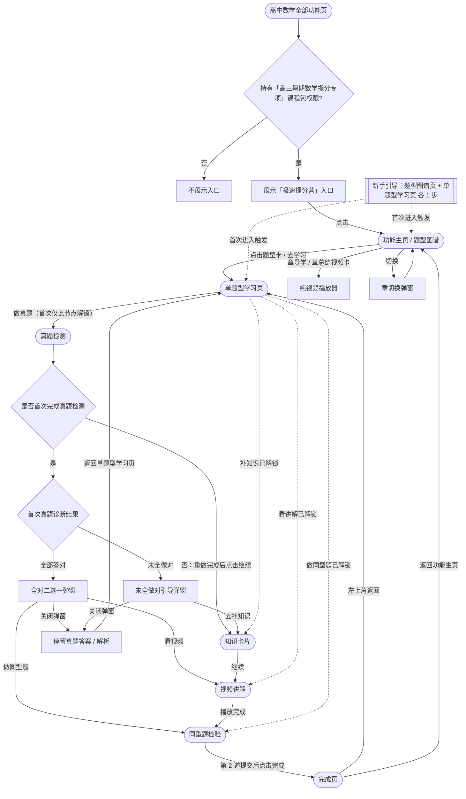

---
## 模块 1：高中数学全部功能页入口与权益展示

### 1.1 功能简述

本模块提供「极速提分营」在 App 首页「高中数学全部功能页」的「培优课」模块内的入口展示与权益鉴权能力，决定哪些用户可以看到入口、入口出现在什么位置，以及点击后进入专项功能主页。

---

### 1.2 交互流程

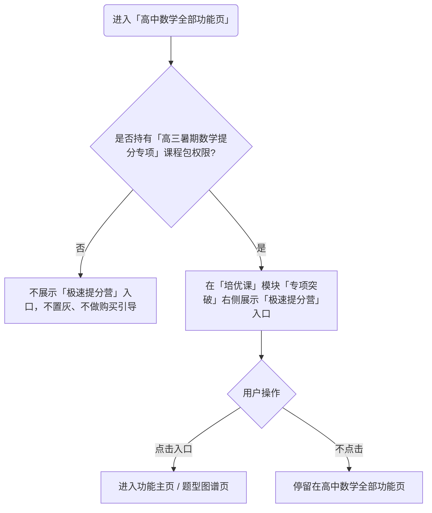

---

### 1.3 App 入口示意图

```
【高中数学全部功能页 - 有权益（展示入口）】750×1334
┌──────────────────────────────┐
│  高中 ▾   数学 ▾              │
├──────────────────────────────┤
│  同步课                       │
│  教材同步 / 同步刷题 / 高频错题│
├──────────────────────────────┤
│  培优课                       │
│  一轮复习培优  二轮复习培优     │
│  真题精讲培优  考前突击        │
│  重难点培优   专项突破         │
│  极速提分营 ◀── 新增入口       │
├──────────────────────────────┤
│  试卷库 / 衔接课              │
└──────────────────────────────┘

① 点击「极速提分营」 → 进入【模块 2 功能主页 / 题型图谱】

【高中数学全部功能页 - 无权益（不展示入口）】750×1334
┌──────────────────────────────┐
│  培优课                       │
│  一轮复习培优 ... 专项突破      │
│  （无「极速提分营」入口）       │
└──────────────────────────────┘
```

**状态流转：**
① 有权益态 --{点击极速提分营}--> 进入功能主页
② 无权益态：入口不渲染，无任何占位 / 提示

---

### 1.4 功能点详情

#### 功能点 A：入口位置与排序

- **功能描述**：在 App 首页切换到「高中」学段、「数学」学科后，在「高中数学全部功能页」的「培优课」模块内展示「极速提分营」入口，固定排在「专项突破」右侧。
- **UI 设计意图**：入口样式与现有培优课功能入口保持一致，让用户感知它是培优课体系下的一个常规功能入口，降低理解成本。
- **业务规则与约束**：
  - 在「培优课」模块内，系统应将「极速提分营」展示在「专项突破」入口的右侧。
  - 入口名称固定为「极速提分营」。
- **影响范围**：仅在「高中数学全部功能页」新增入口；不影响其他学段/学科对应的全部功能页，不改动培优课其他入口。

**验收项**

- [ ] **当** 用户进入「高中数学全部功能页」且持有对应课程包权限 **时**，系统应在「培优课」模块「专项突破」右侧展示「极速提分营」入口
  测试数据：高中数学、持有「高三暑期数学提分专项」课程包的账号
- [ ] **当** 入口展示 **时**，系统应使其样式与同模块其他培优课入口一致
  测试数据：对比同页「专项突破」入口样式

#### 功能点 B：课程包权益鉴权

- **功能描述**：入口是否展示由「高三暑期数学提分专项」课程包（课程包 ID：`4ea71a9d-5e4e-11f1-b21f-e2ce6c91b123`）权限决定；持有该课程包权限的用户展示入口，无权限用户不展示。
- **交互逻辑**：**当** 用户进入「高中数学全部功能页」 **时**，系统应校验当前用户是否持有「高三暑期数学提分专项」课程包权限，命中则展示入口，未命中则不展示。
- **业务规则与约束**：
  - **在** 用户无该课程包权限 **下**，系统应不展示该入口，且不展示置灰入口、不展示购买引导。
- **数据流转**：权益判断依据用户在「高三暑期数学提分专项」课程包上的持有状态，数据来源于现有课程权益体系，专项不另建权益规则。
- **影响范围**：账号注册、登录、设备规则沿用现有 App 规则，本模块不改动。

**验收项**

- [ ] **当** 用户持有「高三暑期数学提分专项」课程包权限 **时**，系统应展示「极速提分营」入口
  测试数据：持有该课程包的账号
- [ ] **如果** 用户无该课程包权限，**那么** 系统应不展示该入口，且不展示置灰入口或购买引导
  测试数据：无该课程包权限的高中数学账号

#### 功能点 C：入口点击跳转

- **交互逻辑**：**当** 用户点击「极速提分营」入口 **时**，系统应进入功能主页 / 题型图谱页（模块 2）。
- **业务规则与约束**：进入功能主页后的默认定位（恢复上次退出位置 / 首章顶部）由模块 2 定义。

**验收项**

- [ ] **当** 用户点击「极速提分营」入口 **时**，系统应跳转到功能主页 / 题型图谱页
  测试数据：有权益账号点击入口
## 模块 2：功能主页 / 题型图谱

### 2.1 功能简述

本模块提供专项的功能主页能力：页面以「当前章内滚动」结构组织内容，左侧为当前章的单层小节目录与章切换入口，右侧按「章导学视频 → 各小节题型 → 章总结视频」滚动展示；题型以卡片形式呈现并附亮点标签、学习进度与掌握程度；支持成绩分层筛选、左右目录联动、按章位置记录与恢复。

---

### 2.2 交互流程

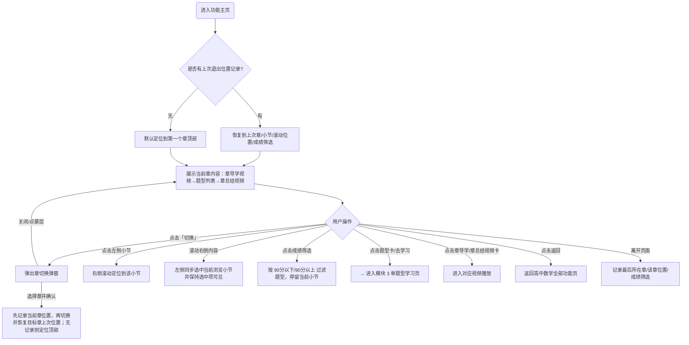

---

### 2.3 功能主页示意图

```
【功能主页 - 默认态（左目录 + 右内容）】750×1334
┌──────────────────────────────┐
│ ←          极速提分营           │
├────────┬─────────────────────┤
│ 函数[切换]│ ┌ 函数·导学视频 ──┐ │
│        │ │高考平均占分36分  │ │
│ ● 1.1   │ │2分钟看懂  [看视频]│ │
│ ○ 1.2   │ └────────────────┘ │
│ ○ 1.3   │ 选择当前成绩         │
│        │ 〔90分以下〕〔90分以上〕│
│        │ 1.1 函数性质        │
│        │ ┌──────────────┐   │
│        │ │求函数值  [去学习]│   │
│        │ │近三年平均考3次·90-│  │
│        │ │进度 ▓▓▓░░░░░░░ │   │
│        │ └──────────────┘   │
│        │ ┌──────────────┐   │
│        │ │判断奇偶性 [去学习]│   │
│        │ │近三年平均考2次·完全掌握│
│        │ │进度 ▓▓▓▓▓▓▓▓▓▓ │   │
│        │ └──────────────┘   │
│        │ ┌ 函数·章总结 ───┐  │
│        │ │2分钟回顾 [看视频]│  │
│        │ └────────────────┘ │
└────────┴─────────────────────┘

① 点击「切换」↓

【章切换弹窗】750×1334
┌──────────────────────────────┐
│  章切换                    ×  │
│  [ 函数 ]                     │
│  [ 导数 ]                     │
│  [ 三角函数 ]                  │
│            [ 确认 ]           │
└──────────────────────────────┘

② 选择成绩筛选「90分以下」↓

【功能主页 - 筛选态】750×1334
┌────────┬─────────────────────┐
│        │ 〔90分以下✓〕〔90分以上〕│
│        │ （仅展示带 90分以下标签题型）│
└────────┴─────────────────────┘

③ 点击题型卡 / [去学习] → 进入【模块 3 单题型学习页】
④ 点击章导学 / 章总结视频卡 → 进入对应视频播放
⑤ 点击 ← 返回 → 高中数学全部功能页
```

**状态流转：**
① 默认态 --{点击切换}--> 章切换弹窗 --{确认}--> 切换章并优先定位该章上次离开位置；无记录则定位顶部
② 默认态 --{点击成绩筛选}--> 筛选态 --{再次点击已选项}--> 默认态（恢复全部）

---

### 2.4 功能点详情

#### 功能点 A：当前章内滚动结构

- **功能描述**：右侧滚动区按**当前章**组织，章内顺序固定为「章导学视频卡 → 当前章各小节题型列表 → 章总结视频卡」；滚动到章总结视频即为当前章内容结束，不连续滚动到下一章。
- **数据流转**：章、小节、知识点结构取 CB 真实结构；题型名和亮点标签分别取知识点名称和该知识点的亮点标签；章导学 / 章总结视频及卡片文案取专项配置。
- **业务规则与约束**：
  - **在** 当前章展示态 **下**，系统应按"章导学视频 → 小节题型列表 → 章总结视频"的固定顺序排列内容。
  - 功能主页不校验章导学 / 章总结视频资源是否可用，视频卡正常展示且可点击；资源异常时进入纯视频播放器后展示端内通用加载失败状态。
  - 小节标题仅展示小节序号和小节名称，本期不提供小节视频下载入口。

**验收项**

- [ ] **当** 进入某章 **时**，系统应按"章导学视频 → 各小节题型 → 章总结视频"顺序展示
  测试数据：函数章（含导学视频、3 个小节、章总结视频）
- [ ] **如果** 某章导学视频 ID 为空或视频已下线，**那么** 系统应保留导学视频卡，点击后进入纯视频播放器并展示通用加载失败状态
  测试数据：章头部视频 ID 为空 / 对应视频已下线
- [ ] **当** 功能主页展示任一小节标题 **时**，系统应只展示小节序号和名称，不展示视频下载入口
  测试数据：包含多个小节的函数章

#### 功能点 B：章切换（左侧入口 + 独立弹窗）

- **功能描述**：章切换入口放在左侧小节目录上方，展示当前章名称与「切换」按钮；点击后弹出独立章切换弹窗（页面蒙层、左上标题「章切换」、右上关闭、章列表纵向排列、底部「确认」）。
- **交互逻辑**：
  - **当** 用户在章切换弹窗中选择某一章并点击「确认」**时**，系统应先记录当前章所在小节和右侧滚动位置，再切换到目标章，并优先定位到目标章上次离开时记录的位置。
  - **如果** 被切换到的章没有上次离开位置记录，**那么** 系统应定位到该章顶部。
  - **当** 用户点击弹窗关闭按钮或点击蒙层 **时**，系统应关闭弹窗并保留当前章不变。
- **影响范围**：章切换只改变右侧展示的当前章与左侧小节目录；不清除其他章已产生的学习进度与掌握度。

**验收项**

- [ ] **当** 用户在章切换弹窗选择有历史位置记录的章并确认 **时**，系统应切换到该章并定位到该章上次离开位置
  测试数据：导数章曾停留在「导数应用」小节后，从函数章切换到导数章
- [ ] **当** 用户在章切换弹窗选择无历史位置记录的章并确认 **时**，系统应切换到该章并定位到该章顶部
  测试数据：首次切换到三角函数章
- [ ] **当** 用户从函数章某位置切换到导数章、再切回函数章 **时**，系统应恢复函数章切换前的小节与右侧滚动位置
  测试数据：函数章停留在「1.2 指对函数」后切章再返回
- [ ] **当** 用户点击关闭或蒙层 **时**，系统应保留原当前章
  测试数据：打开弹窗后点蒙层

#### 功能点 C：左侧单层小节目录与定位

- **功能描述**：左侧为单层小节目录，顶部是当前章 +「切换」按钮，下方展示当前章下的小节列表；点击某小节后右侧滚动区定位到对应小节。
- **交互逻辑**：
  - **当** 用户点击左侧某小节 **时**，系统应将右侧滚动区定位到该小节起始位置。
  - **当** 用户滚动右侧内容进入某小节 **时**，系统应同步选中左侧对应小节。
- **业务规则与约束**：
  - 目录只展示当前章的小节（单层，不展开多级）。
  - 右侧位于章导学区域时选中第一个小节，位于章总结区域时选中最后一个小节。
  - 左侧目录超过可视高度时可独立滚动，并自动保证当前选中小节处于可见区域。

**验收项**

- [ ] **当** 用户点击左侧小节「1.2 指对函数」**时**，系统应将右侧滚动定位到该小节
  测试数据：函数章含多个小节
- [ ] **当** 用户滚动右侧内容进入「1.3 图象零点」**时**，系统应同步选中左侧「1.3 图象零点」
  测试数据：从 1.2 向下滚动到 1.3
- [ ] **当** 右侧位于章导学或章总结区域 **时**，系统应分别选中第一个或最后一个小节
  测试数据：滚动到函数章导学区域 / 章总结区域
- [ ] **当** 左侧小节数量超过可视高度且当前选中项在可视区外 **时**，系统应自动滚动左侧目录使选中项可见
  测试数据：小节数超过一屏的章

#### 功能点 D：题型卡片与亮点标签

- **功能描述**：题型卡片展示题型名、亮点标签、学习进度条与（满格时的）掌握程度标签，右侧固定「去学习」按钮。题型卡片在数据上对应一个 CB 知识点，题型名取知识点名称。
- **UI 设计意图**：亮点标签用于突出题型的高考价值与适配分数段；高亮亮点标签需与普通亮点标签有明显视觉区分，用于强调核心卖点。
- **业务规则与约束**：
  - 亮点标签来自知识点配置，包含「近三年高考平均考察 x 次」「高考平均占分 x 分」「90分以下 / 90分以上」等；同一题型可配 0 个或多个高亮标签。
  - **在** 题型无任何亮点标签 **下**，系统应隐藏标签区域。
  - **当** 题型卡片或「去学习」按钮被点击 **时**，系统应进入单题型学习页（模块 3）。
  - 学习进度条使用中性进度色，仅表达流程进度，不表征作答对错。
  - **在** 学习进度达 100% **下**，系统应在学习进度所在行的最右侧独立展示掌握程度标签（完全掌握 / 初步掌握 / 未掌握）；进度 0%-75% 时仅展示进度条。
  - 题型卡片不展示「学习中」等学习状态标签。
- **影响范围**：进度与掌握程度的计算口径见模块 9；本模块只负责展示。

**验收项**

- [ ] **当** 题型配置了多个亮点标签 **时**，系统应按配置顺序展示，且高亮标签与普通标签有明显视觉区分
  测试数据：含 1 个高亮标签 + 2 个普通标签的题型
- [ ] **在** 题型进度为 75% **下**，系统应只展示进度条、不展示掌握程度标签
  测试数据：完成真题+知识卡片+视频但未做同型题的题型
- [ ] **在** 题型进度为 100% **下**，系统应在进度条外独立展示掌握程度标签
  测试数据：已完成同型题、2/2 做对的题型
- [ ] **当** 题型卡展示掌握程度标签 **时**，系统应将标签放在学习进度所在行的最右侧
  测试数据：进度 100%、历史最佳为初步掌握的题型
- [ ] **当** 题型进度为 25%-75% **时**，系统应仅展示进度条，不展示「学习中」标签
  测试数据：进度 25%、50%、75% 的题型
- [ ] **如果** 题型无亮点标签，**那么** 系统应隐藏标签区域
  测试数据：未配置亮点标签的题型
- [ ] **当** 点击题型卡片任意非按钮区域或「去学习」**时**，系统应进入单题型学习页
  测试数据：点击卡片空白区 / 点击去学习

#### 功能点 E：成绩分层筛选

- **功能描述**：「选择当前成绩」提供「90分以下」「90分以上」两个互斥选项，用于按分层标签过滤题型。
- **交互逻辑**：
  - 默认两个选项均未选中，此时展示全部题型。
  - **当** 用户点击某选项 **时**，系统应仅展示带该分层标签的题型，且两个选项互斥。
  - **当** 用户点击已选中的选项 **时**，系统应取消选择并恢复展示全部题型。
- **业务规则与约束**：
  - **在** 某题型同时带「90分以下 / 90分以上」两个标签 **下**，只要满足当前筛选标签即展示。
  - 筛选后停留在当前小节，不重置滚动位置。
  - 成绩筛选参与退出位置记录；用户离开后再次进入功能主页时，筛选状态应按上次离开时的状态恢复。

**验收项**

- [ ] **当** 用户选中「90分以下」**时**，系统应仅展示带「90分以下」标签的题型并停留当前小节
  测试数据：含 90-、90+、双标签的题型列表
- [ ] **当** 用户再次点击已选中的「90分以下」**时**，系统应恢复展示全部题型
  测试数据：已处于 90- 筛选态
- [ ] **在** 题型同时带两个分层标签 **下**，系统应在任一筛选下都展示该题型
  测试数据：双标签题型

#### 功能点 F：章导学 / 章总结视频卡

- **功能描述**：章导学视频卡展示在当前章第一个小节前，标题「{章名}·导学视频」、文案「高考平均占分 xx 分，2 分钟看懂考察内容」、按钮「看视频」；章总结视频卡展示在当前章最后一个小节后，按钮同为「看视频」。
- **交互逻辑**：**当** 用户点击视频卡或「看视频」**时**，系统应进入对应视频播放。
- **数据流转**：视频资源与卡片文案取专项配置；章导学和章总结视频固定使用端内纯视频播放器，与题型讲解使用的通用知识点播放器区分。具体配置字段和录入方式由技术方案确认。

**验收项**

- [ ] **当** 用户点击章导学视频卡的「看视频」**时**，系统应进入该章导学视频播放
  测试数据：配置了章导学视频 ID 的章
- [ ] **当** 用户点击章总结视频卡 **时**，系统应进入该章总结视频播放
  测试数据：配置了章总结视频 ID 的章
- [ ] **当** 用户打开章导学或章总结视频 **时**，系统应使用纯视频播放器，不展示题型讲解播放器的 AI 答疑等学习工具
  测试数据：分别打开章导学视频和章总结视频
- [ ] **如果** 章总结视频资源加载失败，**那么** 系统应在纯视频播放器展示通用加载失败状态，并允许用户返回功能主页
  测试数据：章总结视频已下线

#### 功能点 G：退出位置记录与恢复

- **功能描述**：切换章时按章记录切换前所在小节和右侧滚动位置；离开功能主页时记录最后所在章、该章位置和当前成绩筛选。下次进入优先恢复最后所在章的上次位置与上次成绩筛选状态。
- **交互逻辑**：
  - **当** 用户切换章 **时**，系统应按章记录切换前所在小节和右侧滚动位置。
  - **当** 用户离开功能主页 **时**，系统应记录最后所在章、该章位置和当前成绩筛选。
  - **当** 用户再次进入功能主页且存在记录 **时**，系统应恢复到上次退出位置，并恢复上次成绩筛选状态。
  - **如果** 无退出记录，**那么** 系统应默认定位到第一个章的顶部位置。
- **数据流转**：位置记录按用户维度保存；小节和右侧滚动位置按章记录，最后所在章和成绩筛选按页面记录。

**验收项**

- [ ] **当** 用户在导数章某滚动位置 + 选中 90分以上 时离开并再次进入 **时**，系统应恢复到导数章该位置且筛选保持 90分以上
  测试数据：先在导数章筛选 90+ 滚动后退出
- [ ] **如果** 用户首次进入无记录，**那么** 系统应定位到第一个章顶部
  测试数据：从未进入过专项的账号

#### 功能点 H：返回

- **交互逻辑**：**当** 用户点击左上角返回 **时**，系统应回到高中数学全部功能页。

**验收项**

- [ ] **当** 用户点击返回 **时**，系统应回到高中数学全部功能页
  测试数据：从功能主页点返回
## 模块 3：单题型学习页与 4 节点解锁

### 3.1 功能简述

本模块提供单题型的横向闯关学习页：展示题型名与「做真题 / 补知识 / 看讲解 / 做同型题」4 个学习节点，按解锁状态机控制各节点的可进入性，并对当前应进入的节点做轻高亮引导；题型已有掌握度时在右上方展示掌握程度浮层。

---

### 3.2 交互流程

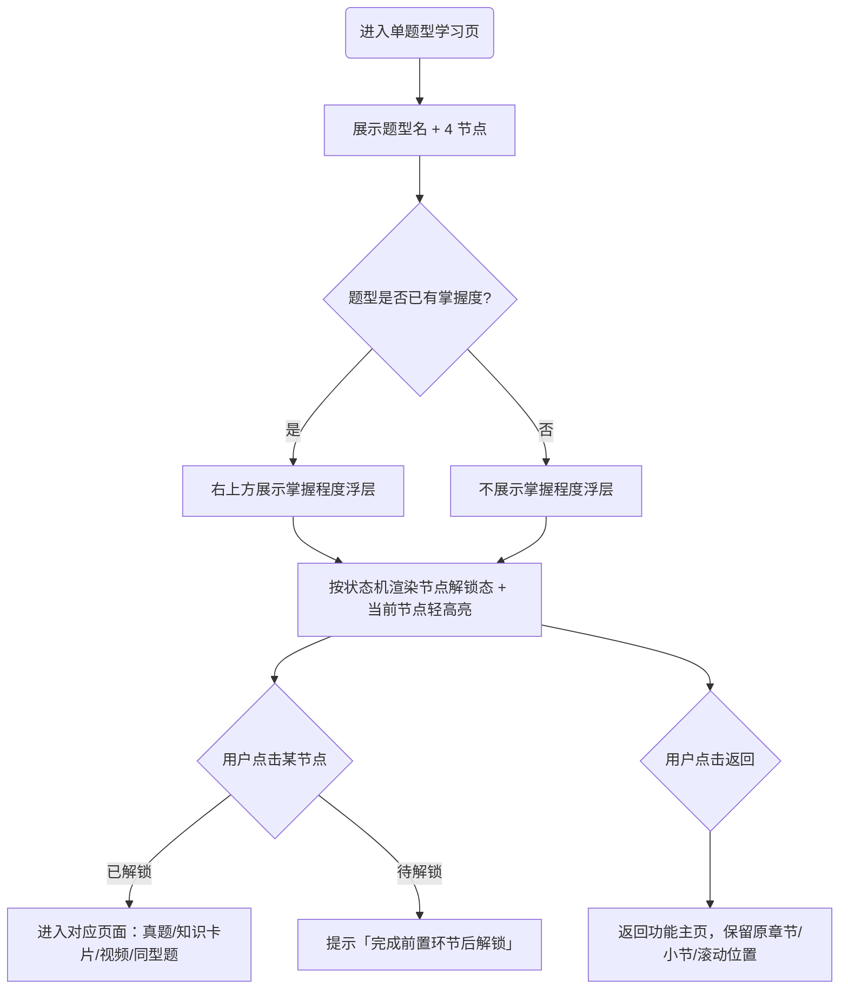

---

### 3.3 单题型学习页示意图

```
【单题型学习页 - 首次进入（仅做真题解锁）】750×1334
┌──────────────────────────────┐
│ ←            求函数值           │
├──────────────────────────────┤
│  ┌──────┐ ┌──────┐            │
│  │做真题 │ │补知识 │            │
│  │找漏洞 │ │必会要点│           │
│  │已解锁⊙│ │待解锁🔒│           │
│  └──────┘ └──────┘            │
│  ┌──────┐ ┌──────┐            │
│  │看讲解 │ │做同型题│           │
│  │题型解法│ │做对才算│           │
│  │待解锁🔒│ │待解锁🔒│           │
│  └──────┘ └──────┘            │
└──────────────────────────────┘
（⊙=轻黄色外描边的当前引导节点）

① 真题未全做对后 ↓

【单题型学习页 - 补知识已解锁并轻高亮】750×1334
┌──────────────────────────────┐
│  做真题已解锁 / 补知识已解锁⊙   │
│  看讲解待解锁🔒 / 做同型题待解锁🔒│
└──────────────────────────────┘

② 真题全部做对后 ↓

【单题型学习页 - 全对后 3 节点全解锁】750×1334
┌──────────────────────────────┐
│  做真题已解锁 / 补知识已解锁     │
│  看讲解已解锁 / 做同型题已解锁⊙ │
└──────────────────────────────┘

③ 点击已解锁节点 → 进入对应页面（模块 4/5/6/7）
④ 点击待解锁节点 → 提示「完成前置环节后解锁」
⑤ 点击 ← 返回 → 返回功能主页（保留原位置）
```

**状态流转：**
① 首次进入（仅做真题解锁，轻高亮做真题）→ 真题未全做对（补知识解锁并轻高亮）→ 知识卡片完成（看讲解解锁）→ 视频完成（做同型题解锁并轻高亮）
② 首次进入 → 真题全对（补知识/看讲解/做同型题全解锁，轻高亮做同型题）

---

### 3.4 功能点详情

#### 功能点 A：页面结构与 4 节点

- **功能描述**：页面展示题型名与 4 个固定节点，每个节点含主标题与副标题：做真题/高考原题找漏洞、补知识/梳理必会要点、看讲解/精学题型解法、做同型题/做对才算掌握。
- **数据流转**：题型名取功能主页所选题型对应的 CB 知识点名称；4 节点解锁状态与右上角掌握度取本专项学习状态数据。
- **业务规则与约束**：4 节点的名称、副标题、排列顺序固定，不随题型变化。

**验收项**

- [ ] **当** 进入单题型学习页 **时**，系统应展示题型名与"做真题/补知识/看讲解/做同型题"4 个含主副标题的节点
  测试数据：任一题型

#### 功能点 B：4 节点解锁状态机

- **功能描述**：节点解锁随真题诊断结果与节点完成情况推进，控制各节点可进入性。完整规则如下表：

| 节点 | 首次进入初始态 | 解锁前置 | 节点完成条件 |
| --- | --- | --- | --- |
| 做真题 | 已解锁 | 进入题型后默认可进入 | 完成全部真题；全部正确记为「答对」，存在任意答错记为「没答对」 |
| 补知识 | 待解锁 | 第一次完成真题检测且未全做对后解锁；第一次完成且真题全对后作为可选补学节点解锁 | 在知识卡片页点击「继续」 |
| 看讲解 | 待解锁 | 第一次完成真题检测且全对后直接解锁；或补知识完成后解锁 | 播放器触发视频播放完成 |
| 做同型题 | 待解锁 | 第一次完成真题检测且全对后即解锁（二选一弹窗或返回学习页直接点击）；第一次未全做对路径下视频完成后解锁 | 2 道同型题均提交完成并进入完成页 |

- **交互逻辑**：
  - **当** 用户第一次完成真题检测且全部答对 **时**，系统应同时解锁补知识、看讲解、做同型题 3 个节点，用户可在二选一弹窗直接进入，也可返回学习页直接点击任意已解锁节点（含直接进入做同型题）。
  - **当** 用户第一次完成真题检测且未全做对 **时**，系统应解锁补知识节点（看讲解、做同型题仍待解锁）；知识卡片完成后解锁看讲解，视频完成后解锁做同型题。
  - **当** 用户点击已解锁节点 **时**，系统应进入对应页面；**当** 用户点击待解锁节点 **时**，系统应提示「完成前置环节后解锁」。
- **业务规则与约束**：
  - 节点完成后仍展示为「已解锁」态，不新增「已完成」视觉态（理由：真题全对可跳过知识卡片/视频，已完成态会让被跳过的可选节点产生歧义）。
  - 已解锁节点可反复进入；中途退出后回到学习页仍可重新进入该节点或其他已解锁节点。
  - 单题型学习页不在节点入口校验真题、知识卡片、讲解视频或同型题资源是否可用；已解锁节点始终可进入，资源异常由对应页面展示通用加载失败状态。
- **影响范围**：本页仅表达"哪些节点当前可进入"；进度与掌握程度的表达交由功能主页、右上角浮层与完成页。

**验收项**

- [ ] **当** 用户首次进入题型 **时**，系统应仅解锁「做真题」，其余 3 节点为待解锁
  测试数据：从未学习过的题型
- [ ] **当** 用户第一次完成全部真题且至少 1 道答错 **时**，系统应解锁「补知识」，看讲解/做同型题仍待解锁
  测试数据：全部真题均已提交，其中至少 1 道答错
- [ ] **当** 用户第一次完成全部真题且全部答对 **时**，系统应同时解锁补知识/看讲解/做同型题
  测试数据：真题全部答对
- [ ] **当** 用户真题全对后返回学习页并点击「做同型题」**时**，系统应直接进入同型题检验
  测试数据：真题全对后关闭二选一弹窗返回学习页
- [ ] **如果** 用户点击待解锁节点，**那么** 系统应提示「完成前置环节后解锁」并不进入该节点
  测试数据：首次进入点击「看讲解」
- [ ] **当** 用户在已解锁的视频节点中途退出后返回学习页 **时**，系统应允许重新进入补知识、看讲解节点
  测试数据：视频播放中途退出
- [ ] **如果** 已解锁节点对应资源已下线，**那么** 系统应仍允许点击进入，并由目标页面展示通用加载失败状态
  测试数据：已解锁的讲解视频对应知识点已下线

#### 功能点 C：当前节点轻高亮引导

- **功能描述**：在题型首次完成前（进度未达 100%），在所有已解锁节点中，按「做真题 → 补知识 → 看讲解 → 做同型题」固定顺序，对顺序最后一个已解锁节点加一圈轻微黄色外描边作为继续学习的引导。
- **UI 设计意图**：轻高亮仅为视觉引导，需克制——不展示「推荐」文字/标签/角标、不放大卡片、不改变卡片内容。
- **业务规则与约束**：
  - **在** 题型首次完成前 **下**，系统应对顺序最后一个已解锁节点展示轻高亮（如首次进入轻高亮做真题；真题未全做对后轻高亮补知识；视频完成解锁同型题后轻高亮做同型题）。
  - 轻高亮不是节点业务状态，不改变解锁/完成/点击规则，其他已解锁节点仍可正常进入。
  - **在** 题型首次完成同型题、进度达 100% 后 **下**，系统应取消所有节点轻高亮；后续重学不再展示轻高亮。

**验收项**

- [ ] **在** 首次进入题型 **下**，系统应对「做真题」节点展示轻黄色外描边
  测试数据：首次进入题型
- [ ] **在** 视频完成并解锁同型题后（题型尚未首次完成）**下**，系统应对「做同型题」展示轻高亮
  测试数据：未全做对路径走到视频完成
- [ ] **在** 题型首次完成（进度 100%）后再次进入 **下**，系统应不展示任何轻高亮
  测试数据：已完成同型题的题型
- [ ] **当** 轻高亮展示 **时**，系统应不放大卡片、不展示推荐文字/标签/角标
  测试数据：观察轻高亮节点样式

#### 功能点 D：掌握程度浮层

- **功能描述**：题型已有掌握度时，页面右上方展示当前题型掌握程度，取该题型已刷新的掌握度结果，与功能主页保持一致。
- **业务规则与约束**：**在** 题型已有掌握度 **下**，系统应在右上方展示文案，按掌握度映射为「完全掌握本题型 / 初步掌握本题型 / 未掌握本题型」；展示的是历史最佳掌握程度（口径见模块 9）。

**验收项**

- [ ] **在** 题型历史最佳为完全掌握 **下**，系统应在右上方展示「完全掌握本题型」
  测试数据：历史 2/2 做对的题型
- [ ] **当** 题型从未生成过掌握度 **时**，系统应不展示任何掌握程度文案或浮层
  测试数据：未完成过同型题的题型

#### 功能点 E：返回

- **交互逻辑**：**当** 用户点击左上角返回 **时**，系统应回到功能主页，并保留原章节、小节和滚动位置。

**验收项**

- [ ] **当** 用户从单题型学习页点返回 **时**，系统应回到功能主页且保留进入前的章/小节/滚动位置
  测试数据：从某小节题型进入后返回
## 模块 4：真题检测

### 4.1 功能简述

本模块提供题型的真题诊断能力：完全复用端内做题组件，按题目难度配置倒计时组件。用户必须完成该题型配置的全部真题（1-2 道）；第一次完成时记录首次诊断结果，并按「全部答对 / 未全做对」分流到对应弹窗；后续重做完成后不再弹窗，点击「继续」直接进入知识卡片。

---

### 4.2 交互流程

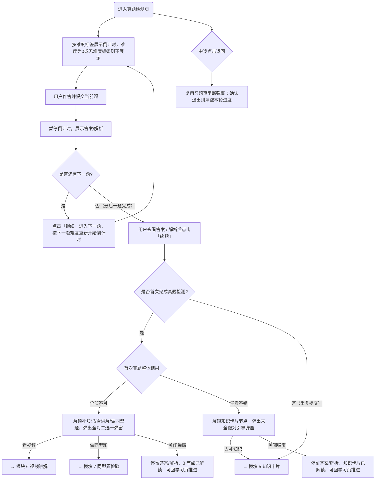

---

### 4.3 真题检测示意图

```
【真题检测 - 作答中（含倒计时）】750×1334
┌──────────────────────────────┐
│ ←   ⏱08:00      ●─○ 1/2  ☆收藏│
├──────────────────────────────┤
│ 题目1  [新高考 I 卷]             │
│ 已知函数 f(x) 是 R 上的奇函数， │
│ x≥0 时 f(x)=x²-2x，f(-1)=（ ）│
│   A -3      B -1              │
│   C  1      D  3             │
├──────────────────────────────┤
│                       [提交]  │
└──────────────────────────────┘

① 提交后倒计时暂停 ↓

【真题检测 - 已提交（答案/解析）】750×1334
┌──────────────────────────────┐
│ 题目1  正确答案：B  你的：B ✓   │
│ 解析：……                      │
│                       [继续]  │
└──────────────────────────────┘

② 第一次完成最后一题 & 全部答对 ↓

【全对二选一弹窗】750×1334
┌──────────────────────────────┐
│ 太棒了！都答对了，接下来怎么学？ │
│ 可以看视频再巩固，也可直接做同型题│
│      [看视频]    [做同型题]     │
└──────────────────────────────┘

③ 第一次完成最后一题 & 存在答错 ↓

【未全做对引导弹窗】750×1334
┌──────────────────────────────┐
│ 这次真题已经帮你找到了漏洞。     │
│ 先补知识，再看讲解，会更容易学明白│
│            [去补知识]          │
└──────────────────────────────┘

④ 后续重复完成最后一题 → [继续] → 直接进入模块5，不展示弹窗
⑤ [看视频]→模块6  [做同型题]→模块7  [去补知识]→模块5
⑥ 倒计时归零 → 停在 00:00，不提交/不弹窗/不禁止作答
```

**状态流转：**
① 作答中 --{提交并暂停倒计时}--> 答案解析 --{继续}--> 下一题作答中（按下一题难度重置并启动倒计时）
② 第一次完成最后一题 --{全部答对}--> 全对二选一弹窗
③ 第一次完成最后一题 --{存在答错}--> 知识卡片节点已解锁 + 未全做对引导弹窗
④ 后续重复完成最后一题 --{继续}--> 知识卡片页（不展示弹窗）

---

### 4.4 功能点详情

#### 功能点 A：复用端内做题组件

- **功能描述**：真题检测页完全复用端内做题组件，本专项不改造做题组件、不新增额外按钮，仅按配置项使用，并在提交结果回调上叠加业务弹窗。
- **业务规则与约束**：
  - 标题区域使用习题组件默认标题区，展示题序「题目1」「题目2」。
  - 题目标签不展示习题年份；试卷来源等其他题目标签按端内做题组件正常展示。
  - 题干、选项、答案、解析按现有做题组件正常展示；答题进度使用默认单题节点式进度；习题反馈组件配置为关闭。
  - 答题模式为常规一题一提交：用户选择答案后「提交」可点击，提交后展示答案与解析。
  - 工具栏右上角展示草稿、收藏，收藏按端内做题组件能力处理。
  - **如果** 配置的任一真题缺失、下线或加载失败，**那么** 页面应展示端内通用加载失败状态，本轮不生成真题诊断结果；用户可返回单题型学习页。
- **数据流转**：真题习题 ID 取当前知识点的专项配置，支持 1-2 道；题干、选项、答案、解析、试卷来源和难度标签取端内题目数据；习题年份不在页面展示。具体配置字段和录入方式由技术方案确认。

**验收项**

- [ ] **当** 进入真题检测页 **时**，系统应展示题序、试卷来源、题干、选项，且不展示习题年份
  测试数据：配置 2 道真题的题型
- [ ] **当** 用户选择答案后 **时**，系统应使「提交」可点击，提交后展示答案与解析
  测试数据：单选题作答
- [ ] **当** 用户点击收藏 **时**，系统应按端内做题组件能力完成收藏
  测试数据：作答页点击收藏
- [ ] **如果** 配置的任一真题缺失或已下线，**那么** 系统应展示通用加载失败状态且不生成真题诊断结果
  测试数据：2 道真题中 1 道已下线

#### 功能点 B：难度倒计时

- **功能描述**：真题检测页配置习题组件的倒计时组件，以「xx:xx」形式展示在左上角返回按钮右侧；倒计时开始时长由当前题目难度标签映射。映射规则：

| 题目难度标签 | 倒计时时长 |
| --- | --- |
| 55 | 3 分钟 |
| 65 | 5 分钟 |
| 75 | 8 分钟 |
| 85 | 12 分钟 |
| 95 | 15 分钟 |
| 0 或无难度标签 | 不展示倒计时组件 |

- **交互逻辑**：
  - **当** 用户进入某真题 **时**，系统应按该题难度标签展示对应倒计时并开始倒数；难度标签为 0 或没有难度标签时不展示倒计时。
  - **当** 用户提交当前题 **时**，系统应立即暂停倒计时，并在答案/解析展示期间保持暂停。
  - **当** 用户点击「继续」进入下一题 **时**，系统应按下一题难度重新设置时长并开始倒计时。
- **业务规则与约束**：
  - **当** 倒计时归零 **时**，系统应使时间停留在「00:00」，且不自动提交、不弹出提示、不禁止继续作答、不改变提交按钮状态，用户仍按正常流程作答提交。

**验收项**

- [ ] **当** 进入难度标签为 65 的真题 **时**，系统应展示 5 分钟倒计时并开始倒数
  测试数据：难度 65 的题
- [ ] **当** 真题页展示倒计时 **时**，系统应以「xx:xx」形式将其放在左上角返回按钮右侧
  测试数据：难度 75 的题
- [ ] **当** 进入难度标签为 0 或没有难度标签的真题 **时**，系统应不展示倒计时组件
  测试数据：难度 0 的题 / 没有难度标签的题
- [ ] **当** 用户在倒计时剩余 03:20 时提交当前题 **时**，系统应暂停在 03:20，答案/解析展示期间不继续倒数
  测试数据：难度 75 的题提交后停留答案解析页
- [ ] **当** 用户点击「继续」进入难度标签为 65 的下一题 **时**，系统应重新从 05:00 开始倒计时
  测试数据：前一题提交后进入难度 65 的下一题
- [ ] **当** 倒计时归零 **时**，系统应停在 00:00 且不自动提交、不禁止作答
  测试数据：难度 55 的题等待 3 分钟后
#### 功能点 C：多题合并诊断结果

- **功能描述**：用户必须完成该题型配置的全部真题后才完成本轮检测；第一次完成时生成并记录首次真题诊断结果，全部正确记为「答对」，任意一道答错记为「没答对」。
- **交互逻辑**：**当** 用户提交一题并查看答案/解析后点击「继续」**时**，无论该题对错，系统应进入下一题；**当** 第一次完成最后一道真题 **时**，系统应按整体结果弹出全对弹窗或未全做对弹窗；**当** 后续重做完成最后一道真题 **时**，系统应在用户点击「继续」后直接进入知识卡片。
- **业务规则与约束**：
  - **在** 全部真题答对 **下**，整体记为「答对」。
  - **在** 任意一道答错 **下**，整体记为「没答对」。
  - 真题诊断结果只记录首次结果（口径见模块 9），用于完成页首次文案与首次真题答题情况展示。
  - **如果** 题型仅配置 1 道真题，**那么** 系统应以该 1 道结果作为整体诊断结果。
- **数据流转**：错题本——用户提交答错时按端内做题组件规则自动进入端内错题本。

**验收项**

- [ ] **当** 用户第一次完成全部真题且全部答对，并在最后一道题答案/解析页点击「继续」**时**，系统应弹出全对二选一弹窗
  测试数据：2 道真题全部答对
- [ ] **当** 用户第一次完成全部真题且存在答错，并在最后一道题答案/解析页点击「继续」**时**，系统应弹出未全做对引导弹窗
  测试数据：2 道真题中 1 道答错
- [ ] **当** 用户答错某道真题 **时**，系统应将该题按端内规则计入错题本
  测试数据：真题作答错误
- [ ] **如果** 题型仅配置 1 道真题，**那么** 系统应以该 1 道结果作为整体诊断结果
  测试数据：仅 1 道真题的题型

#### 功能点 D：真题全部做对弹窗

- **功能描述**：用户第一次完成真题检测，全部真题提交且答案全部正确，并在查看答案/解析后点击做题组件「继续」按钮时，居中弹出二选一弹窗（不在提交瞬间弹出）。真题检测页不展示「完成」按钮，最后一道题提交后的推进按钮仍为「继续」。弹窗文案「太棒了！都答对了，接下来你想怎么学？可以看视频再巩固一下知识点和解题思路，也可以直接去做同型题检验哦。」
- **交互逻辑**：
  - **当** 用户点击「看视频」**时**，系统应进入视频讲解页（模块 6）。
  - **当** 用户点击「做同型题」**时**，系统应进入同型题检验页（模块 7）。
  - **当** 用户点击关闭键关闭弹窗 **时**，系统应停留在真题页答案/解析状态；此时补知识、看讲解、做同型题 3 节点均已解锁，用户可回单题型学习页直接推进（含直接进入做同型题）。

**验收项**

- [ ] **当** 用户第一次完成真题且全部答对并点击「继续」**时**，系统应在看到答案/解析后再弹出二选一弹窗
  测试数据：全对后查看解析点继续
- [ ] **当** 用户在弹窗点「看视频」**时**，系统应进入视频讲解页
  测试数据：全对弹窗点看视频
- [ ] **当** 用户在弹窗点「做同型题」**时**，系统应进入同型题检验页
  测试数据：全对弹窗点做同型题
- [ ] **当** 用户关闭全对弹窗 **时**，系统应停留答案/解析且 3 节点保持已解锁
  测试数据：关闭弹窗后返回学习页查看节点态

#### 功能点 E：真题未全做对引导弹窗

- **功能描述**：用户第一次完成真题检测，全部真题提交且存在答错，并在查看答案/解析后点击「继续」按钮时，系统先将知识卡片节点解锁为可进入状态，再居中弹出单按钮引导弹窗。弹窗标题「这次真题已经帮你找到了漏洞」、正文「先补知识，再看讲解，会更容易把这类题学明白。」、主按钮「去补知识」。
- **交互逻辑**：
  - **当** 未全做对引导弹窗展示时，知识卡片节点应已经处于已解锁状态。
  - **当** 用户点击「去补知识」**时**，系统应直接进入知识卡片页（模块 5）。
  - **当** 用户点击关闭键 **时**，系统应停留在真题页答案/解析状态，用户可稍后从单题型学习页推进。
- **业务规则与约束**：该弹窗只承担引导后续学习的作用，不展示题号结果列表。

**验收项**

- [ ] **当** 用户第一次完成真题且存在答错并点击「继续」**时**，系统应在看到答案/解析后弹出未全做对引导弹窗
  测试数据：1 道答错后查看解析点继续
- [ ] **当** 未全做对引导弹窗展示 **时**，系统应已经解锁知识卡片节点
  测试数据：未全做对弹窗展示后返回学习页查看节点态
- [ ] **当** 用户点击「去补知识」**时**，系统应直接进入知识卡片页
  测试数据：未全做对弹窗点去补知识

#### 功能点 F：后续重复提交真题

- **交互逻辑**：**当** 该题型已经存在首次真题诊断结果，用户再次进入真题检测并完成全部题目 **时**，系统应先展示最后一道题的答案/解析；用户点击「继续」后直接进入知识卡片页（模块 5）。
- **业务规则与约束**：后续重复提交无论全部答对还是存在答错，均不展示全对弹窗或未全做对弹窗，也不覆盖首次真题诊断结果。

**验收项**

- [ ] **当** 用户第二次完成真题且全部答对并点击「继续」**时**，系统应直接进入知识卡片页，不展示全对弹窗
  测试数据：已有首次真题结果后重做全对
- [ ] **当** 用户第二次完成真题且存在答错并点击「继续」**时**，系统应直接进入知识卡片页，不展示未全做对弹窗
  测试数据：已有首次真题结果后重做未全对
- [ ] **当** 用户重复提交真题 **时**，系统应保留该题型首次真题诊断结果
  测试数据：首次未全对、第二次全对

#### 功能点 G：中途退出与恢复

- **交互逻辑**：**当** 用户中途点击左上角返回 **时**，系统应复用习题页通用阻断弹窗；用户取消退出则留在当前题目，确认退出则离开做题页。
- **业务规则与约束**：**在** 用户确认退出且尚未完成整个真题诊断 **下**，系统应清空本轮真题作答进度，下次从第 1 道真题重新开始（即使第 1 道已答对）。

**验收项**

- [ ] **当** 用户在真题作答中点返回 **时**，系统应弹出习题页通用阻断弹窗
  测试数据：作答中点返回
- [ ] **当** 用户确认退出后再次进入 **时**，系统应从第 1 道真题重新开始
  测试数据：第 1 道已答对后退出再进入
## 模块 5：知识卡片

### 5.1 功能简述

本模块提供题型的知识卡片学习页：以「上方大图 + 下方缩略图切换」的形式展示该题型的知识卡片图片（最多 5 张，16:9 横版），支持图片放大查看，底部常驻「继续」进入视频讲解。

---

### 5.2 交互流程

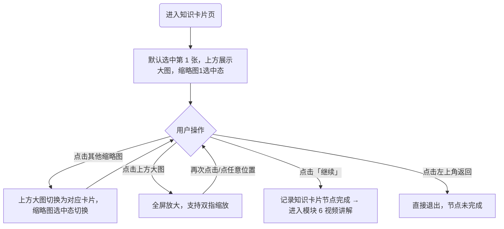

---

### 5.3 知识卡片示意图

```
【知识卡片 - 默认态（大图+缩略图）】750×1334
┌──────────────────────────────┐
│ ←          补知识             │
├──────────────────────────────┤
│  ┌────────────────────────┐  │
│  │   当前选中卡片大图       │  │
│  │      16:9 横版          │  │
│  └────────────────────────┘  │
│  [缩1✓][缩2][缩3][缩4][缩5]   │
│                       [继续]  │
└──────────────────────────────┘

① 点击缩略图2 ↓
【切换态】上方大图=卡片2，缩2 选中

② 点击上方大图 ↓
【图片放大态】750×1334
┌──────────────────────────────┐
│        [全屏放大的卡片图]       │
│      （双指放大/缩小）          │
└──────────────────────────────┘
（再次点击或点任意位置 → 收起回默认态）

③ 点击「继续」→ 进入【模块 6 视频讲解】
④ 点击 ← 返回 → 直接退出（节点未完成）
```

**状态流转：**
① 默认态 --{点缩略图}--> 切换态（大图随之切换）
② 默认态/切换态 --{点大图}--> 放大态 --{再次点击/点任意位置}--> 回知识卡片页
③ 任意态 --{点继续}--> 记录完成并进入视频

---

### 5.4 功能点详情

#### 功能点 A：大图 + 缩略图展示与切换

- **功能描述**：页面上方展示当前选中的知识卡片大图，下方展示该题型全部知识卡片缩略图；进入时默认选中第 1 张，缩略图 1 展示选中态。
- **交互逻辑**：**当** 用户点击下方任意缩略图 **时**，系统应将上方大图切换为对应卡片，并把该缩略图置为选中态。
- **业务规则与约束**：
  - 缩略图只负责切换，不直接触发图片放大。
  - 知识卡片图片为 16:9 横版（建议素材 1280×720 或同等比例），前端按图片原比例展示，最多 5 张。
  - **如果** 图片缺失、下线或加载失败，**那么** 页面应展示端内通用图片加载失败状态；本次不记为知识卡片完成，用户可返回单题型学习页。
- **数据流转**：知识卡片图片取当前知识点的专项配置，最多 5 张；具体配置字段和录入方式由技术方案确认。

**验收项**

- [ ] **当** 进入知识卡片页 **时**，系统应默认选中第 1 张并在上方展示其大图、缩略图 1 为选中态
  测试数据：配置 5 张卡片的题型
- [ ] **当** 用户点击缩略图 3 **时**，系统应将上方大图切换为第 3 张并把缩略图 3 置为选中态
  测试数据：多张卡片题型
- [ ] **在** 配置少于 5 张（如 2 张）**下**，系统应只展示已配置的缩略图
  测试数据：配置 2 张卡片的题型
- [ ] **如果** 知识卡片图片加载失败，**那么** 系统应展示通用图片加载失败状态且不记为知识卡片完成
  测试数据：知识卡片图片链接失效

#### 功能点 B：图片放大查看

- **交互逻辑**：
  - **当** 用户点击上方大图 **时**，系统应复用习题组件的图片查看能力进入全屏放大，支持双指放大、双指缩小。
  - **当** 图片处于全屏放大状态且用户再次点击图片或点击任意位置 **时**，系统应收起图片回到知识卡片页。

**验收项**

- [ ] **当** 用户点击上方大图 **时**，系统应进入全屏放大并支持双指缩放
  测试数据：任一卡片大图
- [ ] **当** 用户在放大态点击任意位置 **时**，系统应收起图片回到知识卡片页
  测试数据：放大态点击

#### 功能点 C：继续与节点完成

- **交互逻辑**：**当** 用户点击右下角常驻「继续」**时**，系统应将知识卡片节点记为学习完成，并直接跳转进入视频播放器页（模块 6）。
- **业务规则与约束**：
  - **当** 用户点击左上角返回直接退出 **时**，系统应不记录知识卡片节点完成；再次进入从知识卡片页初始位置开始。

**验收项**

- [ ] **当** 用户点击「继续」**时**，系统应记录知识卡片节点完成并进入视频讲解页
  测试数据：从知识卡片点继续
- [ ] **当** 用户点左上角返回退出 **时**，系统应不记录节点完成，再次进入从初始位置开始
  测试数据：未点继续直接返回
## 模块 6：视频讲解与答疑

### 6.1 功能简述

本模块提供题型的视频讲解能力：复用端内通用知识点播放器，通过题型对应的 CB 知识点进入播放器播放讲解视频；播放完成后将视频节点记为完成、解锁同型题并自动进入同型题检验；答疑区复用端内现有能力并接入高中其他培优课的人工答疑链路。

---

### 6.2 交互流程

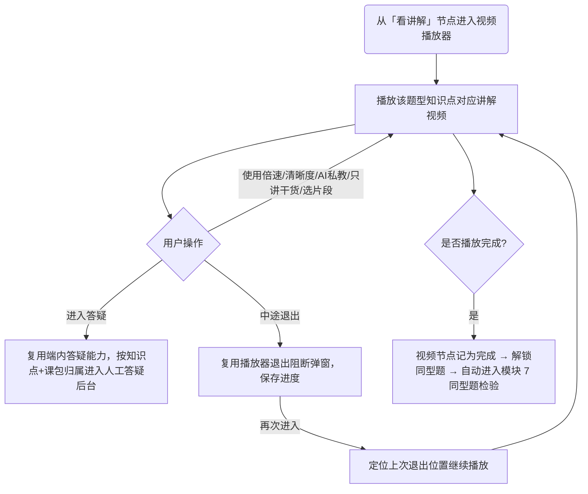

---

### 6.3 视频讲解示意图

```
【视频讲解 - 播放态（通用知识点播放器）】750×1334
┌──────────────────────────────┐
│  ┌────────────────────────┐  │
│  │       讲解视频画面       │  │
│  └────────────────────────┘  │
│  ▶ ──●───────  03:20/08:10   │
│  倍速 清晰度 弹幕 AI私教       │
│  只讲干货 选片段 答疑          │
└──────────────────────────────┘

① 点击「答疑」→ 复用端内答疑（按知识点+课包归属进人工答疑后台）
② 中途返回 → 播放器退出阻断弹窗（保存进度）
③ 播放完成 → 视频节点完成 + 解锁同型题 → 自动进入【模块 7 同型题检验】
```

**状态流转：**
① 播放态 --{中途退出}--> 再次进入定位续播
② 播放态 --{播放完成}--> 标记完成 + 解锁同型题 + 自动跳转同型题

---

### 6.4 功能点详情

#### 功能点 A：复用通用知识点播放器

- **功能描述**：复用端内通用知识点播放器页面，倍速、清晰度、弹幕、AI 私教、只讲干货、选片段等能力均按通用播放器能力保留。
- **数据流转**：从「看讲解」节点进入时，播放该题型对应 CB 知识点的视频内容；题型讲解播放器保留 AI 答疑、倍速等学习工具。
- **业务规则与约束**：
  - 本专项通过题型对应的 CB 知识点进入播放器，其余产品功能沿用现有通用能力，不改造播放器。
  - **如果** 知识点或对应视频下线、缺失或加载失败，**那么** 播放器应展示端内通用加载失败状态；视频节点不记为完成、不解锁同型题，用户可返回单题型学习页。

**验收项**

- [ ] **当** 用户从「看讲解」节点进入 **时**，系统应播放该题型知识点对应的讲解视频
  测试数据：配置了讲解知识点的题型
- [ ] **当** 用户使用倍速/清晰度等工具 **时**，系统应按通用播放器能力正常响应
  测试数据：播放中切换倍速
- [ ] **如果** 题型对应知识点或视频不可用，**那么** 系统应展示通用加载失败状态，且不完成视频节点、不解锁同型题
  测试数据：题型对应知识点已下线

#### 功能点 B：答疑链路接入

- **功能描述**：答疑区复用端内现有答疑能力，并复用高中其他培优课的人工答疑链路。
- **交互逻辑**：**当** 用户从播放器进入答疑并提问 **时**，系统应按当前知识点和课包归属将问题进入人工答疑后台。
- **业务规则与约束**：该链路为现成能力，本专项通过配置接入，无需新增开发。

**验收项**

- [ ] **当** 用户从播放器进入答疑提问 **时**，系统应按当前知识点和课包归属进入人工答疑后台
  测试数据：题型讲解视频内进入答疑提问

#### 功能点 C：播放完成解锁与流转

- **交互逻辑**：**当** 播放器触发播放完成 **时**，系统应先将视频节点记为完成、解锁同型题节点，再自动进入同型题检验页（模块 7）。
- **业务规则与约束**：
  - 只有播放器触发播放完成才将视频节点记为完成；播放到一半未完成时进度仍停留在上一已完成节点（口径见模块 9）。
  - **如果** 用户在播放完成与自动跳转之间退出，**那么** 返回单题型学习页时同型题节点应保持已解锁。

**验收项**

- [ ] **当** 视频播放完成 **时**，系统应记完成、解锁同型题并自动进入同型题检验页
  测试数据：完整播放至结束
- [ ] **如果** 用户在播放完成后、自动跳转前退出，**那么** 返回学习页时同型题节点应保持已解锁
  测试数据：完成瞬间退出

#### 功能点 D：中途退出与续播

- **交互逻辑**：**当** 用户中途退出视频 **时**，系统应复用端内通用知识点播放器的退出阻断弹窗并保存当前视频学习进度；再次进入时定位到上次退出位置继续播放。
- **业务规则与约束**：中途退出（未播放完成）不解锁同型题节点。

**验收项**

- [ ] **当** 用户中途退出视频后再次进入 **时**，系统应定位到上次退出位置继续播放
  测试数据：播放至 03:20 退出再进入
- [ ] **在** 视频未播放完成 **下**，系统应不解锁同型题节点
  测试数据：播放一半退出
## 模块 7：同型题检验

### 7.1 功能简述

本模块提供题型的同型题检验能力：复用端内做题组件，固定 2 道后台配置题目，用户依次作答提交后进入完成页。同型题结果是判定掌握程度的唯一依据。

---

### 7.2 交互流程

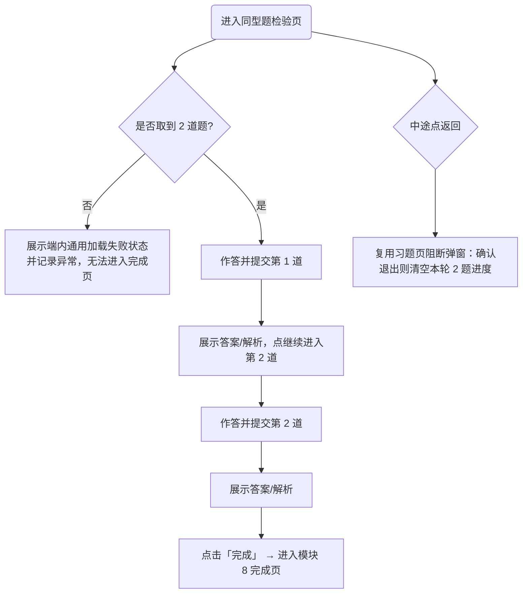

---

### 7.3 同型题检验示意图

```
【同型题检验 - 作答中】750×1334
┌──────────────────────────────┐
│ ←              ●─○ 1/2  ☆收藏 │
├──────────────────────────────┤
│ 题目1  [同型题]                │
│ 已知函数 f(x) 是 R 上的奇函数， │
│ x≥0 时 f(x)=x²-2x，f(-1)=（ ）│
│   A -3    B -1   C 1   D 3   │
├──────────────────────────────┤
│                       [提交]  │
└──────────────────────────────┘

① 提交第1道 → 答案/解析 → [继续] → 第2道
② 第2道提交 → 答案/解析 → [完成] → 进入【模块 8 完成页】
③ 中途返回 → 习题页阻断弹窗（确认退出清空 2 题进度）
④ 取不到 2 道题 → 加载失败状态，无法进入完成页
```

**状态流转：**
① 第 1 道作答 --{提交+继续}--> 第 2 道作答 --{提交+完成}--> 完成页
② 任意作答态 --{返回并确认}--> 清空本轮进度（下次从第 1 道开始）

---

### 7.4 功能点详情

#### 功能点 A：复用做题组件与题目配置

- **功能描述**：复用端内做题组件的题干、提交、答案解析、错题本、收藏等基础能力；同型题固定 2 道，标题区展示「题目1」「题目2」，不展示习题年份。同型题检验页不配置倒计时组件。
- **数据流转**：同型题习题 ID 取当前知识点的专项配置，固定 2 道；题干、选项、答案和解析取端内题目数据；习题年份不在页面展示。具体配置字段和录入方式由技术方案确认。
- **业务规则与约束**：
  - **如果** 任一题目缺失或下线导致取不到 2 道题，**那么** 系统应展示端内通用加载失败状态并记录异常，本轮无法进入完成页；本专项不兼容仅 1 道同型题的情况。
  - 同型题支持进入端内错题本，也支持收藏，按端内做题组件既有能力处理。

**验收项**

- [ ] **当** 进入同型题检验页且配置正常 **时**，系统应展示 2 道同型题（题目1、题目2）
  测试数据：配置 2 道同型题的题型
- [ ] **当** 进入同型题检验页 **时**，系统应不展示两道题的习题年份
  测试数据：配置带年份信息的 2 道同型题
- [ ] **如果** 仅取到 1 道题，**那么** 系统应展示加载失败状态并记录异常，不进入完成页
  测试数据：1 道同型题被下线
- [ ] **当** 用户答错同型题 **时**，系统应按端内规则计入错题本
  测试数据：同型题作答错误

#### 功能点 B：作答提交与完成流转

- **交互逻辑**：
  - **当** 用户提交某道同型题 **时**，系统应展示答案/解析；用户点击「继续」进入下一道。
  - **当** 第 2 道同型题提交并展示答案/解析后用户点击「完成」**时**，系统应进入完成页（模块 8）。
- **业务规则与约束**：完成页不在提交瞬间跳转，确保用户先看到同型题的答案与解析（尤其做错的题目）。

**验收项**

- [ ] **当** 用户提交第 1 道后 **时**，系统应展示答案/解析并允许点继续进入第 2 道
  测试数据：第 1 道作答提交
- [ ] **当** 第 2 道提交后用户点击「完成」**时**，系统应在看到答案/解析后进入完成页
  测试数据：第 2 道提交后查看解析点完成

#### 功能点 C：中途退出与恢复

- **交互逻辑**：**当** 用户中途点击左上角返回 **时**，系统应复用习题页通用阻断弹窗；取消退出则留在当前题目，确认退出则离开做题页。
- **业务规则与约束**：**在** 用户确认退出且尚未完成 2 道题 **下**，系统应清空本轮两道题的作答进度，下次从第 1 道同型题重新开始（即使第 1 道已提交）。

**验收项**

- [ ] **当** 用户在同型题作答中点返回 **时**，系统应弹出习题页通用阻断弹窗
  测试数据：作答中点返回
- [ ] **当** 用户确认退出后再次进入 **时**，系统应从第 1 道同型题重新开始
  测试数据：第 1 道已提交后退出再进入
## 模块 8：完成页与学习结果反馈

### 8.1 功能简述

本模块提供单题型学习的完成页：左右两栏展示本次学习结果与老师反馈文案；左栏汇总题型名称、高考价值信息、真题与同型题答题情况，右栏按「首次真题结果 + 同型题结果」匹配老师反馈文案；提供返回单题型学习页与返回功能主页两个出口，并触发题型状态刷新。

---

### 8.2 交互流程

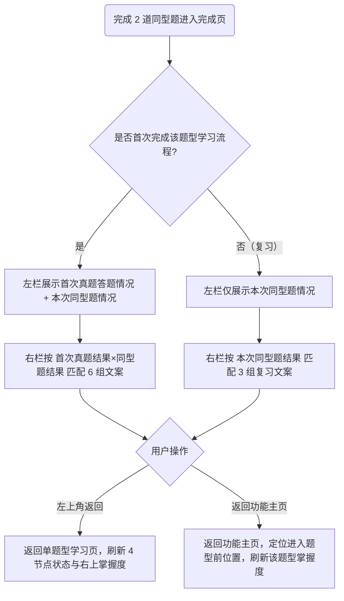

---

### 8.3 完成页示意图

```
【完成页 - 首次完成】750×1334
┌──────────────────────────────┐
│ ←                            │
├───────────────┬──────────────┤
│ 本次学习结果   │ 老师反馈文案   │
│ 题型：求函数值 │ 🎉 恭喜你完成了 │
│ 近三年平均考3次│ 【求函数值】的 │
│ 高考占分5分    │ 学习！这个题型 │
│ 真题：做对 ✓   │ 高考平均占5分… │
│ 同型题：       │              │
│  ① 绿 ② 红     │              │
│               │   [返回功能主页]│
└───────────────┴──────────────┘

【完成页 - 复习完成】750×1334
┌───────────────┬──────────────┐
│ 题型：求函数值 │ 🎉 这次两道同型│
│ 同型题：① 绿②绿│ 题全部答对！… │
│ （不展示历史真题）│   [返回功能主页]│
└───────────────┴──────────────┘

① 左上角 ← 返回 → 单题型学习页（刷新节点状态+右上掌握度）
② [返回功能主页] → 功能主页（定位进入前位置，刷新掌握度）
```

**状态流转：**
① 首次完成态：左栏含真题情况 + 右栏 6 组文案
② 复习完成态：左栏仅本次同型题 + 右栏 3 组复习文案

---

### 8.4 功能点详情

#### 功能点 A：左栏学习结果展示

- **功能描述**：左栏展示当前题型名称、近三年高考平均考察次数、高考平均占分、真题答题情况、同型题答题情况。
- **数据流转**：题型名称取 CB 知识点名称；高考平均占分、近三年高考平均考察次数取该知识点亮点标签的前两个（顺序由录入保证固定：第 1 个=高考占分，第 2 个=考察频次）；真题答题情况取该题型首次真题诊断结果；同型题答题情况取本次同型题提交结果。
- **业务规则与约束**：
  - **在** 用户首次完成该题型学习流程 **下**，系统应展示首次真题答题情况；首次真题结果只记录一次，后续重复进入「做真题」不覆盖。
  - **在** 后续重复学习/复习 **下**，系统应不展示历史真题答题情况，仅展示本次同型题答题情况。
  - 真题答题情况仅展示做对/做错结果。
  - **如果** 题型仅配置 1 道真题，**那么** 完成页应展示该 1 道真题的结果。
  - 同型题答题情况展示题号「1」「2」与作答结果：做对用绿色状态、做错用红色状态；结果项不可点击、不跳转做题详情。

**验收项**

- [ ] **在** 首次完成该题型 **下**，系统应在左栏展示题型名、考察次数、高考占分、首次真题情况、本次同型题情况
  测试数据：首次走完整流程的题型
- [ ] **在** 复习完成 **下**，系统应不展示历史真题情况，仅展示本次同型题情况
  测试数据：已完成过、再次完成同型题
- [ ] **当** 同型题 1 对 1 错 **时**，系统应以绿色展示题1、红色展示题2，且结果项不可点击
  测试数据：同型题 1/2 做对
- [ ] **如果** 题型仅配置 1 道真题，**那么** 完成页应展示该 1 道真题的结果
  测试数据：仅 1 道真题的题型首次完成

#### 功能点 B：右栏老师反馈文案矩阵

- **功能描述**：右栏展示老师反馈文案。首次完成按「首次真题结果 × 同型题结果」匹配 6 组文案；复习完成按「本次同型题结果」匹配 3 组复习文案。
- **业务规则与约束**：
  - 首次真题结果判定：全部真题正确=答对；任意一道提交错误=没答对。
  - 文案变量：【题型】取当前题型名称；【高考平均占分x分】取当前知识点第 1 个亮点标签（高考占分标签，顺序由录入保证）。
  - 首次完成文案矩阵（6 组）：

| 首次真题结果 | 同型题结果 | 展示文案 |
| --- | --- | --- |
| 第一次答对 | 2/2 做对 | 🎉 恭喜你完成了【题型】的学习！这个题型【高考平均占分x分】。  <br/>第一次做题你就拿下了，同型题也全部命中——这个题型你已经掌握得很扎实了。  <br/>继续保持，下一个题型见！💪 |
| 第一次答对 | 1/2 做对 | 🎉 恭喜你完成了【题型】的学习！这个题型【高考平均占分x分】。  <br/>第一次做题就答对了，同型题也拿下一道——稳的。  <br/>偶尔失误很正常，手感已经有了。继续加油，下一个题型见！💪 |
| 第一次答对 | 0/2 做对 | 🎉 恭喜你完成了【题型】的学习！这个题型【高考平均占分x分】。  <br/>第一次做题答对了，但同型题有些卡——说明这个题型还有细节值得再抠一抠，建议回头把讲解再过一遍。  <br/>继续加油，下一个题型见！💪 |
| 第一次没答对 | 2/2 做对 | 🎉 恭喜你完成了【题型】的学习！这个题型【高考平均占分x分】。  <br/>第一次没做出来没关系——看完讲解之后同型题全部拿下，这才是今天最大的收获！  <br/>继续保持，下一个题型见！💪 |
| 第一次没答对 | 1/2 做对 | 🎉 恭喜你完成了【题型】的学习！这个题型【高考平均占分x分】。  <br/>第一次没做出来，但同型题已经拿下一道了——说明你听进去了，再巩固一次就能稳住。  <br/>继续加油，下一个题型见！💪 |
| 第一次没答对 | 0/2 做对 | 🎉 恭喜你完成了【题型】的学习！这个题型【高考平均占分x分】。  <br/>这个题型现在还有点硬——但你完整走完了整个流程，已经比来之前清晰多了。  <br/>建议今天学完之后回来把这个题型再过一遍。继续加油，下一个题型见！💪 |

  - 复习完成文案（3 组）：

| 本次同型题结果 | 展示文案 |
| --- | --- |
| 2/2 做对 | 🎉 这次【题型】的两道同型题全部答对！这个题型【高考平均占分x分】。  <br/>状态很稳，说明你对这个题型的解法已经掌握得很扎实了。  <br/>继续保持，下一个题型见！💪 |
| 1/2 做对 | 🎉 你又完成了一次【题型】的检验！这个题型【高考平均占分x分】。  <br/>这次拿下一道，基本思路还在；把错的那道再复盘一下，细节稳住就更好了。  <br/>继续加油，下一个题型见！💪 |
| 0/2 做对 | 🎉 你完成了【题型】的本次检验。这个题型【高考平均占分x分】。  <br/>这次两道题还没答对，说明这个题型的关键步骤需要重新巩固。建议回看讲解，再来检验一次。  <br/>继续加油，下次把它拿下！💪 |

**验收项**

- [ ] **当** 首次真题答对 + 同型题 2/2 做对 **时**，系统应展示对应的「掌握扎实」首次文案
  测试数据：首次答对 + 2/2
- [ ] **当** 首次真题没答对 + 同型题 0/2 做对 **时**，系统应展示对应的「再过一遍」首次文案
  测试数据：首次没答对 + 0/2
- [ ] **在** 复习完成且同型题 2/2 做对 **下**，系统应展示对应的复习文案
  测试数据：复习 + 2/2
- [ ] **当** 文案含变量 **时**，系统应将【题型】替换为题型名、【高考平均占分x分】替换为知识点第 1 个亮点标签
  测试数据：题型名 + 高考占分标签

#### 功能点 C：掌握程度展示差异

- **业务规则与约束**：
  - **在** 完成页 **下**，系统应展示本次同型题结果对应的本次掌握程度。
  - **在** 功能主页与单题型学习页 **下**，系统应展示该题型历史最佳掌握程度（口径见模块 9）。

**验收项**

- [ ] **当** 本次同型题 0/2 但历史最佳为完全掌握 **时**，完成页应展示本次（未掌握），功能主页应展示历史最佳（完全掌握）
  测试数据：历史完全掌握后复习 0/2

#### 功能点 D：两个返回出口与状态刷新

- **交互逻辑**：
  - **当** 用户点击左上角返回 **时**，系统应返回单题型学习页，并刷新 4 个节点状态与右上角掌握度。
  - **当** 用户点击右下角「返回功能主页」**时**，系统应返回功能主页，定位到用户进入该题型前所在的位置，并刷新该题型掌握度为最新历史最佳掌握程度。
- **业务规则与约束**：用户完成 2 道同型题后，功能主页与单题型学习页均应展示最新历史最佳掌握程度，不得出现完成后返回仍展示旧掌握程度的情况（写入时机由技术方案确定）。

**验收项**

- [ ] **当** 用户点击左上角返回 **时**，系统应回到单题型学习页并刷新节点状态与右上掌握度
  测试数据：完成页点左上角返回
- [ ] **当** 用户点击「返回功能主页」**时**，系统应回到功能主页进入前位置且该题型掌握度为最新历史最佳
  测试数据：完成页点返回功能主页
- [ ] **如果** 完成后返回相关页面仍展示旧掌握程度，**那么** 视为缺陷
  测试数据：完成 2/2 后立即返回功能主页检查掌握度
## 模块 9：学习进度与掌握程度（跨页面状态）

### 9.1 功能简述

本模块定义贯穿各页面的两类学习状态：学习进度（表达流程走到哪一步）与掌握程度（表达学得好不好），包括进度计算与取历史最高、掌握度判定与历史最佳、重学不回退等规则。本模块为跨页面状态规则，被功能主页、单题型学习页、各做题/视频页与完成页共同消费。

---

### 9.2 状态流转

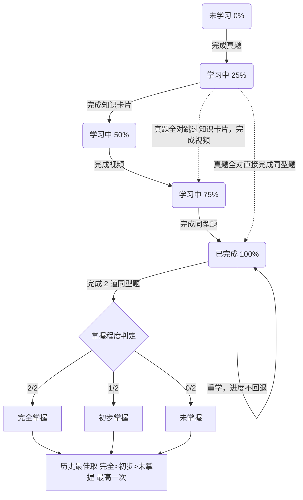

---

### 9.3 状态取值示意

```
【学习进度取值】
0%   未学习   ──  进度条空
25%  完成真题
50%  完成知识卡片
75%  完成视频
100% 完成同型题 ── 进度条满格 + 独立掌握程度标签

【掌握程度（仅按同型题 2 道结果）】
2/2 做对 → 完全掌握
1/2 做对 → 初步掌握
0/2 做对 → 未掌握
历史最佳：完全掌握 > 初步掌握 > 未掌握（取最高一次）

【展示位置】
功能主页题型卡：始终进度条；100% 时额外展示掌握程度标签（历史最佳）
单题型学习页：右上角掌握程度浮层（历史最佳）
完成页：本次掌握程度（本次同型题结果）
```

---

### 9.4 功能点详情

#### 功能点 A：学习进度计算

- **功能描述**：学习进度只表达用户在当前题型学习流程中走到了哪一步，不表达作答对错与掌握好坏。
- **业务规则与约束**：
  - 进度按已完成节点位置计算：未开始=0%；完成真题=25%；完成知识卡片=50%；完成视频=75%；完成同型题=100%。
  - **在** 真题全对跳过知识卡片并完成视频 **下**，进度直接为 75%；**在** 真题全对直接完成同型题 **下**，进度直接为 100%；可选节点被跳过时，后续节点完成后按后续节点对应进度更新。
  - **在** 节点进行中（未完成）**下**，该题型学习进度停留在上一个已完成节点；如视频播放到一半进度仍停留上一节点，播放完成后更新为 75%。
- **数据流转**：进度按题型维度记录，取该题型历史最高，重复进入或重学过程中不回退（如已达 100% 的题型再次进入做真题，进度仍保持 100%）。

**验收项**

- [ ] **当** 用户完成真题但未做其他节点 **时**，系统应展示进度 25%
  测试数据：仅完成真题诊断
- [ ] **在** 真题全对跳过知识卡片并完成视频 **下**，系统应展示进度 75%
  测试数据：全对→看视频→视频完成
- [ ] **当** 已达 100% 的题型再次进入做真题 **时**，系统应保持进度 100% 不回退
  测试数据：已完成题型重学
- [ ] **在** 视频播放到一半未完成 **下**，系统应使进度停留在上一已完成节点
  测试数据：视频播放中查看进度

#### 功能点 B：学习状态映射

- **业务规则与约束**：**在** 进度为 0% **下**为未学习；**在** 进度 25%-75% **下**为学习中；**在** 完成同型题、进度达 100% **下**为已完成。学习状态用于业务判断，题型卡片不展示「学习中」标签。

**验收项**

- [ ] **当** 题型进度为 0% **时**，系统应判定为未学习
  测试数据：未开始的题型
- [ ] **当** 题型进度为 50% **时**，系统应判定为学习中
  测试数据：完成真题+知识卡片
- [ ] **当** 题型进度为 100% **时**，系统应判定为已完成
  测试数据：完成同型题

#### 功能点 C：掌握程度判定与生成时机

- **功能描述**：掌握程度仅以同型题 2 道结果为准，与真题作答无关。
- **业务规则与约束**：
  - 2/2 做对=完全掌握；1/2 做对=初步掌握；0/2 做对=未掌握。
  - **在** 仅完成 2 道同型题后 **下**，系统才生成本次掌握程度；真题、知识卡片、视频环节均不生成掌握程度。
  - **在** 题型图谱页学习进度达 100% **下**，系统才在进度条之外独立展示掌握程度标签。

**验收项**

- [ ] **当** 同型题 2/2 做对 **时**，系统应判定本次掌握程度为完全掌握
  测试数据：同型题全对
- [ ] **在** 题型未完成同型题 **下**，系统应不生成掌握程度、题型卡不展示掌握程度标签
  测试数据：进度 ≤ 75% 的题型

#### 功能点 D：历史最佳掌握程度

- **功能描述**：功能主页与单题型学习页展示该题型历史最佳掌握程度，完成页展示本次掌握程度。
- **业务规则与约束**：
  - 历史最佳按「完全掌握 > 初步掌握 > 未掌握」的优先级取最高一次结果。
  - **当** 用户完成 2 道同型题后 **时**，系统应将功能主页与单题型学习页刷新为最新历史最佳掌握程度，不得出现完成后返回仍展示旧值的情况（写入时机由技术方案确定）。

**验收项**

- [ ] **当** 用户首次 2/2 后又复习得 0/2 **时**，系统应在功能主页与单题型学习页展示历史最佳（完全掌握）
  测试数据：先 2/2 后 0/2
- [ ] **当** 用户首次 1/2 后复习得 2/2 **时**，系统应将历史最佳更新为完全掌握
  测试数据：先 1/2 后 2/2

#### 功能点 E：重复学习

- **业务规则与约束**：
  - 任意已解锁节点均可重新进入学习；已完成题型再次进入仍按 4 节点解锁规则进入对应节点。
  - 重学路径：补知识完成进入视频，视频完成自动进入同型题，只有完成同型题后才生成本次完成页。
  - 真题结果只取首次诊断结果，不因后续重做而覆盖。

**验收项**

- [ ] **当** 已完成题型重新进入并再次完成同型题 **时**，系统应生成本次完成页并按历史最佳更新掌握度
  测试数据：已完成题型重学一遍
- [ ] **当** 用户重做真题 **时**，系统应不覆盖该题型首次真题诊断结果
  测试数据：首次答对后重做答错
## 模块 10：新手引导

### 10.1 功能简述

本模块提供首次进入引导能力：因本专项的学习理念（"做对同型题才算掌握、做错是帮你找漏洞"）与端内常规做题不同，需在最关键的两处（题型图谱页、单题型学习页）做轻量引导，帮助用户第一次接触时理解玩法；其余页面自解释，不再单独引导。

---

### 10.2 交互流程

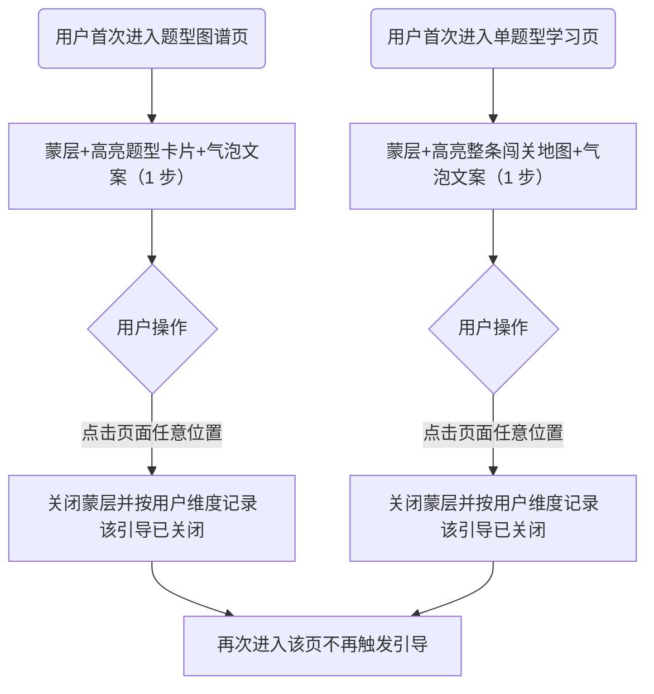

---

### 10.3 新手引导示意图

```
【题型图谱页引导 - 1 步】750×1334
┌──────────────────────────────┐
│░░░░░░░░░░░░░░░░░░░░░░░░░░░░░░░│（蒙层）
│  ┌──────────────┐            │
│  │ 题型卡片(高亮) │            │
│  └──────────────┘            │
│  💬 这里每张卡片都是一道高考高频 │
│     题型～做对同型题才算"拿下"！ │
└──────────────────────────────┘

【单题型学习页引导 - 1 步】750×1334
┌──────────────────────────────┐
│░░░░░░░░░░░░░░░░░░░░░░░░░░░░░░░│（蒙层）
│  [做真题][补知识][看讲解][做同型题]│（整条高亮）
│  💬 四步闯关：做真题→补知识→看讲 │
│     解→做同型题。做错是帮你找漏洞│
│     ～把同型题做对就拿下啦！     │
└──────────────────────────────┘

① 点击页面任意位置 → 关闭蒙层并按用户维度记录已关闭 → 再次进入不再触发
（具体视觉样式与蒙层交互以后续 UED 新手引导设计稿为准）
```

**状态流转：**
① 首次进入对应页 → 展示引导 → 点击页面任意位置关闭 → 记录已关闭 → 后续不再触发

---

### 10.4 功能点详情

#### 功能点 A：触发与频次

- **功能描述**：用户首次进入对应页面时自动出现引导；引导只展示一句气泡文案，不提供「跳过」「完成」「我知道了」等按钮。用户点击页面任意位置后关闭蒙层，并按用户维度记录为已关闭状态。全流程仅 2 处引导：题型图谱页 1 步、单题型学习页 1 步。
- **UI 设计意图**：采用蒙层 + 高亮目标元素 + 一句气泡文案的轻提示形式，克制不打断；其余页面（知识卡片/视频/同型题/完成页等）自解释，不再单独引导。
- **业务规则与约束**：
  - **当** 用户首次进入题型图谱页或单题型学习页 **时**，系统应自动展示对应引导。
  - **当** 引导蒙层展示后用户点击页面任意位置 **时**，系统应关闭蒙层，并按用户维度记录该引导已关闭，后续进入不再触发。
  - 引导不提供独立按钮；具体视觉样式与蒙层交互以后续 UED 新手引导设计稿为准。

**验收项**

- [ ] **当** 用户首次进入题型图谱页 **时**，系统应自动展示题型图谱页引导
  测试数据：从未触发过引导的账号
- [ ] **当** 用户点击页面任意位置关闭单题型学习页引导后再次进入 **时**，系统应不再触发该引导
  测试数据：已关闭引导的账号再次进入
- [ ] **当** 新手引导展示 **时**，系统应不展示「跳过」「完成」「我知道了」等操作按钮
  测试数据：首次进入题型图谱页 / 单题型学习页
- [ ] **在** 知识卡片/视频/同型题/完成页 **下**，系统应不展示独立新手引导
  测试数据：进入这些页面观察

#### 功能点 B：引导内容

- **功能描述**：
  - 引导一（题型图谱页，高亮题型卡片）：传达"每张卡片是一道高考高频题型，进度与掌握程度随学习更新，做对同型题才算拿下"。
  - 引导二（单题型学习页，高亮整条 4 节点闯关地图）：一次讲清流程与核心理念"做真题→补知识→看讲解→做同型题，做错是帮你找漏洞，把同型题做对就拿下"。
- **业务规则与约束**：引导文案为示意，最终文案可由 PM 微调；引导二已合并原"做真题=找漏洞"的单独引导。

**验收项**

- [ ] **当** 题型图谱页引导展示 **时**，系统应高亮题型卡片并展示对应理念文案
  测试数据：题型图谱页首次引导
- [ ] **当** 单题型学习页引导展示 **时**，系统应高亮整条 4 节点闯关地图并一次讲清流程与理念
  测试数据：单题型学习页首次引导
## 响应式适配

> 本章节为所有涉及前端页面项目的固定标准部分，不属于业务功能模块，不计入模块编号。
> **本专项特殊约束**：PRD V1.6 明确"页面布局以横屏为主，竖屏响应式适配以后续 UED 设计稿为准，PRD 不展开单独竖屏布局规则"。因此本章节只声明断点体系与本专项的适配原则，**不臆造各断点的具体竖屏布局**；最终竖屏适配以 UED 设计稿为准，届时回写本章节。

### 适配断点定义

| 断点名 | 条件 | 典型设备 |
|--------|------|----------|
| 默认 | — | 750×1334 iPhone7 竖屏 |
| 小屏 | width ≤ 374px | 小屏手机 |
| 宽屏竖屏（高） | width ≥ 640px & height ≥ 640px | 1280×2048 MatePad11 竖屏 |
| 宽屏竖屏 | width ≥ 640px | — |
| 平板竖屏 | width ≥ 768px | 1536×2048 iPad 竖屏 |
| 大屏竖屏 | width ≥ 1024px | — |
| 横屏 | landscape & height < 639px | 1334×750 iPhone7 横屏 |

### 关键布局变化说明

> 本专项当前以横屏布局为主交付（各模块示意图为表达交互而用竖屏 750×1334 绘制，最终适配以 UED 横屏/竖屏设计稿为准）。以下仅列出已知、需特别关注的布局意图，具体断点数值与栅格以 UED 稿落地。

**横屏（主交付形态）**

- 功能主页：左侧小节目录 + 右侧当前章滚动内容的双栏结构在横屏下并列展示（对应模块 2 示意图的左右分栏）。
- 单题型学习页：4 节点横向闯关地图在横屏下一行平铺展示（对应模块 3）。
- 完成页：左右两栏（本次学习结果 / 老师反馈文案）在横屏下并列展示（对应模块 8）。
- 知识卡片页：上方大图 + 下方缩略图条横向排列（对应模块 5）。

**竖屏及其他断点（待 UED 稿）**

- 功能主页双栏、单题型学习页 4 节点横排、完成页左右两栏在窄屏/竖屏下的折叠或堆叠方式，统一以 UED 设计稿为准。
- 真题检测页、同型题检验页、视频播放器页均复用端内做题组件/通用播放器，其响应式行为沿用端内组件既有适配，不在本专项单独定义。

### 响应式适配示意图

> 本专项竖屏布局以 UED 稿为准，暂不绘制臆造的断点线框图。横屏主形态布局参见各模块 N.3 示意图所表达的分栏/横排结构。UED 设计稿产出后，在此补充关键断点（如默认竖屏 750×1334 与横屏 1334×750）的对比线框图。

### 响应式验收项

- [ ] **在** 横屏（主交付形态）**下**，功能主页应呈左侧目录 + 右侧内容双栏、单题型学习页应呈 4 节点横排、完成页应呈左右两栏
  测试数据：横屏设备访问对应页面
- [ ] **当** UED 竖屏/各断点设计稿产出后 **时**，各自研页面（功能主页、单题型学习页、知识卡片页、完成页）应按 UED 稿适配对应断点
  测试数据：UED 稿覆盖的断点设备
- [ ] **在** 真题检测页 / 同型题检验页 / 视频播放器页 **下**，系统应沿用端内做题组件 / 通用播放器的既有响应式适配
  测试数据：不同尺寸设备访问做题页与播放器
- [ ] **如果** 屏幕尺寸在两个断点之间，**那么** 系统应按较小断点的布局规则渲染
  测试数据：介于两个断点之间的尺寸
