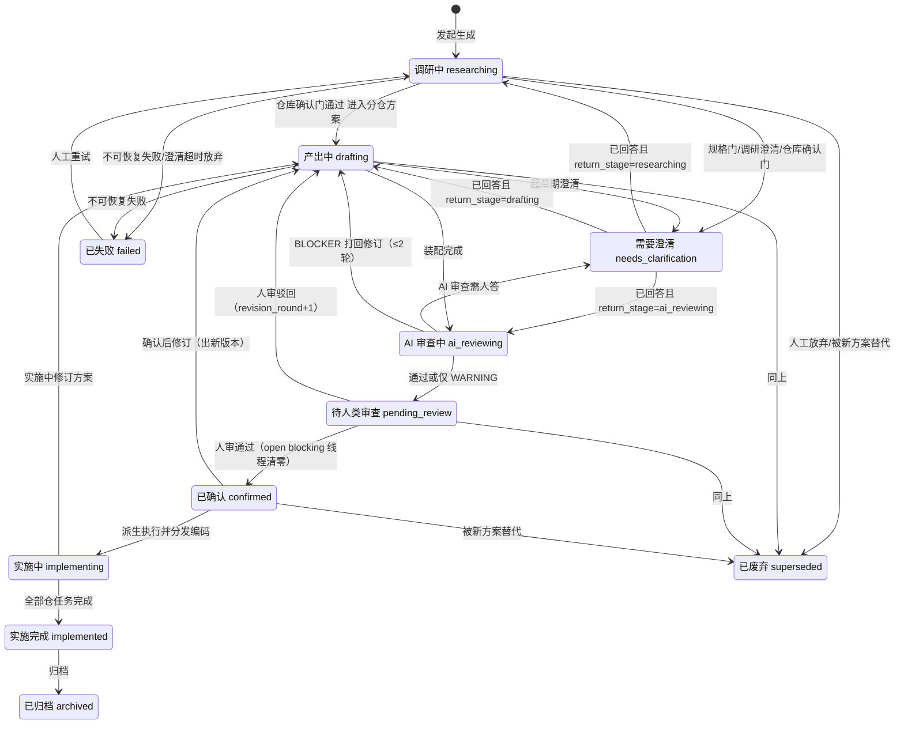
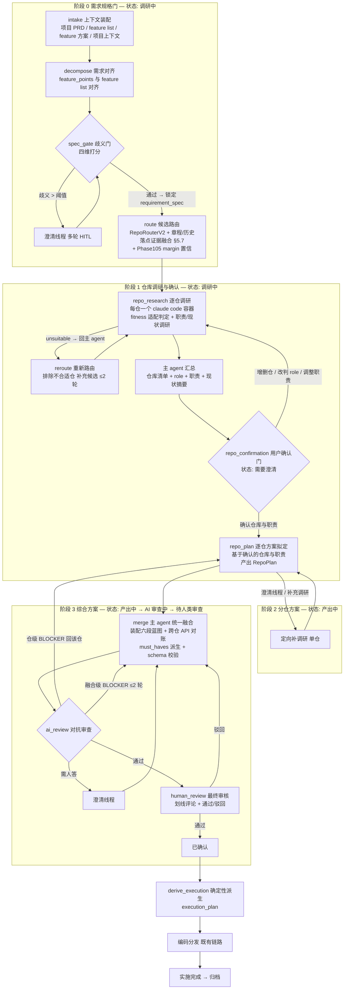
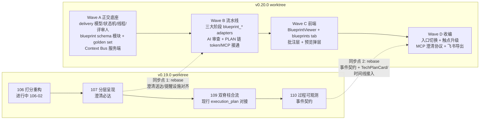

# 技术方案蓝图（Technical Blueprint）设计

**Status:** DRAFT — 待评审
**Created:** 2026-07-29
**Scope:** 重新设计「技术方案」产物与生成流程：从单轮 §7 MergedPlan 升级为多阶段、结构化、可澄清、可追溯的技术方案蓝图（human-readable + AI-executable）
**关联规划:** v0.19.0 技术方案可信度（Phases 105–110，见 `.planning/ROADMAP.md`）；本设计吸收 Phase 108（方案深度）并扩展 Phase 109/110 的产物面
**现状调研来源:** `server/services/process_runtime/`、`server/delivery/models/`、`server/codegraph/services/repo_router_v2.py`、`web/src/pages/knowledge/`、`.claude/gsd-core/`

---

## 0. 一句话定位

> 技术方案蓝图 = **一个项目一份**的结构化技术方案文档：六段固定骨架、每条结论带引用证据；由需求规格门 + **三大编排阶段**（仓库调研与用户确认 → 分仓方案 → 综合方案融合）+ 双重审查（AI 对抗审查 + 人类划线审查）产出；具备**完整生命周期状态机**与**飞书文档式划线澄清**；人类可直接读，AI 可基于它完备编码。

---

## 1. 问题与目标

### 1.1 现状（实证）

当前 `technical_plan` 编排：`decompose → route → recall → classify → clarify → research → merge`（`server/services/process_runtime/builtin_processes.py`），产物为 §7 MergedPlan JSON（`title / summary / api_contracts / dependency_dag / data_migrations / compat_risks / release_order / rollback_plan / execution_plan`），落 `delivery.Artifact(artifact_type=technical_plan)`。

### 1.2 差距表

| # | 用户诉求 | 现状 | 差距 |
|---|---------|------|------|
| 1 | 仓库关联分「直接/间接」，带选仓理由与约束引用 | 路由只有 high/medium/low 置信度 + `routed_reason`；无 direct/indirect 语义 | 缺角色语义、缺结构化 rationale、缺证据引用 |
| 2 | 固定六段结构化骨架 | §7 字段偏执行视角（release_order/rollback），缺现状分析、实现概述（新建/改动/删除/间接完善）、影响范围、交互流程 | schema 需重设计 |
| 3 | 实现概述多轮、多 subagent、跨周期打磨 | merge 单轮融合，`MAX_MERGE_RETRIES=1`，无对抗审查 | 缺仓库确认门、分仓方案拟定、AI 审查、有界修订循环 |
| 4 | 每处可「待澄清」、多轮、飞书划线评论式 | `delivery.Clarification` 是阶段级多题问卷，不锚定文本；MCP 链路 `skip_clarification=True` | 缺 span 锚定线程模型、缺全入口 HITL |
| 5 | 生命周期状态（调研中→…→已归档） | `ArtifactStatus`（draft/under_review/approved/superseded/archived）+ `ConvergenceSessionStatus`（running/waiting_*/done/failed）两轴分离，无用户可读的统一状态 | 缺统一状态机与转移守卫 |
| 6 | 前端结构化查看器 + 引用预览 + 知识库 tab + 项目关联 + 方案互引 | 前端全部 markdown/`<pre>` 渲染；知识库无技术方案 tab；无划线评论组件先例 | 前端从零建查看器与批注层 |
| 7 | 人类可读 + AI 可依此完备编码 | markdown 渲染给人、execution_plan 给编码，两者来自同一次单轮融合，质量不稳 | 蓝图为唯一事实源，执行段确定性派生 |

### 1.3 设计目标

1. **结构强制**：六段骨架 + 需求规格 + 验收锚点（must_haves）由 schema 强制，AI 无法「漏写某段」。
2. **证据强制**：现状分析、选仓理由、能力引用等关键结论必须携带 citations（可打开预览的知识/代码引用），审查阶段做引用覆盖检查——低幻觉的机械保障。
3. **过程长程**：阶段化推进、产物落库、fresh-context 子代理、有界修订循环，支持跨天、多轮、随时挂起恢复。
4. **澄清一等公民**：从需求规格门到人审，任何阶段都能对文档任意位置发起划线澄清，多轮追问，答案回灌产生新版本。
5. **下游兼容**：`execution_plan` 从蓝图确定性派生，`ai_coding_dispatcher` / `repository_tasks` 矩阵 / MCP 执行链零回归。

---

## 2. 核心理念：GSD 机制映射

GSD 能长程、低幻觉、干净上下文的根因不是更大的 prompt，而是一组工程机制。逐条映射到本设计：

| GSD 机制 | GSD 实现 | 蓝图流水线对应 |
|----------|----------|----------------|
| What/How 两段门 | SPEC.md（锁 WHAT）→ CONTEXT.md（锁 HOW） | `requirement_spec` 段先锁定（需求规格门），后续阶段禁止扩 scope；scope 外想法进 `deferred_ideas` |
| 歧义量化门控 | ambiguity ≤ 0.20 才写 SPEC | 规格门给需求打歧义分（goal/boundary/constraint/acceptance 四维），超阈值必须澄清后才进入调研 |
| 产物落盘 + orchestrator 只路由 | subagent 读写 `*.md`，orchestrator 只看 frontmatter | 阶段产物全部落 `delivery` 表（RepoResearchTask / RepoPlan / ReviewReport），`ProcessEngine` 的 `stage_state` 只存 id 引用与小摘要，绝不内联正文 |
| 传路径不传正文 | `<files_to_read>` 列磁盘路径 | 子代理 prompt 传 artifact/record id，容器内经知识 MCP / DB API 自取 |
| goal-backward + must_haves | truths / artifacts / key_links 写入 PLAN frontmatter | 蓝图 `must_haves` 段由规格派生；AI 审查按「目标为真需要什么」逆向核对，而非「章节写齐没有」 |
| 执行前 plan-checker（对抗式、有界） | 独立审查 agent，BLOCKER/WARNING，≤3 轮修订 | `ai_review` 阶段独立审查代理，产出结构化 findings，≤2 轮按归因打回分仓方案/融合，之后升级人审 |
| Gray areas + adaptive questioning | 只问改变实现的具体灰区，选项带先例注解 | 澄清线程必须带候选选项与证据引用（对齐 DEPTH-05）；已锁定决策不再重复问 |
| STATE digest + SUMMARY 依赖图 | STATE.md <100 行，SUMMARY frontmatter requires/provides | `ConvergenceSession.stage_state` 保持 digest 尺寸；分节草稿声明 `depends_on`，装配阶段按依赖合并 |
| Wave 并行 | plan 声明 wave/depends_on/files_modified | 阶段 1 调研按仓 fan-out 并行；阶段 2 分仓方案按仓并行；阶段 3 主 agent 融合内部可分节多调用 |

---

## 3. 产物 Schema：TechnicalBlueprint v1

### 3.1 载体决策

- **沿用** `delivery.Artifact(artifact_type=technical_plan)` + `ArtifactVersion.content`（JSON），content 增加判别字段 `schema_version: "blueprint/v1"`（旧 MergedPlan 视为隐式 v0）。不新增 artifact_type，前后端按 `schema_version` 分支渲染，旧数据零迁移。
- 蓝图是**唯一事实源**；markdown（给人看/飞书导出）与 `execution_plan`（给编码）都是**确定性派生物**，杜绝双轨。

### 3.2 基元：Block 与 Citation

所有叙述性内容统一为 block 序列——这是划线澄清（锚定）、人工编辑（patch）、版本 diff 的共同地基：

```jsonc
// Block：最小可锚定/可编辑单元
{
  "block_id": "blk_01JC5X…",        // ULID，版本间稳定：编辑保留、新增才生成
  "type": "paragraph | pseudocode | table | list | mermaid",
  "text": "……",                      // paragraph / list（list 时为 items[]）
  "code": { "language": "python", "source": "…" },   // pseudocode 专用
  "rows": [["…"]],                   // table 专用
  "citations": ["cit_a1", "cit_b2"]  // 本块结论依据的引用
}

// Citation：文档级去重存放，块内只存 id
{
  "citation_id": "cit_a1",
  "source_type": "knowledge_entity | rag_chunk | repo_file | artifact_version | blueprint | repo_charter | work_item | feishu_doc | url",
  "source_id": "…",                  // 对应实体主键 / chunk id / URL
  "locator": { "file_path": "…", "line_start": 10, "line_end": 42 },  // 或 heading / chunk 定位
  "quote": "被引用的关键原文摘录",
  "title": "展示用标题快照"
}
```

### 3.3 文档骨架（顶层）

```jsonc
{
  "schema_version": "blueprint/v1",
  "meta": { /* §3.4 */ },
  "requirement_spec": { /* §3.5 需求规格（锁 WHAT）*/ },
  "repo_associations": [ /* §3.6 六段之1：仓库关联 */ ],
  "current_state_analysis": [ /* §3.7 六段之2：现状分析 */ ],
  "implementation_overview": { /* §3.8 六段之3：实现概述 */ },
  "api_contracts": [ /* §3.9 六段之4：API */ ],
  "impact_analysis": { /* §3.10 六段之5：影响范围 */ },
  "interaction_flows": [ /* §3.11 六段之6：业务与接口交互流程 */ ],
  "must_haves": { /* §3.12 goal-backward 验收锚点 */ },
  "decision_log": [ /* §3.13 澄清决策记录（已解决线程物化）*/ ],
  "deferred_ideas": [ /* scope 外想法，防扩 scope */ ],
  "execution_plan": [ /* §3.14 派生段：兼容下游编码 */ ],
  "citations": { "cit_a1": { … } }   // 文档级引用池
}
```

### 3.4 meta

| 字段 | 类型 | 说明 |
|------|------|------|
| `title` / `summary` | string / Block[] | 标题与执行摘要 |
| `project_id` / `space_id` | uuid | **必填**：蓝图挂在项目下，**一个项目一份活跃蓝图**（多版本演进；被新蓝图取代走 superseded） |
| `requirement_refs` | ref[] | 需求来源：项目 PRD / feature list / 既有 feature 方案（FeatureSolution 工件）/ 相关 work item |
| `language` | string | 文档语言，默认 zh-CN |
| `revision_round` | int | 修订轮次（AI 审查打回 / 人审驳回 +1） |

**粒度澄清**：蓝图是**项目级主方案**，统摄整个项目的跨仓实现全貌，不按 work item 划分。feature 级方案（既有 `FeatureSolution` 链路）继续存在，作为蓝图的输入与引用；work item 按 feature list 拆分（既有链路）发生在蓝图确认之后。`requirement_spec.feature_points` 与 feature list 条目一一对齐，形成「项目蓝图 → feature 方案 → work item」三层结构。

### 3.5 requirement_spec（需求规格，锁 WHAT）

对应 GSD SPEC.md。规格门通过后**锁定**，后续阶段只可引用不可扩展：

```jsonc
{
  "goal": Block[],                       // 一段话可证伪目标
  "background": Block[],
  "feature_points": [{
    "id": "fp_01", "title": "…", "description": Block[],
    "source_ref": "requirement_refs 内的来源",       // feature list 条目 / feature 方案 / PRD 章节
    "acceptance_criteria": ["可机械验证的验收句"],
    "test_cases": [{ "name": "…", "given_when_then": "…" }]
  }],
  "boundaries": { "in_scope": ["…"], "out_of_scope": ["…"] },
  "constraints": [{ "id": "c_01", "text": "…", "kind": "tech|security|compat|convention", "citations": [] }],
  "ambiguity_report": {
    "score": 0.12,                       // 规格门放行时的终值（阈值见 §5.3）
    "dimensions": { "goal": 0.1, "boundary": 0.15, "constraint": 0.1, "acceptance": 0.12 },
    "resolved_thread_ids": ["thr_…"]     // 由哪些澄清线程收敛而来
  }
}
```

### 3.6 六段之 1：repo_associations（仓库关联）

**核心新增语义：`role: direct | indirect`。** direct = 本方案要在其中编码改动的仓库；indirect = 需调研理解、其能力被依赖/使用但本方案不改动（或仅需其配合支持）的仓库。

```jsonc
{
  "repository_id": "…", "repository_name": "onion-practice",
  "role": "direct",                          // direct | indirect
  "rationale": {
    "text": Block[],                         // 为什么选它：参考了什么、符合哪些原则
    "constraint_refs": ["c_01"],             // 关联到 requirement_spec.constraints
    "citations": ["cit_…"]                   // 活跃度数据、既有相似功能代码、规范文档等证据
  },
  "responsibility": Block[],                 // 本仓在方案中的职责（阶段 1 确认门锁定）
  "fitness": {                               // 阶段 1 逐仓调研的适配判定快照
    "verdict": "suitable | partial | unsuitable",
    "reasons": Block[], "citations": ["cit_…"]
  },
  "planned_change_summary": Block[],         // direct 专属：本仓要做什么改动（细节在实现概述）
  "capabilities_used": [{                    // indirect 专属：会被用到的能力
    "name": "题目渲染引擎", "location": "src/render/…",
    "how_used": "习题页复用其 schema 渲染", "citations": ["cit_…"]
  }],
  "routing_evidence": {                      // 承接路由层输出（Phase 105/107 产物）
    "score": 0.83, "confidence": "high", "score_breakdown_ref": "session_event_id",
    "group": "project | global", "cross_team": false
  },
  "decided_by": "ai | human",                // 角色判定是 AI 提议还是人工确认/改判
  "confirmed_at_gate": true,                 // 是否经阶段 1 用户确认门锁定
  "support_needed": Block[]                  // 需要该仓团队配合的事项（如 indirect 仓需新增接口）
}
```

与既有模型的关系：`initiatives.RepoAssociation`（项目↔仓库，propose→confirm→verify）仍是**项目级**关联唯一真相源，为路由提供「本项目关联仓」候选组；蓝图内的 `repo_associations` 是**方案级**快照与角色判定，确认后可回写项目级关联（新仓 propose）。确认门锁定的 `responsibility` 与「移除仓」动作同时回灌**仓库级章程**（`RepoCharter`，§5.7）：方案级职责聚合沉淀为 `owned_domains`、移除动作沉淀为 `boundaries` 候选（AI 草案 + 人工 confirm）。

### 3.7 六段之 2：current_state_analysis（现状分析）

按仓组织，每条 finding 必须带引用（审查阶段机械检查）：

```jsonc
{
  "repository_id": "…",
  "summary": Block[],                        // 该仓与本需求相关的现状综述
  "findings": [{
    "id": "cs_01", "topic": "xxx 能力现状",
    "text": Block[],                         // 「经调研，该仓已有 X 能力，实现于 Y，
                                             //   对我们 Z 功能点需要 W 改造」
    "kind": "capability | gap | risk | convention",
    "related_feature_points": ["fp_01"],     // 与哪些功能点相关
    "citations": ["cit_…"]                   // 必填：代码文件/知识条目证据
  }]
}
```

### 3.8 六段之 3：implementation_overview（实现概述，核心段）

三层结构：需求级叙事 → 模块 → 实现项。实现项带 `change_type` 四分类与依赖/波次：

```jsonc
{
  "requirement_narrative": Block[],          // 完整需求「如何实现」的总叙事
  "modules": [{                              // 功能模块层
    "id": "mod_01", "name": "习题生成模块",
    "feature_point_ids": ["fp_01", "fp_02"],
    "repository_ids": ["…"],                 // DEPTH-02：功能↔模块↔仓库映射
    "narrative": Block[]                     // 模块级「如何实现」
  }],
  "items": [{                                // 功能点实现项（最细粒度）
    "id": "impl_01",
    "feature_point_id": "fp_01", "module_id": "mod_01",
    "repository_id": "…",
    "change_type": "create | modify | remove | indirect_refine",   // 新建/改动/删除/间接完善
    "title": "…",
    "how": Block[],                          // 具体怎么做，可含 pseudocode block
    "existing_integration": Block[],         // DEPTH-03：改造项与既有功能如何配合
    "files_touched": [{ "path": "…", "action": "create|modify|remove", "note": "…" }],
    "depends_on": ["impl_00"], "wave": 1,    // 实现顺序依赖（供派生 execution_plan）
    "test_strategy": Block[],                // 结合规格里的 test_cases
    "citations": ["cit_…"]
  }]
}
```

### 3.9 六段之 4：api_contracts（API）

覆盖「提供的接口」与「消费的接口 + 数据从哪来、有没有」：

```jsonc
{
  "id": "api_01", "name": "生成习题", "kind": "http | rpc | event | mq",
  "direction": "provided | consumed",        // 本方案新提供 vs 需要调用别人
  "repository_id": "…",
  "method": "POST", "path": "/api/practice/generate",
  "description": Block[],
  "request_example": { … }, "response_example": { … },
  "request_schema": { … }, "response_schema": { … },   // 可选 jsonschema
  "data_source": {                           // consumed 专属：数据来源说明
    "from_service": "study-course",
    "from_api": "GET /api/course/chapters",
    "fields_needed": ["chapter_id", "knowledge_points"],
    "availability": "existing | needs_support",         // 已有 or 需对方支持产出
    "support_repository_id": "…",            // needs_support 时：哪个仓要配合
    "notes": Block[]
  },
  "consumers": ["mod_01"],                   // 哪些模块消费
  "citations": ["cit_…"]
}
```

### 3.10 六段之 5：impact_analysis（影响范围）

业务语言优先（给人看的自然语言），代码维度佐证：

```jsonc
{
  "business_impact": Block[],                // 对现有业务正常造成什么影响（自然语言）
  "affected_features": [{
    "feature": "已有的错题本功能", "repository_ids": ["…"],
    "kind": "behavior_change | perf | compat | data | none",
    "description": Block[], "citations": ["cit_…"]
  }],
  "regression_scope": [{                     // 需要测试回归到什么程度
    "area": "习题提交链路", "level": "full | smoke | none", "reason": "…"
  }],
  "compat_risks": Block[],                   // 承接原 §7 字段
  "data_migrations": [{ "description": "…", "reversible": true }],
  "rollback_plan": Block[]
}
```

### 3.11 六段之 6：interaction_flows（业务与接口交互流程）

对齐 DEPTH-01：在哪个页面、经哪个接口、传什么参数、数据流向哪里、有哪几条行为路径：

```jsonc
{
  "id": "flow_01", "name": "用户生成习题主路径",
  "trigger": "用户在 xxx 页面点击「开始生成」",
  "steps": [{
    "seq": 1, "actor": "frontend | backend | service:study-course | user",
    "action": "调用生成接口", "component": "PracticePage.vue",
    "api_ref": "api_01",                     // 引用 api_contracts
    "data_in": "chapter_id, difficulty", "data_out": "practice_id",
    "note": Block[]
  }],
  "alternative_paths": [{ "condition": "生成超时", "steps": [ … ] }],
  "mermaid": "sequenceDiagram…",             // 由 steps 确定性生成，前端渲染
  "citations": ["cit_…"]
}
```

### 3.12 must_haves（goal-backward 验收锚点）

由规格派生、供 AI 审查与实施后验证使用（GSD must_haves 的方案版）：

```jsonc
{
  "truths": ["用户在 xxx 页面点击生成后 3s 内看到首批习题"],   // 可观察行为
  "artifacts": [{ "path": "onion-practice/src/generate/…", "provides": "生成入口" }],
  "key_links": [{ "from": "PracticePage.vue", "to": "POST /api/practice/generate", "via": "api_01" }]
}
```

### 3.13 decision_log（决策记录）

已解决澄清线程的物化（GSD CONTEXT.md 的 Decisions 等价物）——线程本体存独立表（§6），这里只存结论快照，保证「文档自包含、导出不丢决策」：

```jsonc
{ "thread_id": "thr_…", "question": "…", "decision": "…", "decided_by": "human:zane", "applied_in_version": 4 }
```

### 3.14 execution_plan（派生段，下游兼容）

从 `implementation_overview.items` 按仓聚合 + `depends_on/wave` 拓扑排序，**确定性派生**（无 LLM 参与），沿用 `server/workflows/schemas/technical_plan.py` 既有 schema（`id/name/repository_id/branch_strategy/coding_instruction/files/dependencies/…`）。`coding_instruction` 由实现项的 `how`（含 pseudocode）+ 相关规格/现状分析引用拼装。保证 `ai_coding_dispatcher`、`repository_tasks` 矩阵、MCP 执行链零改动可消费（对齐 SPINE-01、Phase 109 幂等投影）。

---

## 4. 生命周期状态机

### 4.1 对你提出的九状态的评估

**结论：骨架合理、方向正确，覆盖了主干生命周期；建议补 2 个终态、明确 1 个语义、定义清楚转移规则后即可落地。**

1. **补「已失败 failed」**：生成不可恢复失败（模型/容器故障、重试耗尽、澄清超时放弃）需要终态，否则失败方案永远停在「产出中」骗人——这正是 v0.19.0 RELY-02「超时/失败有明确出口」的要求。可从 failed 重试回到调研中。
2. **补「已废弃 superseded」**：被新方案取代、或中途人工放弃。与「已归档」语义不同：归档是**完成后的冷藏**（实施完成→归档），废弃是**中途终止或被替代**。`ArtifactStatus` 已有 `superseded` 可直接对齐。
3. **明确「需要澄清」是叠加态**：它可以从调研中/产出中/AI 审查中/待人类审查任何一个状态进入，解决后要**回到原状态**继续。实现上是「主状态 + blocking 澄清存在」的派生显示 + `return_stage` 记录；对用户仍显示为一等状态（「等你回答」的信号价值高，保留）。**阶段 1 出口的仓库确认门也归入此态**（`kind=repo_confirmation` 的阻塞线程，前端以确认卡而非划线形式呈现）。
4. **「待人类审查」被驳回的去向**：驳回 = 回到「产出中」（`revision_round + 1`，人审划线评论作为修订输入），不需要单独的「修订中」状态。
5. **「实施中」允许回流**：实施中发现方案问题 → 回「产出中」出修订版本（版本链保留实施记录）。

### 4.2 状态机全图（11 态）



### 4.3 与现有模型的映射与守卫

| 蓝图状态 | `ConvergenceSessionStatus` | `ArtifactStatus` | 编码执行 |
|----------|---------------------------|-------------------|----------|
| researching / drafting / ai_reviewing | running / waiting_event | draft | — |
| needs_clarification | waiting_clarification | draft | — |
| pending_review | done（本轮编排完） | under_review | — |
| confirmed | done | approved | 未派发 |
| implementing | done | approved | 有未完成 CodingTask |
| implemented | done | approved | 全部完成 |
| archived | done | archived | — |
| failed | failed | draft | — |
| superseded | 任意 | superseded | — |

- 新增 `Artifact.blueprint_status` 字段（持久化用户可见状态），转移收口于 `delivery/services` 新的 `BlueprintLifecycleService`（对齐「状态转移唯一入口」惯例，镜像 `convergence_session_service`）。
- **守卫规则**：`pending_review → confirmed` 要求「无 open 且 blocking 的澄清线程」+「AI 审查报告无未解决 BLOCKER」；`confirmed → implementing` 要求 execution_plan 派生成功且幂等（同版本重复派发不产生重复计划，对齐 Phase 109）。
- 状态变更写 `ConvergenceSessionEvent`（复用 Phase 110 同一事件源），前端时间线与状态徽标同源。

---

## 5. 多阶段流水线

### 5.1 阶段图（process_runtime 新 stage graph：`technical_blueprint`）

主体为**三大编排阶段**（仓库调研与确认 → 分仓方案 → 综合方案），前置需求规格门，后接双重审查：



三大阶段的 HITL 语义：

- **阶段 1 出口是硬确认门**：调研完成后必须把「仓库清单 + role 建议 + 职责描述 + fitness 结论 + 现状摘要 + 证据」发给用户确认；用户可确认、移除仓、手动添加仓（触发新仓调研）、改判 direct/indirect、修改职责描述——反馈驱动回调研循环，直到用户确认。确认后仓库集与职责**锁定**，后续阶段不得擅自变更（要变必须重开确认门）。
- **阶段 2 可多轮澄清**：任何单仓方案拟定中可对用户抛澄清线程，也可发起对该仓的定向补调研。
- **阶段 3 可澄清 + 终审**：融合中发现跨仓矛盾可抛澄清；最终蓝图必经人类审核（划线评论 + 通过/驳回）。

### 5.2 各阶段契约（输入/产物/代理/上下文纪律)

| Stage | 执行体 | 输入（只传 id/摘要） | 产物（落库） | 备注 |
|-------|--------|----------------------|--------------|------|
| `intake` | 确定性 service | requirement_refs | 上下文快照（项目 PRD / feature list / feature 方案引用） | 无 LLM |
| `decompose` | LLM 单调用 | 需求文本 + feature list / feature 方案摘要 | `requirement_spec.feature_points` 草案（与 feature list 对齐） | 升级现有 `decompose_segments` |
| `spec_gate` | LLM 打分 + 澄清代理 | 规格草案 | `ambiguity_report`；阻塞澄清线程 | 阈值默认 0.20，可配置；超时出口对齐 RELY-02 |
| `route` | `blueprint_route` adapter（内嵌 `RepoRouterV2`） | 需求 + 项目关联仓/include_repos + **RepoCharter + 历史落点召回 + feature_point 意图分类**（§5.7） | 候选 + score breakdown（含 `charter_match` 分量） | 直接消费 Phase 105–107 产物；双面证据在 adapter 层融合，不改 `repo_router_v2.py`（§13.2） |
| `repo_research`（阶段 1） | **容器子代理 per repo（claude code，fresh context）** | repo id + 规格 + 路由证据 id | `RepoResearchTask` + 调研报告：**fitness 判定**（`suitable / partial / unsuitable` + 理由 + 替代建议）+ role 建议（direct/indirect）+ 职责描述 + 现状 findings（带 citations） | 并行 fan-out；复用 `SubAgentSession(PLAN)` |
| `reroute`（阶段 1 循环） | 主 agent + `RepoRouterV2` | unsuitable 仓的调研结论 | 更新候选集（排除不合适仓、补充替代候选）→ 新候选回 `repo_research` | ≤2 轮；仍不收敛则带全部现状升确认门由用户裁决 |
| `repo_confirmation`（阶段 1 出口，**硬门**） | HITL | 汇总卡：仓库清单 + role 建议 + 职责 + fitness 结论 + 现状摘要 + 证据引用 | 确认记录：**锁定仓库集与职责**，`decided_by=human`；**章程回灌草案**（确认/移除动作 → `RepoCharter` 修订建议，§5.7） | 用户可确认 / 移除仓 / 手动添加仓（触发新仓调研）/ 改判 role / 修改职责 → 反馈回 `repo_research`；超时策略见 §6.2 |
| `repo_plan`（阶段 2） | 容器或 LLM per repo（fresh context） | 已确认仓 + 锁定职责 + 该仓调研报告 id + 规格 | `RepoPlan`（分仓方案，schema 见 §5.3） | 可抛澄清线程多轮；可发起单仓定向补调研 |
| `merge`（阶段 3） | **主 agent（可分节多调用）** | 全部 RepoPlan id + 规格 + 确认记录 | 完整蓝图 `ArtifactVersion`：六段装配 + 跨仓 API 对账 + interaction_flows 编织 + must_haves 派生 + jsonschema 校验 | 校验失败按归因回 `repo_plan`（单仓）或本阶段重融合；可抛跨仓矛盾澄清 |
| `ai_review` | **独立审查代理（fresh context）** | 蓝图版本 id | `ReviewReport`（findings：BLOCKER/WARNING/INFO + 锚点） | 规则见 §5.5；**仓级 BLOCKER 只回对应仓的 `repo_plan`，融合级回 `merge`**，合计 ≤2 轮后带未决项升人审 |
| `human_review` | HITL（终审） | 蓝图 + 审查报告 + 划线线程 | 通过/驳回 + 划线评论 | 前端查看器（§8） |
| `derive_execution` | 确定性 service | confirmed 版本 | `execution_plan` 段 + 投影执行对象 | 幂等（Phase 109） |

蓝图六段与阶段产物的对应：`repo_associations` ← route + fitness + 确认门；`current_state_analysis` ← 阶段 1 各仓 findings（merge 时装配）；`implementation_overview.items` ← 各 RepoPlan 的实现项汇总；`api_contracts` ← 各 RepoPlan 的 provided/consumed 对账（consumed 必须找到 provider 或标 `needs_support`）；`interaction_flows` ← 主 agent 跨仓编织；`impact_analysis` ← 各仓局部影响 + 主 agent 全局回归判断。

**上下文纪律（强制）**：`stage_state` 只允许存 id、计数、小摘要（单字段 < 2KB）；任何阶段代理的 prompt 由「任务指令 + 引用 id 清单」构成，正文由代理侧自取（容器内走知识 MCP，服务端走 DB service）；并行容器间的动态共享与等待走会话级上下文总线（§5.6），不靠 prompt 传递。

### 5.3 中间产物：RepoPlan（分仓方案）

阶段 2 每仓一份，落 `delivery` 中间产物表（升级现有 `PartialPlan`），是蓝图六段的直接原料，全程可追溯：

```jsonc
{
  "repository_id": "…", "role": "direct | indirect",
  "responsibility": Block[],                 // 确认门锁定的职责（只读引用）
  "fitness": { "verdict": "suitable", "reasons": Block[], "citations": [] },   // 阶段 1 结论快照
  "current_state": [ /* findings，同 §3.7 结构 */ ],
  "impl_items": [ /* 实现项，同 §3.8 items 结构（含 change_type/how/files_touched/test_strategy） */ ],
  "apis_provided": [ /* 同 §3.9 结构 */ ],
  "apis_consumed": [ /* 同 §3.9 结构，含 data_source 与 availability */ ],
  "local_impact": { /* 本仓维度影响，同 §3.10 子集 */ },
  "risks": Block[],
  "open_question_thread_ids": ["thr_…"]      // 本仓未决澄清
}
```

### 5.4 歧义门（spec_gate）

- 四维打分：goal / boundary / constraint / acceptance，加权总分 > 0.20（可配置 `SystemSetting`）则生成灰区澄清线程（带候选选项 + 证据），阻塞进入调研。
- 借鉴 GSD assumptions 模式作为低交互档位：把「假设 + 证据 + 猜错的后果」列给用户纠错，而不是逐题问答——作为 MCP/自动化入口的默认档（全入口支持 HITL，但交互密度可配）。
- 已回答的决策进 `decision_log`，后续阶段**禁止重复提问**（审查规则之一）。

### 5.5 AI 审查规则（plan-checker 方案版）

独立代理（不参与起草，fresh context），按以下机械+语义混合规则产出 findings：

1. **schema 完整性**：jsonschema 校验（六段非空、必填字段、id 引用可解析）。
2. **goal-backward**：对每个 feature_point 逆向核对——`acceptance_criteria` 是否被 `implementation_overview.items` + `test_strategy` 覆盖；`must_haves.truths` 是否有实现项支撑；`key_links` 两端是否都存在。
3. **引用覆盖**：`current_state_analysis.findings`、`repo_associations.rationale`、`affected_features` 必须携带 citations；无引用的事实性断言标 WARNING，关键结论无引用标 BLOCKER。
4. **角色一致性**：每个 direct 仓必须有 ≥1 个实现项；每个 indirect 仓的 `capabilities_used` 必须被某实现项或 API 的 `data_source` 引用；出现「改动了 indirect 仓」即 BLOCKER。
5. **API 闭环**：`interaction_flows.steps.api_ref` 必须指向已声明契约；`consumed` 契约的 `data_source.availability=needs_support` 时，`support_repository_id` 必须出现在 repo_associations（否则缺协作仓）。
6. **禁令检查**：不得出现以周为单位的排期（DEPTH-04）、不得引入 out_of_scope 内容、不得与 `constraints` 冲突；**不得偏离确认门锁定的仓库集与职责**（新增/移除仓、职责漂移即 BLOCKER——要变必须重开确认门）；direct 仓的实现项若违背该仓 `RepoCharter.boundaries` 或落在 `maintenance_only` 仓（§5.7），必须有对应 `decision_log` 条目支撑，否则 BLOCKER。
7. findings 带 block 级锚点，直接生成划线线程（kind=ai_review_finding）；BLOCKER 按归因打回——仓级问题只回对应仓的 `repo_plan`，融合级问题回 `merge`（合计 ≤2 轮），仅 WARNING/INFO 可进人审。

### 5.6 共享调研上下文：Blueprint Context Bus（会话级上下文总线）

**问题**：阶段 1/2 会同时跑多个仓的调研/方案容器，它们需要共享彼此的发现（接口契约、能力边界、依赖声明），且要支持「某容器等某条上下文出现后再继续」。现有项目上下文机制基于「分支 + 项目」绑定（`lookup_project_by_branch` 三源反查），但方案阶段还没有分支可建；且调研容器（PLAN 链）目前未接任务 token 与容器知识 MCP（只有派发时一次性塞进 prompt 的静态摘要），无法实时读写。

**绑定改造：以「任务 token → 会话 → 项目」替代「分支 + 项目」。**

- 复用 Phase 103 编码链的成熟机制：蓝图容器（repo_research / repo_plan）派发时同样 `mint_task_token` + 注入 `FRIDAY_TASK_KNOWLEDGE_ENDPOINT`（现状 PLAN 链缺失，补齐即可）。
- 任务 token（opaque PAT）已绑 `session_id`（SubAgentSession）；SubAgentSession 派发时记录所属 `ConvergenceSession` 与 `project_id`。服务端工具由 token → SubAgentSession → ConvergenceSession → project 解析作用域，**全程无需分支**。分支阶段性缺席不再是阻塞：分支要到执行段派生后才存在，方案期一切按会话作用域走。

**存储：新模型 `BlueprintContextEntry`（delivery app），不复用 `ProjectMemory`。**

```jsonc
{
  "convergence_session": FK, "project": FK,
  "key": "contract:practice-generate",       // 结构化主题键（约定前缀：repo:{id}.api_surface / decision:{thread_id} / contract:{name} / dependency:{from}->{to}）
  "kind": "finding | api_surface | contract | decision | dependency_claim | question",
  "repository_id": "…",                      // 可选：来源仓
  "content": { … },                          // 结构化内容 + citations
  "produced_by": "subagent_session_id | stage | user_id",
  "seq": 42,                                 // 会话内单调序号（增量拉取用）
  "status": "active | superseded"
}
```

不复用 `ProjectMemory` 的原因：那是项目级**长期**记忆（人工共享、打包预算 ≤30 条），高频调研写入会污染它。总线是**会话级、高频、结构化的工作内存**；蓝图确认后，有长期价值的条目走既有 distill/draft 管道沉淀进 `ProjectMemory`（人工 confirm，遵守「AI 不覆盖人工」）。

**容器实时读写：扩展容器知识 MCP 白名单（仅蓝图任务 token 可见）两个工具。**

- `read_blueprint_context(key_prefix?, kind?, repository_id?, since_seq?)`——实时查库（server-authoritative，写入即全局可见），支持增量拉取。
- `report_blueprint_context(key, kind, content)`——服务端校验只能写本会话总线；内容过 `redact_secrets_in_text`；写入触发 waiter 匹配（见下）。

**等待-恢复原语：两档，不发明新通道。**

- **短等待（分钟级，容器保活）**：`await_blueprint_context(key_pattern, timeout)`——机制对齐现有 `ask_user` 先例（容器保持 RUNNING、轮询答案）：服务端登记 waiter，容器侧轮询/MCP 长轮询；匹配条目写入后下一次轮询立即返回。超时返回未命中，agent 自行降级（记录假设 + 开澄清线程），不无限挂。
- **长等待（跨阶段，不占容器）**：容器以 `waiting_context` 结构化结果**退出**（携带 partial 产物 id + 等待声明）；编排层登记依赖，目标条目就绪后**重新派发**该仓容器（prompt 带 partial 产物引用续作）。复用 workflow `waiting_event` + barrier 与 GSD「原子收尾 + 恢复指针」模式，不假设容器可被外部推送。
- **第一道防线仍是 wave 预排**：repo_plan 阶段按 API provider/consumer 关系预排 wave（provider 仓先行），`await` 只兜预排不出来的动态依赖，避免退化成「人人互等」。

**典型场景**：仓 A（consumer）方案依赖仓 B（provider）的接口契约。B 起草 api_surface 后 `report_blueprint_context(key="contract:xxx")`；A `await_blueprint_context("contract:xxx", timeout=10min)` 拿到即继续；B 未按时产出则 A 以 `waiting_context` 退出，B 完成后编排自动重派 A。死锁防护：编排层检测互相等待环（A 等 B、B 等 A）→ 立即判定并抛澄清给用户裁决。

**观测**：条目写读记 `sampling` 事件，waiter 登记/命中/超时记 `caller` 事件（`component=process_runtime`，容器动作归属 dispatch 用户）；「谁在等谁」进 `ConvergenceSessionEvent` 时间线，前端阶段时间线可视化等待关系。

### 5.7 仓库章程（RepoCharter）：意图面知识与双面路由

**动机（实证，2026-07-29 路由试验）**：用「高三提分专项」feature list 语料（4000 字符验收清单）对 30 仓空间跑 5 轮完整 v2 路由，目标 4 仓稳定只命中 2~3 个，且偏差是**系统性**的（5 轮结果几乎一字不差）：

| 案例 | 根因 | 揭示的知识缺口 |
|------|------|----------------|
| `study-course` 十轮全漏 | 能力树有「专项课与总复习 > 重难点培优」强相关节点，但被长 query 稀释 + 全空间 top-50 节点名额竞争出局；换一句话摘要 query 立刻升至第 1 | 查询侧问题（spec 摘要化可解），非知识缺口 |
| `onion-learning` 被 LLM 阶段淘汰 | 代码里有「培优课（即将上线）」占位入口（`learn-textbook-sync`），但能力树把该 app 抽象为「教材同步课程/章节导航」，无培优/功能页节点 | **净新增需求在目标仓没有代码痕迹，事实面永远推不出落点** |
| `study-plan`/`study-practice` 顽固误报（medium 置信 + 理由通顺） | LLM 按能力树推理「权益鉴权→study-plan」逻辑自洽，但团队已决定该职责归属 study-course | **服务边界归属是团队决策，代码/能力树推不出来** |

结论：能力树是**事实面**（这个仓现在有什么，随索引自动刷新），回答不了净新增需求的「应该落哪」。需要补一个**意图面**知识资产——仓库章程：职责、侧重、落点偏好、边界禁区。其核心内容是决策知识，必须人工确认或从历史行为学习，不可全自动推导。

**模型：`RepoCharter`（repositories app，一仓一份，版本化，人工确认生效）**

```jsonc
{
  "repository_id": "…",
  "positioning": "C 端学生移动 H5 学习应用集（功能页/教材同步/培优课入口的前端落点）",  // 一句话定位
  "owned_domains": [{                          // 正向：业务域 owned（净新增落点的第一依据；可含"规划中尚未实现"的域）
    "domain": "学习功能页入口 / 培优课 / 专项突破",
    "status": "implemented | planned",         // planned = 规划归属但代码尚未落地（正是净新增场景）
    "note": "…", "citations": ["cit_…"]
  }],
  "boundaries": [{                             // 负向禁区（最高价值：LLM 推不出来的边界决策）
    "rule": "不承接新需求的课程权益鉴权（归 study-course 场景鉴权模块）",
    "decided_by": "human:…", "citations": ["cit_…"]
  }],
  "placement_preferences": [{                  // 新功能落点偏好（可到子应用/模块粒度，monorepo 友好）
    "kind": "学生端练习交互页", "target": "apps/*（onion-practice）", "note": "…"
  }],
  "audience": "C端学生", "form": "移动端H5",    // 与既有 ai_summary.facets 对齐（服务对象/技术形态）
  "evolution": "active | maintenance_only | deprecated",   // 演进态：maintenance_only = 只修不加新功能
  "source": "ai_draft | human_confirmed",      // AI 起草 / 人工确认；人工确认后 AI 只可提修订草案不可覆盖
  "confirmed_by": "user_id", "version": 3, "updated_at": "…"
}
```

**双面路由（意图分流 = 权重融合，不是硬开关）**：

1. **意图分类**：spec_gate 通过后，对每个 `feature_point` 轻量分类 `intent: greenfield（净新增）| brownfield（改造存量）| fix`。一个需求通常是混合体（本次高三提分营：入口=改造 onion-learning 存量功能页，学习页=净新增），所以按功能点分类，不做整单二选一。
2. **两路证据、按意图加权**：route 阶段把两面证据同框给 Stage1 LLM 裁决——
   - `greenfield` 权重：章程（`owned_domains`（含 planned）+ `placement_preferences`）+ **历史同类落点**（delivery knowledge 召回近期 code_change/tech_plan「这类需求实际合进了哪个仓」）为主，能力树只作业务邻近性佐证；
   - `brownfield / fix` 权重：能力树 + 代码检索为主，章程作 sanity check——候选命中 `boundaries` 或 `evolution=maintenance_only` 时降权，LLM 保留它必须给显式理由（防"理由通顺的误报"）。
3. **score_breakdown 增 `charter_match` 分量**，接入 Phase 105 的 breakdown 呈现；`repo_associations.routing_evidence` 字段形状不变。
4. **实现纪律（守 §13.2）**：v0.20.0 **不改 `repo_router_v2.py`**——章程证据在蓝图自己的 `blueprint_route` adapter 层融合（RepoRouterV2 原样输出 + charter 匹配 + 历史落点召回，在 adapter 内合成候选清单与 Stage1 上下文），旧 `technical_plan` process 零感知。

**章程从哪来（确认门即学习闭环，避免"又一份要人肉维护的文档"）**：

1. **初始 AI 起草**：从 `ai_summary`/facets + 近 N 月 MR/code_change 历史（哪类需求实际落在此仓）+ 既有 verified/rejected `RepoAssociation` 蒸馏草案 → 人工确认生效（`source=human_confirmed`）。镜像 `ProjectMemory`「AI 不覆盖人工」原则。
2. **repo_confirmation 门回灌（核心闭环）**：确认门上人工的每个动作都是章程增量信号——确认/改判 role 后锁定的方案级 `responsibility`（§3.6）聚合沉淀为仓库级 `owned_domains`；**移除仓动作**沉淀为 `boundaries` 候选（"该类需求不落此仓"）。回灌走「AI 生成章程修订草案 → 人工 confirm」，绝不自动改。第 N 个项目的确认劳动从此惠及第 N+1 个项目。
3. **rejected 提案消费**：项目关联面板拒绝路由候选时，提示「是否沉淀为章程禁区」——现状该信号只躺在 `RepoAssociation.status=rejected` 里无人消费。

**与能力树的关系与冲突语义**：能力树由代码自动生成、随索引刷新（事实面）；章程人工确认、低频演进（意图面）。两者在 Stage1 同框呈现，**冲突即信号**：章程说 owned（planned）但能力树无对应实现 → 正是净新增落点的强证据，LLM 应据此给出 direct 提议并在 rationale 中引用章程条目（citation `source_type` 增补 `repo_charter`）。

---

## 6. 划线澄清与评论模型（飞书文档式）

### 6.1 数据模型（新增，`delivery` app）

```
BlueprintThread（线程）
  id / artifact FK / created_on_version FK
  anchor JSON: { section_path: "implementation_overview.items[impl_01].how",
                 block_id, start_offset, end_offset, quoted_text }
                                              # anchor 可空：全局/段级线程（如仓库确认门、整段评审意见）
  anchor_status: anchored | orphaned          # 版本变更后重锚定失败 → orphaned
  kind: ai_clarification | ai_review_finding | human_comment | repo_confirmation
  severity: blocker | warning | info          # review_finding 用
  blocking: bool                              # 是否阻塞 confirmed（repo_confirmation 恒为 true）
  options JSON: [{ label, value, note }]      # 澄清候选选项（DEPTH-05）；确认门为结构化仓库清单操作
  status: open → answered → resolved | dismissed
  return_stage: researching | drafting | ai_reviewing   # needs_clarification 恢复目标
  initiated_by_user_id                        # 观测规范：绑定触发用户，AI 侧标 system

BlueprintThreadMessage（多轮消息）
  thread FK / author_type: ai | human / author user FK / body / created_at
```

### 6.2 生命周期与文档的关系

- **线程独立存储、按 block_id 渲染时叠加**——文档 content 保持纯净，导出/diff 不受批注污染。
- AI 在 spec_gate / research / ai_review 阶段创建线程（划线提问，如「xxxx 功能与此功能重复，是否基于 xxx 继续完善？」+ 候选选项）；人类回复 = 追加 message；人也可对任意选区主动开线程。
- 线程 `answered` 后由对应阶段代理**消费答案 → 产出新版本**（或修订分节草稿），线程置 `resolved` 并记录 `applied_in_version`；结论快照物化进 `decision_log`（§3.13），保证文档自包含。
- **重锚定**：新版本装配时按 `block_id` 优先重挂；块被编辑则按 `quoted_text` 模糊匹配；失败置 `orphaned`（前端集中展示在「失锚评论」列表，不静默丢失）。
- **阻塞语义**：存在 open+blocking 线程 → 派生显示「需要澄清」状态；全部解决才可 confirmed（§4.3 守卫）。
- 超时策略（已定夺）：blocking 线程无人应答时**保持 pending**——会话停在「需要澄清」显式状态，超过可配置时限触发提醒（飞书卡片重推 / 站内通知），随时可作答恢复；不自动作答、不判失败。对齐 RELY-02：杜绝的是「无声卡死在 running」，显式挂起 + 送达提醒即为明确出口。

### 6.3 人工直接编辑

- 人类在查看器中可直接编辑 block（改写/补充/删除），提交为 block 级 patch ops（`replace/insert/delete`），生成新 `ArtifactVersion`，`produced_by_ref = "human_edit:{user_id}"`——与 AI 产版本同链路、同 diff 视图，编辑归属可审计。
- 人工编辑不经 AI 审查强制打回；但下一次 AI 修订会读取人工版本作为基线（人工内容不被 AI 覆盖，冲突时 AI 必须开线程询问——镜像 `ProjectContextLink` 的「人工不被 AI 覆盖」原则）。

### 6.4 权限与方案评审人（已定夺）

- **低门槛进入**：项目成员皆可查看、评论、回答澄清、执行确认门/终审确认——不设前置审批角色。
- **评审人名单（BlueprintReviewer）**：任何成员在该蓝图上执行过「确认」类动作（仓库确认门确认、终审通过/驳回）即自动加入该蓝图的方案评审人名单；可多人；也可手动添加。名单落轻量关联表（蓝图 ↔ 用户 + 首次确认动作 + 时间）。
- **名单的用途**：操作留痕与署名（谁确认的仓库集、谁通过的终审）；后续修订版本与新澄清的定向通知对象；确认门/终审卡片的默认送达列表。
- **编辑权**：项目成员皆可直接编辑 block（§6.3），归属可审计；不引入更细的段级权限（保持简单，出问题靠版本链回溯）。

---

## 7. 引用与知识关联

### 7.1 引用来源与预览

`Citation.source_type` 覆盖：知识实体（`KnowledgeEntity`）、RAG chunk、仓库文件（path+行号）、其他 Artifact 版本、**其他蓝图**、**仓库章程条目**（`repo_charter`，§5.7——选仓 rationale 引用章程 owned/boundaries 条目）、work item、飞书文档、外部 URL。每种类型定义预览端点（已有 `artifactsApi.view`、`getEntity`、`get_repository_file` 可复用），前端统一走引用预览弹层（§8.3）。

### 7.2 知识图谱物化（双向可查）

- 蓝图沿用 `KnowledgeEntity(kind=tech_plan)` 入图（v0.17.0 已有链路），payload 带 `schema_version`。
- 装配阶段把 `citations` 物化为 `KnowledgeEdge(REFERENCES)`：蓝图实体 → 被引实体；项目关联物化为 `RELATES_TO`。
- 反向查询即得「本蓝图被哪些方案/知识引用」；蓝图互引（`source_type=blueprint`）同样成边——知识库详情页「关联」区直接复用 `getRelated` / `getArtifactAssociations`。
- 蓝图确认后可回写 `ProjectContextLink`（AI 生成候选，人工可拒），与项目上下文关联体系闭环。

---

## 8. 前端设计

### 8.1 结构化查看器（BlueprintViewer）

- **入口形态**：独立路由 `/knowledge/blueprints/:id`（深链）+ 全屏 `DialogScrollContent` 弹窗形态（从知识库列表/项目物料/chat 卡片/工作流节点打开）。
- **布局**：左侧六段目录导航（含各段完成度/批注数徽标）→ 中间结构化渲染 → 右侧线程面板（open/resolved 分组）。
- **分段渲染组件**：仓库关联卡片（role 徽标 + 跳转仓库页 + rationale 展开）、现状分析列表（findings 按仓分组）、实现项表格/卡片（change_type 四色徽标 + pseudocode 代码块 + files_touched）、API 契约卡（请求/响应示例 + data_source 可用性徽标）、影响范围矩阵（回归级别）、交互流程（mermaid sequence 渲染 + 步骤表）。
- **批注层**：block 渲染时叠加下划线高亮（按线程 status/severity 着色）；点击唤出线程侧栏；选中文本浮出「发起评论」popover。样式对齐飞书划线评论心智。
- **状态与进度**：顶栏状态徽标（11 态）+ 阶段时间线（复用 `ConvergenceSessionEvent`，与 Phase 110 同源）；生成中各段显示骨架屏与「调研中/起草中」进度（WS 推送）。
- **版本**：版本切换器 + block 级 diff 视图（新增/删除/修改块着色）；`revision_round` 与触发原因（AI 打回/人审驳回/人工编辑）展示在版本历史。
- **操作栏**：回答澄清、通过/驳回、直接编辑、导出飞书、派发编码（confirmed 后）、归档/废弃。

### 8.2 知识库「技术方案」Tab

- `KnowledgeTab` 联合类型增加 `'blueprints'`（`web/src/pages/knowledge/index.vue` 的 TABS 扩展，支持 `?tab=blueprints` 深链）。
- 列表：状态筛选（11 态）+ 项目筛选 + 仓库筛选 + 全文搜索（走既有 knowledge search，kind=tech_plan）；卡片显示标题/状态/项目/涉及仓库/批注数/更新时间。
- 详情即 BlueprintViewer；「关联」区展示引用的知识、被引用方、关联项目、关联 work item（复用 `getRelated`）。

### 8.3 引用预览弹层（查看器上再弹一层）

- 新增受控的**二级弹层**组件（stacked dialog）：查看器（一级 Dialog）内点击引用 chip → 打开 `CitationPreviewDialog`（二级）。现状代码库无嵌套 Dialog 先例，需在 `web/src/components/ui/dialog/` 基础上做 z-index/焦点管理的标准化封装（一次建好，全站复用）。
- 预览按 source_type 分发：知识实体（元数据+正文）、代码文件（CodeMirror 只读 + 行高亮）、RAG chunk、其他蓝图（迷你只读查看器）、飞书文档（外链）。

### 8.4 既有触点升级

- 项目页 `ArtifactTimeline`（`artifact-type=technical_plan`）→ 点击打开 BlueprintViewer；项目内发起生成自动带 `project_id`。
- Chat `TechPlanCard` → 升级为蓝图摘要卡（状态+六段完成度+关键结论）+「打开蓝图」按钮；徒手 markdown 创作路径按 Phase 109 退役。
- 工作流 `NodeDataTab` 的 `AI_NODE_TYPES` 补 `ai_plan_research`（现状缺失），节点输出渲染蓝图摘要 + 跳转查看器。
- 飞书导出：蓝图 → 结构化 markdown（六段全量 + decision_log 附录，批注不导出）→ 复用 `feishu_doc.create_document`；导出物标注版本号与状态（未确认版本水印「未经确认」，对齐 RELY-01 草稿显式标注）。

---

## 9. 入口收编与兼容

| 入口 | 现状 | 目标 |
|------|------|------|
| 工作流 `ai_plan_research` 节点 | 驱动 technical_plan 编排 | 切到 `technical_blueprint` stage graph；`clarify` 输出口透传划线线程；输出 `artifact_version_id` 不变 |
| MCP `create_feishu_technical_plan` | `skip_clarification=True`，partial 无 resume | 异步协议：立即返回 session_id + 状态；新增 `get_technical_blueprint`（轮询/取文档）与 `answer_blueprint_clarification`（作答）工具；澄清同时推飞书卡片（全入口 HITL，交互密度走 assumptions 档位可配） |
| Chat `start_plan_research` | 同引擎 | 同引擎新 graph；进度走既有 SSE（OBS-01） |
| Chat `create_coding_plan` | 徒手 markdown 旁路 | 创作半边退役（SPINE-02/Phase 109 既定），执行半边保留；执行对象从蓝图 execution_plan 投影 |
| Feature list（`create_feature_tech_plan`） | 三段式门面 | 蓝图 graph 的裁剪配置（feature 分类进 `implementation_overview.items.change_type`） |

**兼容承诺**：`execution_plan` schema 不变；`repository_tasks` 矩阵映射不变；旧 MergedPlan 数据按 v0 渲染（只读 markdown 视图），不做数据迁移。

---

## 10. 可观测性（按 LOGGING-SPEC 强制项）

- 每 stage 发 `blueprint_stage_started/completed/failed` 结构化事件，`duration_ms`、`category=caller`（会话级）/`sampling`（块级高频）、`component=process_runtime`。
- 新 LLM 调用点赋 `call_source`：`blueprint_decompose / blueprint_spec_gate / blueprint_repo_research / blueprint_reroute / blueprint_repo_plan / blueprint_merge / blueprint_ai_review`（入 LOGGING-SPEC §4.1 枚举），上报 token/TTFT/上游错误码。
- 调研容器沿用 `SubAgentSession` 日志链路（OBS-02 一致体验）；线程创建/作答/超时记 `caller` 事件并绑定 `initiated_by_user_id`（AI 侧 `system`）。
- 新 REST 入口纳入 QPS/错误率/时长；澄清超时率、AI 审查打回率、引用覆盖率作为质量指标进精简事件表，支撑后续调参。

---

## 11. 落地路线（衔接既有规划）

**原则：v0.19.0 Phases 105–107（路由可信 + 澄清必达 + 链路韧性）是本设计的地基，原样先行；Phase 108（方案深度）整体移交 v0.20.0，由蓝图 schema 原生满足（避免两条线同改 `process_runtime` 打架，见 §13）；蓝图全量能力立新里程碑 v0.20.0，与 v0.19.0 并行开发。**

- **v0.19.0 Phase 105–107**：不变。margin 置信度、score breakdown、分组呈现、澄清必达/超时出口都是蓝图直接消费的输入。
- **v0.19.0 Phase 108（方案深度）→ 移交 v0.20.0**：DEPTH-01~05 全部由 `blueprint/v1` schema 原生强制（数据流编排叙事=interaction_flows、模块↔仓映射=implementation_overview.modules、新增/改造对照=change_type、无分周计划=禁令检查、主动澄清=spec_gate+划线线程），不再在旧 `process_runtime` prompt 文件上做增量修补。需同步修订 v0.19.0 的 ROADMAP/REQUIREMENTS traceability（DEPTH 组迁至 v0.20.0）。
- **v0.19.0 Phase 109/110**：目标不变，提前接续 107 之后执行；109 以**现行 §7 execution_plan** 对接「选仓→分支→确认编码」执行流（蓝图的 `derive_execution` 保证同 schema，v0.20.0 合并后执行流无缝换上蓝图来源）；110 定义 `ConvergenceSessionEvent` 事件契约，蓝图时间线只消费不另立。
- **v0.20.0 技术方案蓝图（新里程碑，Phases 111–116，续 v0.19.0 的 110 编号）**：
  1. **Phase 111 蓝图底座**：`blueprint/v1` schema 模块（jsonschema 校验）+ `blueprint_status` 状态机 + `BlueprintLifecycleService` + `BlueprintThread/Message` + `BlueprintReviewer` 模型与 API + **`RepoCharter` 模型与 AI 起草管道**（§5.7，含从 ai_summary/MR 历史/关联裁决蒸馏草案 + 人工确认 API）+ 重锚定算法 + execution_plan 确定性派生 + 观测埋点 + 蓝图 golden set 与质量指标基线（引用覆盖率 / AI 打回率 / 人审修改量 / 澄清轮次 / **目标仓命中率**——以高三提分专项路由试验为第一条 golden case）。
  2. **Phase 112 规格门与双面路由调研（阶段 1）**：spec_gate 歧义门（多轮澄清 + feature_point 意图分类 greenfield/brownfield/fix）+ `blueprint_route` 双面路由（章程/历史落点/能力树证据融合 + `charter_match` breakdown，§5.7）+ repo_research 逐仓容器（fitness 判定 + role 建议；PLAN 链接通任务 token/容器知识 MCP）+ reroute 有界循环 + repo_confirmation 硬确认门（增删仓/改判/调整职责回路 + **章程回灌草案**）+ indirect 轻量调研可人工升级。
  3. **Phase 113 分仓方案与融合（阶段 2/3）+ Context Bus**：repo_plan 逐仓方案（多轮澄清 / 单仓定向补调研）+ **Blueprint Context Bus**（`read/report/await_blueprint_context` 工具、`waiting_context` 退出重派、等待环检测、distill 沉淀管道）+ merge 主 agent 融合装配（跨仓 API 对账 + 六段装配 + 引用强制 + must_haves 派生）。
  4. **Phase 114 审查与澄清收敛**：AI 对抗审查代理 + 七类规则 + 有界修订循环（仓级/融合级归因打回）+ findings→划线线程 + 答案回灌产新版本 + 决策记录物化 + pending 超时语义 + 人工 block 编辑链路。
  5. **Phase 115 前端查看器与知识库**：BlueprintViewer 全量（六段导航/结构化渲染/批注层/版本 diff/阶段时间线）+ 二级引用预览弹层 + 知识库 blueprints tab + 项目关联展示 + 人审终审 UI。
  6. **Phase 116 入口收编与导出**：MCP 异步澄清协议（新工具对）+ workflow/chat/feature list 全入口统一 + 飞书导出升级（决策记录附录 + 未确认水印）+ 知识图谱物化（REFERENCES 边）+ 触点升级（TechPlanCard/工作流节点，同步点 2 后）。
- 里程碑内每个 phase 后续走 GSD `spec → discuss → plan → execute → verify` 正常流程细化；本文档作为 v0.20.0 的 PROJECT 级输入。

---

## 12. 开放问题（已全部定夺，2026-07-29）

1. **蓝图粒度 — 已定**：项目级——一个项目一份活跃蓝图（多版本演进，被替代走 superseded）；feature 方案与按 feature list 拆 work item 保持既有链路（见 §3.4 粒度澄清）。
2. **indirect 仓调研成本 — 已定**：direct 全深调研；indirect 默认轻量（能力树 + RAG + 知识图谱证据），**允许人工升级为深调研**（确认门与查看器上提供「升级调研」操作，触发该仓容器深调研并更新现状分析）。
3. **权限模型 — 已定**：项目成员**谁都可确认**；执行过确认动作的人自动加入该蓝图的「方案评审人」名单（可多人，理论上全体项目成员都可成为评审人）。评审人名单用于：确认门/终审的操作留痕、后续修订版本的通知对象、驳回/通过的署名。详见 §6.4。
4. **澄清超时默认策略 — 已定**：**保持 pending**——不自动作答、不判失败；会话停在「需要澄清」显式状态（可见、可提醒、可随时作答恢复）。对齐 RELY-02 的本质要求：出口 = 显式挂起态 + 送达提醒，杜绝的是「无声卡死」，而非强制自动推进。
5. **AI 审查模型档位 — 已定**：默认与起草代理**同一档位**（不强制换模型）；档位可配留作后续实验。
6. **质量评估基线 — 已定**：**起步即建**蓝图 golden set（对齐 Phase 105 golden set 方法论），回归指标：引用覆盖率 / AI 审查打回率 / 人审修改量 / 澄清轮次；纳入 v0.20.0 第一个 phase 的交付物。
7. **多容器共享上下文 — 已定**：建会话级 Blueprint Context Bus（§5.6）——作用域绑定从「分支 + 项目」改为「任务 token → 会话 → 项目」（方案期无分支不再阻塞）；容器经扩展的知识 MCP 实时读写；等待恢复走两档原语（保活轮询 / `waiting_context` 退出重派）+ 等待环检测。
8. **净新增需求的落点知识 — 已定（2026-07-29）**：建 `RepoCharter` 仓库章程（§5.7）补齐路由的**意图面**——能力树只反映既有实现（事实面），回答不了「净新增功能应该落哪」与「服务边界归属」这类团队决策（实证：高三提分专项 5 轮路由试验，onion-learning 因树无培优/功能页节点被淘汰、study-plan/study-practice 因 LLM 不知边界决策而顽固误报）。路由按 feature_point 意图分流加权（greenfield 重章程/历史落点，brownfield 重能力树），章程经确认门动作回灌（AI 草案 + 人工 confirm），实现收敛在 `blueprint_route` adapter 不改 `repo_router_v2.py`。

---

## 13. 与 v0.19.0 的并行开发策略（worktree 双线）

**决策（2026-07-29）：v0.20.0 立即开独立 worktree 与 v0.19.0 并行开发。** 记录时点：v0.19.0 已推进至 106-02（Phase 105 完成、Phase 106 进行中，107–110 未开工）。

### 13.1 冲突面评估

| v0.19.0 Phase | 与 v0.20.0 的冲突 | 说明 |
|---------------|-------------------|------|
| 105 / 106（打分核心、golden set、权重外置） | **基本为零** | 改动在 `codegraph/services/repo_router_v2.py` 与评估 harness；蓝图只消费路由输出（`routing_evidence`），不改这些文件 |
| 107（分层呈现、澄清必达） | **中** | 路由呈现正交；「澄清必达/超时出口」碰 `clarify_adapter` 与飞书卡片链路，蓝图的线程模型是其重构版 |
| 108（方案深度） | **正面相撞** | 108 与蓝图流水线改同一批 `process_runtime` 文件（decompose/research/merge prompts + schema）——**故整体移交 v0.20.0（§11）** |
| 109（双脊柱合流） | **高** | `TechPlanCard`、`create_coding_plan` 拆分、execution 投影与蓝图 `derive_execution`/入口收编同面 |
| 110（过程可观测） | **中** | 同用 `ConvergenceSessionEvent` 与前端阶段时间线 |

### 13.2 边界纪律（两条线都必须遵守）

1. **Phase 108 移交 v0.20.0**：v0.19.0 收敛为 105–107 + 109 + 110；109 以现行 §7 execution_plan 对接执行流（§11）。同步动作：修订 v0.19.0 的 `ROADMAP.md` 与 `REQUIREMENTS.md` traceability（DEPTH-01~05 迁至 v0.20.0），并把 109 的依赖说明从「依赖 108」改为「以现行 execution_plan 对接，方案深度由 v0.20.0 提供」。
2. **v0.20.0 不改既有 `technical_plan` process 的文件**：`decompose_segments.py` / `research_adapter.py` / `architect_merge_adapter.py` / `merged_plan.py` / `clarify_adapter.py` / `render.py` 对 0.20 **只读冻结**；三大阶段流水线全部走**新文件**（`blueprint_*` adapters + schema 模块），`builtin_processes.py` 仅新增一个 process 注册项（冲突面收敛到注册字典一处，机械可解）。蓝图上线、旧 process 退役后再统一删除。
3. **事件契约 0.19 定、0.20 消费**：`ConvergenceSessionEvent` 的既有事件类型与 payload 由 0.19（105-07 快照 + 110 时间线）定义；0.20 只**新增** `blueprint_*` 事件类型，不改既有类型与字段。
4. **前端只新建不改旧**：0.20 只新建组件（BlueprintViewer / 知识库 blueprints tab / 批注层 / 二级预览弹层）；`TechPlanCard`、`RoutingDecisionPanel`、执行时间线组件归 0.19（109/110）——§8.4 的触点升级排到同步点 2 之后。
5. **migration 纪律**：预期 0.19 不动 `delivery` / `mcp_tools` 的 models（若需动，提前打招呼）；0.20 侧新增 migration 在每次同步点 rebase 时重新生成序号，避免编号冲突。
6. **worktree 管理**：两条线用 gsd-workstreams 管理；0.20 在每个同步点（0.19 phase 合并主干时）rebase 一次，不做长期漂移。

### 13.3 并行时间线与同步点



- **立即可动工（Wave A/B/C）**：与 0.19 剩余工作零文件交集——`delivery` 新模型、schema 模块、Context Bus、新 adapters、全新前端组件。这是 v0.20.0 前四个 phase 的主体。
- **同步点 1（0.19 Phase 107 合并）**：0.20 rebase；蓝图线程模型接上 107 落地的澄清送达/提醒/超时设施（复用同一送达通道，不重建）。
- **同步点 2（0.19 Phase 109/110 合并）**：0.20 rebase；执行 Wave D——入口切换（`technical_blueprint` 设为默认 process）、`TechPlanCard`/工作流节点/时间线触点升级、MCP 异步澄清协议对外。
- **合并顺序**：0.19 各 phase 先合主干（既定承诺 + 蓝图地基），0.20 始终 rebase 消费；0.20 最终合并时旧 `technical_plan` process 进入退役观察期。

**结论**：真正的冲突源已通过「108 移交 + 旧 process 冻结 + 事件契约单向依赖 + 前端只新建」四条纪律拆除；剩余冲突集中在 `builtin_processes.py` 注册字典与 migration 序号，均为机械冲突，同步点 rebase 即解。
