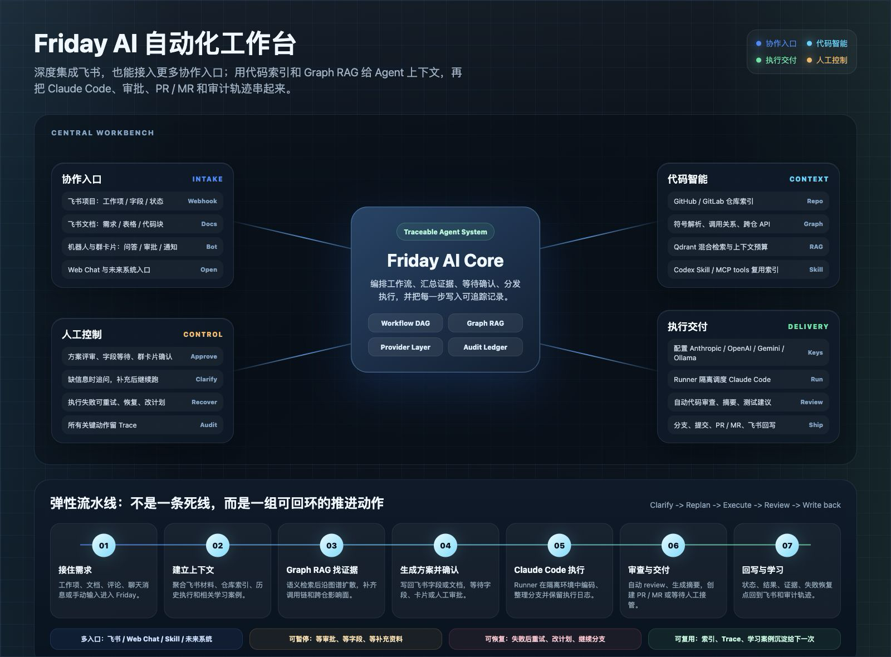

<p align="center">
  <picture>
    <source media="(prefers-color-scheme: dark)" srcset="web/public/logo-dark.svg">
    
  </picture>
</p>

<p align="center">
  <a href="https://github.com/friday-ai-codes/friday-ai/actions/workflows/ci.yaml">
    
  </a>
  <a href="https://codecov.io/gh/friday-ai-codes/friday-ai">
    
  </a>
  <a href="https://github.com/friday-ai-codes/friday-ai/actions/workflows/ci.yaml">
    
  </a>
  <a href="https://github.com/friday-ai-codes/friday-ai/releases">
    
  </a>
  <a href="LICENSE">
    
  </a>
  <a href="https://github.com/friday-ai-codes/friday-ai/stargazers">
    
  </a>
</p>

<p align="center">
  <a href="README.en.md">English</a>
</p>

Friday AI 是一个开源的 AI 开发自动化平台。用一句话说：**它把飞书里的需求，自动变成可以审查的代码 PR**。

需求进来后，Friday 会先读懂它、翻代码、写出技术方案；等团队确认后，再让 AI 在隔离环境里写代码、提 PR，并把每一步进度同步回飞书。人负责把关，Friday 负责跑腿。

<p align="center">
  <a href="#它解决什么问题">它解决什么问题</a>
  ·
  <a href="#它怎么工作">它怎么工作</a>
  ·
  <a href="#它能做什么">它能做什么</a>
  ·
  <a href="#agent-skill-和代码索引增强">Skill</a>
  ·
  <a href="#graph-rag-有什么不一样">Graph RAG</a>
  ·
  <a href="#快速开始">快速开始</a>
  ·
  <a href="#文档">文档</a>
</p>

---

## 它解决什么问题

想象一个研发团队里每天都在发生的场景：

产品经理在飞书项目里建了个需求——“购物车页面加一个优惠券入口”，附上需求文档，把状态拖到“待开发”。接下来呢？有人要去读文档、翻代码、评估改动范围、写技术方案，然后开发、提 PR、找人 review。每一步都在等人，信息散落在文档、群聊和代码仓库三个地方。

接上 Friday 之后，这条链路变成：

1. Friday 监听到工作项状态变化，自动拉取需求描述、评论和关联文档；
2. 在已建好索引的代码仓库里检索相关文件、函数和调用关系；
3. 生成一份技术方案，写回飞书字段或文档；
4. Tech Lead 看完方案，在飞书卡片上点“确认”；
5. Friday 调度 Claude Code 在隔离容器里改代码、跑代码审查、整理分支；
6. PR 链接、审查摘要和执行记录发回飞书群。

人始终在关键节点把关：方案要人确认，代码要人 review。Friday 接手的是中间那些读文档、翻代码、来回同步进度的体力活。

执行过程也不是黑盒。分支、提交、PR / MR、代码审查、检索证据、模型用量和失败恢复点都记录在同一条轨迹里，团队看到的不是一句“AI 已完成”，而是一段可以追问、可以审查、可以继续推进的工程过程。

Friday 已经深度集成飞书，但不是只为飞书而生：核心能力是工作流编排、代码智能和可审计的 Agent 执行，后续也可以接入更多协作入口。

## 名词速查

正文里会反复出现这几个词：

| 名词 | 含义 |
| --- | --- |
| PR / MR | Pull Request / Merge Request，提交代码供团队审查、合并的请求。GitHub 叫 PR，GitLab 叫 MR。 |
| Claude Code | Anthropic 出品的 AI 编程工具，Friday 用它来实际写代码。 |
| Graph RAG | Friday 的代码检索方式：先按语义找到相关代码，再沿调用关系把上下游一起找出来。 |
| Runner | Friday 的任务调度器，负责创建隔离的 Docker 容器，AI 编码都在容器内进行。 |
| 工作流 | “触发 → 取需求 → 生成方案 → 等确认 → 写代码 → 通知”的可视化编排，在网页上拖拽搭建。 |
| Agent Skill / MCP | 让 Cursor、Claude Code 这类本地 AI 助手调用 Friday 代码索引与执行能力的接入方式。 |

## 它怎么工作



整个系统分四块：Web 控制台（看板、流程编辑器、对话）、Server（工作流引擎和代码智能）、Runner（调度隔离容器）、Task（容器里跑 Claude Code）。需求从飞书或网页进来，沿着你编排的工作流往前走；每个节点的输入输出、模型用量和失败恢复点都会被记录，随时可以回看。

## 它能做什么

| 场景 | 实际例子 | Friday 怎么推进 |
| --- | --- | --- |
| 需求从飞书进入开发 | 工作项状态变成“待开发”，评论里补了一个需求文档链接。 | 监听飞书事件，拉取工作项、评论、关系和文档内容，生成技术方案，等确认后再派发编码任务。 |
| 方案要先评审 | Tech Lead 想先看风险、改动范围、测试建议，而不是让 AI 直接改代码。 | 用 Graph RAG 找代码证据，生成方案并回填飞书字段或文档，通过卡片 / 字段等待人工确认。 |
| 跨仓改造 | 前端页面要改接口参数，后端 handler、调用方、类型定义和测试可能分散在不同仓库。 | 通过语义检索、代码图谱和跨仓 API 关系找到上下游，拆出仓库任务矩阵，再分别执行。 |
| 群里持续协作 | 执行中缺字段、缺截图、需要确认分支或要通知结果。 | 飞书机器人在群聊 / 私聊里发送问题卡片、审批卡片、代码审查卡片和结果通知。 |
| 用户自己问代码库 | “这个支付回调现在走哪几个入口？”“这个组件还有哪些调用方？” | 在 Friday Web Chat 里选择已索引仓库，模型可以调用检索和代码浏览工具回答。 |
| 用 Agent Skill 增强自己 | 你在 Cursor / Claude Code / Codex 里写代码，希望 AI 助手直接调用 Friday 的代码索引、Graph RAG 和执行工具。 | `npx @friday-ai-codes/skills` 安装全部 Skill，配合 `@friday-ai-codes/mcp` 做仓库发现、分析、计划、执行和 MR 创建。 |
| AI 代码审查 | Claude Code 改完之后还需要一轮自动 review 和可读摘要。 | 工作流可以接 `ai_code_review`，把审查结果、分支摘要和 PR / MR 信息回写到飞书。 |

## 飞书深度集成，但不绑定飞书

Friday 当前对飞书的集成已经很深，不只是发通知。

| 集成面 | 已有能力 |
| --- | --- |
| 飞书项目 | 项目空间绑定、插件凭据、Webhook token、工作项详情、字段、关系、评论、状态流转和触发日志。 |
| 飞书文档 | 识别文档链接，读取云文档，把飞书块转成 Markdown，也能把 Markdown 写回文档，支持表格、代码块和引用。 |
| 飞书机器人 / IM | 发送文本和卡片、更新卡片、读取群聊历史、下载消息资源、检查或邀请机器人入群，处理群聊和私聊。 |
| 飞书卡片回调 | 审批、方案确认、补充信息、代码审查、编码结果等卡片都有对应回调。 |
| 飞书工作流节点 | `feishu_event_trigger`、`fetch_work_item`、`wait_feishu_field`、`notify_feishu`、`fetch_group_chat`、`join_group_chat` 等节点可以直接拖进工作流画布。 |
| MCP / Agent 工具 | `get_feishu_work_item_context` 聚合工作项、关系、评论和文档；`create_feishu_technical_plan` 结合代码证据生成并写回方案。 |

飞书是 Friday 现在打磨得最完整的协作入口。Friday 的底层模型仍然是“协作入口 + 工作流 + 代码智能 + Runner”，所以以后接入其他项目管理、文档、IM 或自动化系统时，不需要推翻这套主流程。

## Agent Skill 和代码索引增强

如果你平时在 Cursor / Claude Code / Codex 里写代码，Friday 还能当它们的“代码库后台”：仓库先在 Friday 里完成索引，本地 AI 助手就能直接查整个仓库（甚至多个仓库）的代码关系，而不是只靠当前窗口里打开的几个文件猜上下文。

三步接入：

1. 创建访问令牌：登录 Friday Web 控制台 → 个人资料 → 访问令牌 → 创建（明文只显示一次）。

2. 配置连接（交互式中文向导：凭证问答 → 注册 MCP server → 连通性测速 → 能力演示）：

   ```bash
   npx -y @friday-ai-codes/mcp setup
   ```

3. 安装 Skill（中文向导，自动嗅探 Claude Code、Cursor、Codex 等宿主，包含从需求路由到 MR 创建的 4 个 skill）：

   ```bash
   npx @friday-ai-codes/skills          # 默认安装到当前项目
   ```

   交互模式下装完技能会自动检测连接配置，没配好会直接接力拉起第 2 步的向导——先跑哪步都能闭环。

之后 AI 助手就能用同一套索引做仓库发现、Graph RAG 分析、代码计划、计划修订、远程执行、分支总结和 MR 创建。这部分适合两类人：一类是在 Friday Web 里点流程的人，另一类是在本地 IDE 里写代码的人。前者拿到可视化工作流，后者拿到可调用的代码智能工具；底层证据和审计轨迹是同一套。详见 [Friday Codebase Agent 指南](docs/guide/friday-codebase-agent.md)。

## Graph RAG 有什么不一样

先解释一下 RAG：它是“先从资料库里检索相关内容，再交给模型回答”的常见做法，能让 AI 基于你的代码和文档说话，而不是凭记忆瞎猜。但代码和普通文档不一样——一个函数的影响面藏在调用链里，光靠“找相似的文本”经常找不全。

普通 RAG、普通 Graph 和 Friday 的 Graph RAG 解决的问题不一样：

| 类型 | 它擅长什么 | 它容易漏掉什么 |
| --- | --- | --- |
| 普通 RAG | 根据语义相似度找到几段文本，适合回答文档类问题。 | 代码里的调用链、导入关系、跨文件影响、前后端接口关系经常不在相似文本里。 |
| 普通 Graph | 展示符号、文件、调用、依赖之间的关系，适合导航结构。 | 只有图很难理解“这个需求在说什么”，也很难把证据压成模型刚好能用的上下文。 |
| Friday Graph RAG | 先用语义和关键词召回相关 chunk，再沿代码图谱做一跳 / 二跳扩散，并补上跨仓 API 关系。 | 它不是单纯的可视化图谱，而是为了让 Agent 改代码时拿到更接近真实影响面的证据。 |

Friday 的索引会结合符号解析、Qdrant 混合检索、图谱扩散、跨仓 API 关联和 token 预算控制。最终进入模型的不是一堆散落片段，而是“需求 + 相关文件 + 符号 + 邻居关系 + 跨仓线索”的组合上下文。

## AI Provider、对话和多模态

Friday 内置 Web Chat，也能在工作流、技术方案生成、代码分析和 Agent 工具里使用模型能力。你需要在界面里配置对应 Provider 的 Key 或服务地址。

当前 Provider 层支持：

| Provider | 用途 |
| --- | --- |
| Anthropic Claude | Claude 模型、Claude Code 执行、方案生成、代码分析和审查。 |
| OpenAI Responses API | OpenAI 新版 Responses 能力，适合对话、推理和工具调用。 |
| OpenAI Chat Completions | 兼容 Chat Completions 的模型和网关。 |
| Google Gemini | Gemini 模型、推理和视觉能力。 |
| Ollama | 本地或私有部署模型，适合内网实验和轻量场景。 |

Friday 会识别模型输入模态。当前 Web Chat 已支持图片上传链路，支持 PNG、JPEG、GIF、WebP；如果你选择的模型支持视觉输入，Friday 可以把图片作为多模态消息的一部分发给模型。模型是否支持图片、推理、流式输出和工具调用，最终取决于你选择的 Provider 和模型配置。

## 快速开始

前置要求很简单：安装 Docker、Docker Compose v2 和 Git。

1. 克隆仓库并初始化本地环境：

   ```bash
   git clone https://github.com/friday-ai-codes/friday-ai.git
   cd friday-ai
   scripts/setup.sh
   ```

   这一步会准备本地运行所需的配置和数据目录。你不需要自己 build 镜像。

2. 启动 Friday：

   ```bash
   docker compose up -d
   ```

   Compose 会启动 Web、Server、Runner、PostgreSQL、Redis 和 Qdrant。

3. 打开 Web 界面：

   | 入口 | 地址 |
   | --- | --- |
   | Friday Web | <http://localhost:10240> |
   | API 文档 | <http://localhost:10240/docs> |

4. 配置 AI Provider：

   在界面里添加 Anthropic、OpenAI、Gemini 或 Ollama 的凭据。配置完成后，Friday 的 Web Chat、技术方案生成、工作流 AI 节点和 Agent 工具才能调用模型。

5. 接入并索引仓库：

   连接 GitHub / GitLab 仓库，选择默认分支并建立索引。索引完成后，Chat、Skill、Graph RAG、技术方案和代码执行才会拥有代码上下文。

6. 可选：接入飞书：

   如果你的团队使用飞书，可以绑定飞书项目、文档目录、机器人、Webhook 和相关字段。这样需求、审批、通知和结果回写都会出现在飞书工作台里。

7. 跑第一条链路：

   你可以从 Web Chat 问一个已索引仓库的问题，也可以从飞书工作项或工作流模板触发“生成方案 -> 人工确认 -> Claude Code 执行 -> PR / MR”的完整流程。

8. 可选：在 IDE 里使用 Friday Skill：

   先在个人资料页创建访问令牌，然后两条命令接入（中文交互式向导）：

   ```bash
   npx -y @friday-ai-codes/mcp setup    # 配置连接 + 注册 MCP + 测速
   npx @friday-ai-codes/skills          # 安装 skill 到当前项目的 agent 配置
   ```

   Cursor / Claude Code / Codex 就能直接调用 Friday 的代码智能与执行工具。

## 文档

完整文档站：<https://friday-ai-codes.github.io/friday-ai/>（涵盖部署、核心技术实现、集成与 API 参考）。

| 文档 | 内容 |
| --- | --- |
| [快速开始](docs/guide/quick-start.md) | 本地部署、创建第一个项目、测试工作流。 |
| [工作流指南](docs/guide/workflows.md) | 工作流节点、触发器、执行记录和调试。 |
| [管理指南](docs/guide/admin.md) | 用户、权限、OIDC、Runner 和运维配置。 |
| [Friday Codebase Agent](docs/guide/friday-codebase-agent.md) | Agent Skill 一键安装、MCP server、Graph RAG 分析和 MR 创建。 |
| [代码智能层](docs/internals/code-intelligence.md) | Graph RAG、跨仓 API 关联、Galaxy 图谱和 MCP 工具。 |
| [API 参考](docs/api/index.md) | REST API 文档。 |
| [Task 执行器](task/README.md) | Claude Agent SDK / Claude Code task 容器。 |
| [English README](README.en.md) | 英文版 README。 |

## 贡献者

感谢每一位贡献者，欢迎提 Issue 和 PR 加入进来。

<a href="https://github.com/friday-ai-codes/friday-ai/graphs/contributors">
  
</a>

## Star History

<a href="https://www.star-history.com/#friday-ai-codes/friday-ai&Date">
  <picture>
    <source media="(prefers-color-scheme: dark)" srcset="https://api.star-history.com/svg?repos=friday-ai-codes/friday-ai&type=Date&theme=dark">
    <source media="(prefers-color-scheme: light)" srcset="https://api.star-history.com/svg?repos=friday-ai-codes/friday-ai&type=Date">
    
  </picture>
</a>

## License

Friday AI 使用 [MIT License](LICENSE) 发布。
