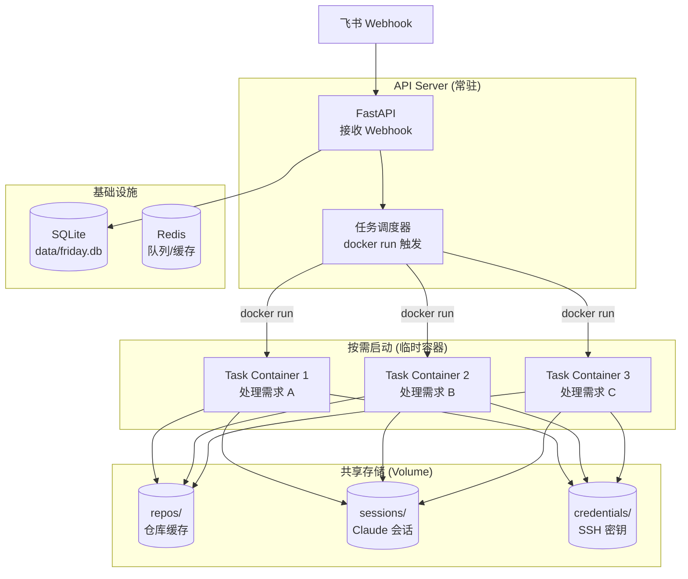
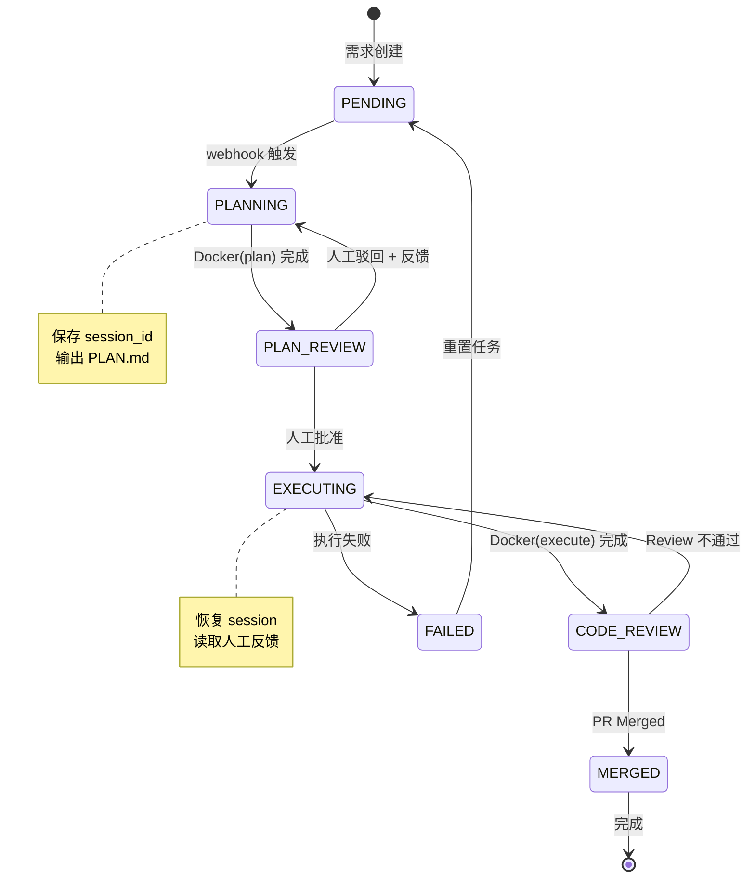

# Friday AI Dev Agent - 实施方案
## 1. 项目概述
基于飞书 Project、Git 与 Claude Code 的集成自动化系统，实现从"需求看板"到"代码落地"的半自动化闭环。
### 1.1 核心目标
- 打通飞书 Project（Meego）→ Claude Code → Git 的工作流
- 实现需求分析-方案设计-人类评审-代码实现-状态流转的自动化闭环
- 支持多项目、多 Git 平台（GitHub/GitLab/Gitea/Bitbucket）的认证管理
### 1.2 核心挑战与解决方案
- **挑战1**: Docker容器的无状态性与人类评审断点的矛盾
- **解决方案**: 每任务一容器 + Session持久化
- **挑战2**: 多项目多平台的认证管理
- **解决方案**: 项目级凭证配置 + 动态认证适配
- **挑战3**: 部署复杂度与用户门槛
- **解决方案**: SQLite + Docker Compose 一键部署
## 2. 技术栈选择
### 2.1 核心技术栈
| 组件 | 技术选型 | 版本 | 理由 |
|------|----------|------|------|
| **Python 环境管理** | uv | latest | 超快依赖解析和安装 |
| **Web 框架** | FastAPI | 0.109+ | 高性能异步 API，自动文档生成 |
| **ORM** | SQLModel | 0.0.14+ | 统一数据模型（SQLAlchemy + Pydantic） |
| **数据库** | SQLite + aiosqlite | - | 零配置本地存储，异步支持 |
| **配置管理** | pydantic-settings | 2.1+ | 环境变量 + .env 文件支持 |
| **HTTP 客户端** | httpx | 0.26+ | 异步 HTTP 请求 |
| **加密** | cryptography | 41+ | 凭证加密存储 |
### 2.2 外部集成
| 组件 | 技术选型 | 版本 | 理由 |
|------|----------|------|------|
| **AI Agent** | Claude Code CLI | latest | Anthropic官方工具 |
| **飞书 SDK** | lark-python-sdk | latest | 官方维护，完整API覆盖 |
| **Git 操作** | GitPython + dulwich | latest | 纯Python实现，无系统依赖 |
| **SSH 管理** | paramiko | latest | SSH密钥认证，连接池管理 |
### 2.3 部署与容器化
| 组件 | 技术选型 | 版本 | 理由 |
|------|----------|------|------|
| **容器运行时** | Docker | 24+ | 轻量级隔离，镜像分层 |
| **容器编排** | Docker Compose | 2.0+ | 简单易用，一键部署 |
| **镜像构建** | Docker Build | - | 多阶段构建，体积优化 |
## 3. 系统架构
### 3.1 整体架构

### 3.2 状态机设计

## 4. 项目结构
```
friday/
├── pyproject.toml # uv 依赖管理
├── uv.lock # uv 锁定文件
├── docker-compose.yml # 一键部署
├── Dockerfile # 容器镜像
├── .env.example # 环境变量模板
├── setup.sh # 一键安装脚本
│
├── src/
│ ├── __init__.py
│ ├── main.py # FastAPI 入口
│ ├── config.py # 配置管理
│ ├── database.py # SQLModel 数据库配置
│ │
│ ├── models/ # SQLModel 模型
│ │ ├── __init__.py
│ │ ├── project.py # 项目模型
│ │ ├── credential.py # 凭证模型
│ │ └── task.py # 任务模型
│ │
│ ├── routes/ # API 路由
│ │ ├── __init__.py
│ │ ├── projects.py # 项目管理
│ │ ├── tasks.py # 任务管理
│ │ └── webhook.py # 飞书 Webhook
│ │
│ ├── services/ # 业务逻辑
│ │ ├── __init__.py
│ │ ├── feishu.py # 飞书集成
│ │ ├── git.py # Git 操作
│ │ ├── claude.py # Claude 集成
│ │ └── crypto.py # 凭证加密
│ │
│ └── utils/
│ ├── __init__.py
│ └── docker.py # Docker 操作
│
├── task/ # 任务容器
│ ├── Dockerfile
│ └── src/
│ └── task.py # 任务执行逻辑
│
└── data/ # 持久化数据
 ├── friday.db # SQLite 数据库
 ├── repos/ # 仓库缓存
 ├── sessions/ # Claude 会话
 └── credentials/ # SSH 密钥
```
## 5. 数据模型设计
### 5.1 SQLModel 模型
```python
# src/models/project.py
from datetime import datetime
from typing import Optional, List
from sqlmodel import SQLModel, Field, Relationship
from enum import Enum
import uuid
class GitPlatform(str, Enum):
 GITHUB = "github"
 GITLAB = "gitlab"
 GITEA = "gitea"
 BITBUCKET = "bitbucket"
class AuthType(str, Enum):
 SSH_KEY = "ssh_key"
 ACCESS_TOKEN = "access_token"
 DEPLOY_KEY = "deploy_key"
class ProjectBase(SQLModel):
 name: str = Field(index=True)
 repo_url: str
 git_platform: GitPlatform = GitPlatform.GITHUB
 default_branch: str = "main"
 claude_md_path: str = "developer-notes.md"
class Project(ProjectBase, table=True):
 __tablename__ = "projects"
 id: str = Field(default_factory=lambda: str(uuid.uuid4), primary_key=True)
 created_at: datetime = Field(default_factory=datetime.utcnow)
 updated_at: datetime = Field(default_factory=datetime.utcnow)
 # 关联
 credential: Optional["GitCredential"] = Relationship(back_populates="project")
 tasks: List["Task"] = Relationship(back_populates="project")
class ProjectCreate(ProjectBase):
 pass
class ProjectRead(ProjectBase):
 id: str
 created_at: datetime
 has_credential: bool = False
```
### 5.2 数据库配置
```python
# src/database.py
from sqlmodel import SQLModel
from sqlmodel.ext.asyncio.session import AsyncSession
from sqlalchemy.ext.asyncio import create_async_engine, AsyncEngine
from sqlalchemy.orm import sessionmaker
from contextlib import asynccontextmanager
from typing import AsyncGenerator
from .config import settings
# 创建异步引擎
def get_engine -> AsyncEngine:
 url = f"sqlite+aiosqlite:///{settings.SQLITE_PATH}"
 return create_async_engine(url, echo=settings.DEBUG, future=True)
engine = get_engine
# 异步 Session 工厂
async_session_maker = sessionmaker(
 engine, class_=AsyncSession, expire_on_commit=False
)
async def init_db:
 """初始化数据库（创建表）"""
 async with engine.begin as conn:
 await conn.run_sync(SQLModel.metadata.create_all)
async def close_db:
 """关闭数据库连接"""
 await engine.dispose
@asynccontextmanager
async def get_session -> AsyncGenerator[AsyncSession, None]:
 """获取数据库 Session（上下文管理器）"""
 async with async_session_maker as session:
 try:
 yield session
 await session.commit
 except Exception:
 await session.rollback
 raise
# FastAPI 依赖注入
async def get_db -> AsyncGenerator[AsyncSession, None]:
 """FastAPI 依赖：获取数据库 Session"""
 async with async_session_maker as session:
 yield session
```
## 6. API 设计
### 6.1 项目管理 API
```python
# src/routes/projects.py
from fastapi import APIRouter, Depends, HTTPException, UploadFile, File
from sqlmodel import select
from sqlmodel.ext.asyncio.session import AsyncSession
from typing import List
from ..database import get_db
from ..models.project import Project, ProjectCreate, ProjectRead
from ..services.crypto import encrypt_value
router = APIRouter(prefix="/api/projects", tags=["projects"])
@router.get("/", response_model=List[ProjectRead])
async def list_projects(db: AsyncSession = Depends(get_db)):
 """列出所有项目"""
 result = await db.execute(select(Project))
 projects = result.scalars.all
 return [ProjectRead(**p.model_dump, has_credential=False) for p in projects]
@router.post("/", response_model=ProjectRead)
async def create_project(
 project: ProjectCreate,
 db: AsyncSession = Depends(get_db)
):
 """创建项目"""
 db_project = Project.model_validate(project)
 db.add(db_project)
 await db.commit
 await db.refresh(db_project)
 return ProjectRead(**db_project.model_dump, has_credential=False)
@router.post("/{project_id}/credential/upload-ssh-key")
async def upload_ssh_key(
 project_id: str,
 file: UploadFile = File(...),
 db: AsyncSession = Depends(get_db)
):
 """上传 SSH 私钥文件"""
 # 保存文件到 data/credentials/{project_id}/id_rsa
 # 保存记录到数据库
 pass
```
### 6.2 任务管理 API
```python
# src/routes/tasks.py
from fastapi import APIRouter, Depends
from sqlmodel import select
from sqlmodel.ext.asyncio.session import AsyncSession
from typing import List
from ..database import get_db
from ..models.task import Task, TaskRead
router = APIRouter(prefix="/api/tasks", tags=["tasks"])
@router.get("/", response_model=List[TaskRead])
async def list_tasks(db: AsyncSession = Depends(get_db)):
 """列出所有任务"""
 result = await db.execute(select(Task))
 tasks = result.scalars.all
 return [TaskRead(**t.model_dump) for t in tasks]
```
### 6.3 飞书 Webhook
```python
# src/routes/webhook.py
from fastapi import APIRouter, BackgroundTasks
from pydantic import BaseModel
from ..services.feishu import verify_webhook
from ..utils.docker import run_task_container
router = APIRouter(prefix="/api/webhook", tags=["webhook"])
class FeishuWebhook(BaseModel):
 work_item_id: str
 action: str
 # ... 其他字段
@router.post("/feishu")
async def handle_feishu_webhook(
 payload: FeishuWebhook,
 background_tasks: BackgroundTasks
):
 """处理飞书 Webhook"""
 # 验证签名
 if not verify_webhook(payload):
 return {"error": "invalid signature"}
 # 后台启动任务容器
 background_tasks.add_task(
 run_task_container,
 work_item_id=payload.work_item_id,
 mode="plan" # 或根据 action 判断
 )
 return {"status": "accepted"}
```
## 7. 任务执行流程
### 7.1 任务容器启动
```python
# src/utils/docker.py
import subprocess
import os
from pathlib import Path
async def run_task_container(work_item_id: str, mode: str):
 """启动任务容器"""
 from ..config import settings
 # 获取项目信息
 project = await get_project_by_work_item(work_item_id)
 credential = await get_project_credential(project.id)
 # 构建 docker run 命令
 cmd = [
 "docker", "run", "--rm",
 "--name", f"friday-task-{work_item_id}",
 "--network", "friday_default",
 "-e", f"WORK_ITEM_ID={work_item_id}",
 "-e", f"MODE={mode}",
 "-e", f"PROJECT_ID={project.id}",
 "-e", f"ANTHROPIC_API_KEY={os.environ['ANTHROPIC_API_KEY']}",
 # ... 其他环境变量
 ]
 # 挂载共享存储
 data_dir = Path(settings.DATA_DIR)
 cmd.extend([
 "-v", f"{data_dir}:/app/data",
 "-v", "/var/run/docker.sock:/var/run/docker.sock",
 ])
 # 处理凭证
 if credential.auth_type == "ssh_key":
 if credential.ssh_key_path:
 cmd.extend([
 "-v", f"{credential.ssh_key_path}:/root/.ssh/id_rsa:ro"
 ])
 # 镜像
 cmd.append("friday-task:latest")
 # 执行
 result = subprocess.run(cmd, capture_output=True, text=True)
 return result.returncode == 0
```
### 7.2 任务容器逻辑
```python
# task/src/task.py
import os
from pathlib import Path
def main:
 # 从环境变量读取配置
 work_item_id = os.environ["WORK_ITEM_ID"]
 mode = os.environ["MODE"]
 project_id = os.environ["PROJECT_ID"]
 # 获取项目和凭证信息
 project = get_project(project_id)
 credential = get_credential(project_id)
 # 准备仓库
 repo_path = prepare_repo(project, credential)
 # 执行任务
 if mode == "plan":
 result = run_plan_phase(repo_path, work_item_id)
 else:
 session_id = os.environ.get("SESSION_ID")
 result = run_execute_phase(repo_path, work_item_id, session_id)
 # 更新飞书状态
 update_feishu_status(work_item_id, result)
def prepare_repo(project: dict, credential: dict) -> Path:
 """克隆或更新仓库"""
 # 根据认证类型设置 Git 环境
 # 执行 git clone/pull
 pass
def run_plan_phase(repo_path: Path, work_item_id: str):
 """规划阶段"""
 # 获取飞书需求
 # 运行 claude -p "分析需求..."
 # 保存 session
 pass
```
## 8. 部署方案
### 8.1 依赖管理
```toml
# pyproject.toml
[project]
name = "friday"
version = "0.1.0"
description = "AI-powered development automation agent"
requires-python = ">=3.11"
dependencies = [
 "fastapi>=0.109.0",
 "uvicorn[standard]>=0.27.0",
 "sqlmodel>=0.0.14",
 "aiosqlite>=0.19.0",
 "pydantic-settings>=2.1.0",
 "httpx>=0.26.0",
 "python-multipart>=0.0.6",
 "cryptography>=41.0.0",
 "lark>=1.15.0",
 "gitpython>=3.1.40",
 "paramiko>=3.4.0",
]
[project.optional-dependencies]
dev = [
 "pytest>=7.4.0",
 "pytest-asyncio>=0.23.0",
 "ruff>=0.1.0",
]
[tool.uv]
dev-dependencies = ["pytest", "pytest-asyncio", "ruff"]
```
### 8.2 Docker 配置
```dockerfile
# Dockerfile
FROM python:3.11-slim
# 安装系统依赖
RUN apt-get update && apt-get install -y \
 git openssh-client curl \
 && rm -rf /var/lib/apt/lists/*
# 安装 uv
RUN pip install uv
# 安装 Node.js + Claude Code
RUN curl -fsSL https://deb.nodesource.com/setup_18.x | bash - \
 && apt-get install -y nodejs \
 && npm install -g @anthropic-ai/claude-code
# 设置工作目录
WORKDIR /app
# 复制依赖文件
COPY pyproject.toml uv.lock ./
# 安装 Python 依赖
RUN uv sync --frozen --no-install-project
# 复制源代码
COPY src/ ./src/
# 创建数据目录
RUN mkdir -p data/repos data/sessions data/credentials
# 启动命令
CMD ["uv", "run", "uvicorn", "src.main:app", "--host", "0.0.0.0", "--port", "8000"]
```
```yaml
# docker-compose.yml
version: '3.8'
services:
 friday:
 build: .
 container_name: friday
 ports:
 - "8000:8000"
 environment:
 - ANTHROPIC_API_KEY=${ANTHROPIC_API_KEY}
 - FEISHU_APP_ID=${FEISHU_APP_ID}
 - FEISHU_APP_SECRET=${FEISHU_APP_SECRET}
 volumes:
 - ./data:/app/data
 - /var/run/docker.sock:/var/run/docker.sock
 restart: unless-stopped
```
### 8.3 一键安装脚本
```bash
#!/bin/bash
# setup.sh
echo "🚀 Friday AI Dev Agent - 一键部署"
# 检查 uv
if ! command -v uv &> /dev/null; then
 echo "❌ 请先安装 uv: https://github.com/astral-sh/uv"
 exit 1
fi
# 检查 Docker
if ! command -v docker &> /dev/null; then
 echo "❌ 请先安装 Docker"
 exit 1
fi
# 安装依赖
echo "📦 安装 Python 依赖..."
uv sync
# 复制环境变量
if [ ! -f .env ]; then
 cp .env.example .env
 echo "⚠️ 请编辑 .env 文件，填写必要的密钥"
 echo " - ANTHROPIC_API_KEY: Claude API 密钥"
 echo " - FEISHU_APP_ID: 飞书应用 ID"
 echo " - FEISHU_APP_SECRET: 飞书应用密钥"
 exit 1
fi
# 创建数据目录
mkdir -p data/repos data/sessions data/credentials
# 构建镜像
echo "🏗️ 构建 Docker 镜像..."
docker build -t friday:latest .
docker build -t friday-task:latest -f task/Dockerfile task/
# 启动服务
echo "🚀 启动服务..."
docker-compose up -d
# 等待启动
sleep 5
# 健康检查
if curl -s http://localhost:8000/health | grep -q "ok"; then
 echo "✅ 部署成功！"
 echo ""
 echo "🌐 API 地址: http://localhost:8000"
 echo "📖 API 文档: http://localhost:8000/docs"
 echo "📁 数据目录: ./data/"
else
 echo "❌ 部署失败，请检查日志"
 docker-compose logs
fi
```
## 9. 开发与测试
### 9.1 开发环境
```bash
# 安装 uv
curl -LsSf https://astral.sh/uv/install.sh | sh
# 克隆项目
git clone <repo>
cd friday
# 安装依赖
uv sync
# 启动开发服务器
uv run uvicorn src.main:app --reload
# 运行测试
uv run pytest
# 代码格式化
uv run ruff check . --fix
```
### 9.2 测试策略
```python
# tests/test_projects.py
import pytest
from httpx import AsyncClient
from sqlmodel.ext.asyncio.session import AsyncSession
@pytest.mark.asyncio
async def test_create_project(client: AsyncClient, db: AsyncSession):
 """测试创建项目"""
 response = await client.post("/api/projects", json={
 "name": "test-project",
 "repo_url": "https://github.com/user/repo.git",
 "git_platform": "github"
 })
 assert response.status_code == 200
 data = response.json
 assert data["name"] == "test-project"
```
## 10. 安全考虑
### 10.1 凭证加密
```python
# src/services/crypto.py
from cryptography.fernet import Fernet
from ..config import settings
cipher = Fernet(settings.SECRET_KEY.encode)
def encrypt_value(value: str) -> str:
 """加密敏感数据"""
 return cipher.encrypt(value.encode).decode
def decrypt_value(encrypted: str) -> str:
 """解密敏感数据"""
 return cipher.decrypt(encrypted.encode).decode
```
### 10.2 容器安全
- 使用 `--rm` 自动清理容器
- 非 root 用户运行
- 只挂载必要的目录
- 限制网络访问（只允许必要域名）
## 11. 实施路径
| 阶段 | 目标 | 关键交付物 | 预计时间 |
|------|------|------------|----------|
| **Phase** | 基础框架 | FastAPI + SQLModel + SQLite | 1周 |
| **Phase** | 项目管理 | CRUD API + 凭证管理 | 1周 |
| **Phase** | 任务执行 | 容器调度 + Claude 集成 | 2周 |
| **Phase** | 飞书集成 | Webhook + 状态流转 | 1周 |
| **Phase** | 部署优化 | Docker 化 + 一键部署 | 1周 |
## 12. 总结
本实施方案采用 **SQLite + SQLModel + FastAPI + uv** 的技术栈，结合 **每任务一容器** 的架构模式，实现了一个轻量级、可扩展的 AI 开发自动化系统。
**核心优势**：
1. **零配置部署**：SQLite 无需安装数据库
2. **快速开发**：SQLModel 统一数据模型
3. **类型安全**：完整的类型提示和验证
4. **异步性能**：全链路异步处理
5. **易于扩展**：支持多项目、多平台认证
**技术决策**：
- **Python 环境管理**：uv（超快依赖解析）
- **Web 框架**：FastAPI（高性能异步 API）
- **ORM**：SQLModel（统一模型定义）
- **数据库**：SQLite（零配置本地存储）
- **容器化**：Docker Compose（一键部署）
- **任务执行**：每任务一容器（完全隔离）