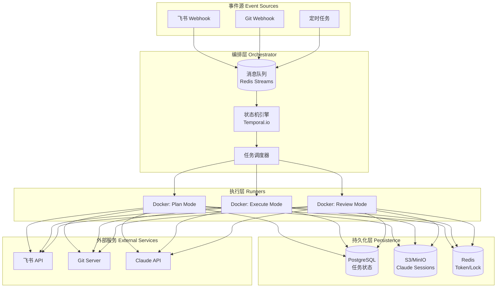
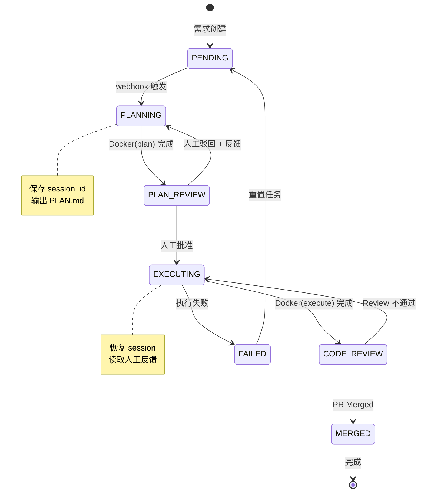
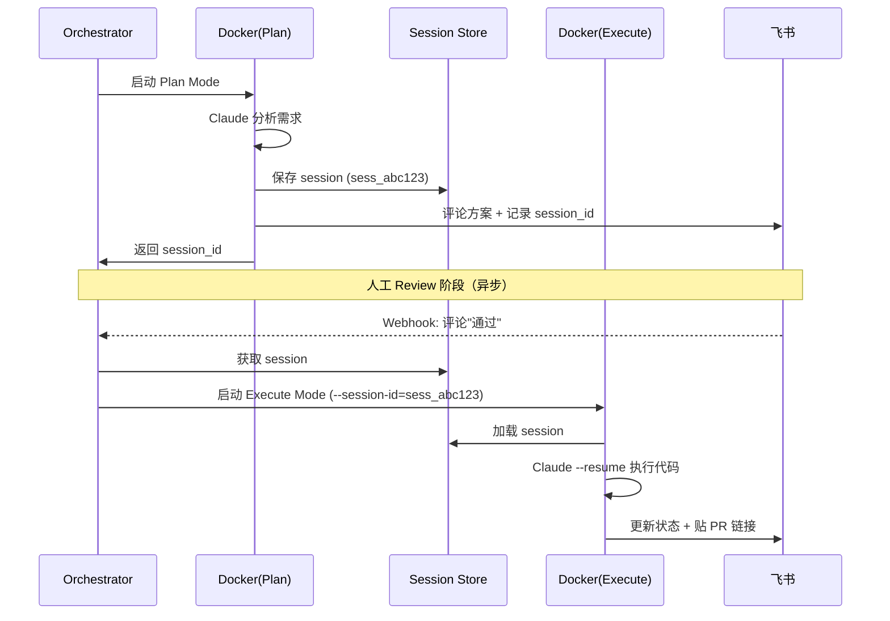
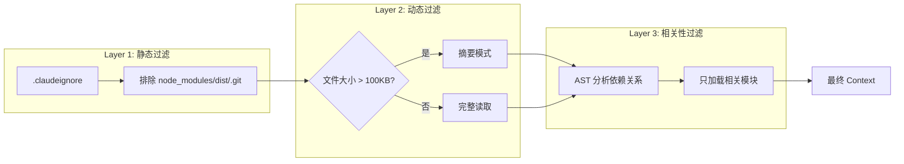
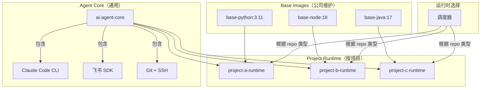
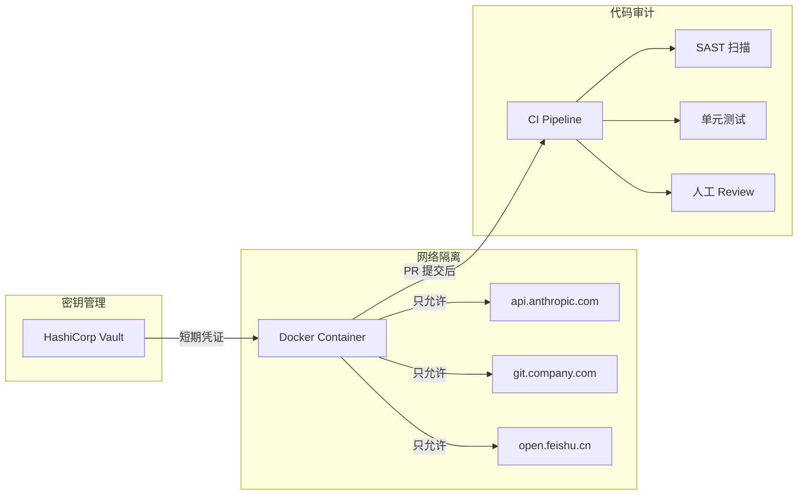

# 自动化敏捷开发系统架构设计
## 1. 系统概述
基于飞书 Project、Git 与 Claude Code 的集成自动化系统，实现从"需求看板"到"代码落地"的半自动化闭环。
### 1.1 核心目标
- 打通飞书 Project（Meego）→ Claude Code → Git 的工作流
- 实现需求分析-方案设计-人类评审-代码实现-状态流转的自动化闭环
- 支持多阶段状态机，确保AI上下文记忆和人类干预能力
### 1.2 核心挑战与解决方案
- **挑战1**: Docker容器的无状态性与人类评审断点的矛盾
- **解决方案**: 采用异步双阶段状态机 + Session持久化
- **挑战2**: 上下文窗口爆炸和Token成本控制
- **解决方案**: 分层Context过滤 + 相关性分析
- **挑战3**: 飞书API复杂的状态流转机制
- **解决方案**: 封装状态流转服务 + 缓存机制
## 2. 整体架构设计
### 2.1 架构模式
采用**事件驱动架构（EDA）+ 有限状态机（FSM）**的组合模式。

### 2.2 状态机设计

## 3. 技术栈选择
### 3.1 后端技术栈
#### 3.1.1 编排层 (Orchestrator)
| 组件 | 技术选型 | 版本 | 理由 |
|------|----------|------|------|
| **工作流引擎** | Temporal.io | v1.22+ | 原生支持长时间运行的工作流、自动重试、状态持久化、事件溯源 |
| **消息队列** | Redis Streams | 7.0+ | 轻量级、支持消费者组、与缓存共用基础设施、性能优异 |
| **状态存储** | PostgreSQL | 15+ | ACID事务支持、JSONB字段存储复杂状态、丰富的索引类型 |
| **缓存层** | Redis | 7.0+ | 分布式锁、Token缓存、会话管理 |
#### 3.1.2 执行层 (Execution Layer)
| 组件 | 技术选型 | 版本 | 理由 |
|------|----------|------|------|
| **容器运行时** | Docker | 24+ | 轻量级隔离、镜像分层、易于部署 |
| **AI Agent** | Claude Code CLI | latest | Anthropic官方工具、原生支持代码生成和修改 |
| **脚本语言** | Python | 3.11+ | 丰富的AI/DevOps生态、异步编程支持(asyncio) |
| **API客户端** | httpx + aiohttp | latest | 异步HTTP客户端、高性能并发请求 |
#### 3.1.3 外部集成 (Integrations)
| 组件 | 技术选型 | 版本 | 理由 |
|------|----------|------|------|
| **飞书SDK** | lark-python-sdk | latest | 官方维护、完整的API覆盖、自动重试机制 |
| **Git操作** | GitPython + dulwich | latest | 纯Python实现、无需系统Git依赖、更好的容器化支持 |
| **SSH管理** | paramiko | latest | SSH密钥认证、代理转发、连接池管理 |
### 3.2 前端技术栈
#### 3.2.1 管理控制台 (Admin Console)
| 组件 | 技术选型 | 版本 | 理由 |
|------|----------|------|------|
| **框架** | Next.js | 14+ | React全栈框架、SSR支持、优秀的开发体验 |
| **UI组件库** | Ant Design | 5.x | 企业级设计语言、丰富的组件、国际化支持 |
| **状态管理** | Zustand | latest | 轻量级、TypeScript友好、无样板代码 |
| **数据获取** | TanStack Query | 5.x | 服务端状态管理、缓存、乐观更新 |
#### 3.2.2 监控面板 (Monitoring Dashboard)
| 组件 | 技术选型 | 版本 | 理由 |
|------|----------|------|------|
| **可视化** | Apache ECharts | 5.x | 高性能、丰富的图表类型、响应式设计 |
| **实时更新** | WebSocket + Socket.IO | latest | 双向通信、实时状态同步、连接恢复 |
### 3.3 基础设施技术栈
#### 3.3.1 容器编排 (Container Orchestration)
| 组件 | 技术选型 | 版本 | 理由 |
|------|----------|------|------|
| **容器编排** | Kubernetes | 1.28+ | 生产级编排、自动伸缩、服务发现、配置管理 |
| **CI/CD** | ArgoCD + Argo Workflows | latest | GitOps、声明式部署、工作流编排 |
| **服务网格** | Istio | 1.20+ | 流量管理、安全策略、观测能力 |
#### 3.3.2 存储与网络 (Storage & Networking)
| 组件 | 技术选型 | 版本 | 理由 |
|------|----------|------|------|
| **对象存储** | MinIO | latest | S3兼容API、分布式存储、数据持久化 |
| **网络策略** | Calico | latest | 网络隔离、安全策略、性能优化 |
| **负载均衡** | NGINX Ingress | latest | 高性能反向代理、SSL终止、流量路由 |
#### 3.3.3 监控与可观测性 (Observability)
| 组件 | 技术选型 | 版本 | 理由 |
|------|----------|------|------|
| **指标收集** | Prometheus | 2.45+ | 多维度指标、强大的查询语言、告警规则 |
| **日志聚合** | Loki + Promtail | latest | 轻量级日志系统、与Prometheus集成 |
| **链路追踪** | Jaeger | latest | 分布式追踪、性能分析、错误诊断 |
| **可视化** | Grafana | 10.x | 丰富的仪表板、告警面板、多数据源支持 |
### 3.4 开发工具与质量保障
#### 3.4.1 代码质量 (Code Quality)
| 组件 | 技术选型 | 版本 | 理由 |
|------|----------|------|------|
| **代码检查** | ESLint + Prettier | latest | 代码规范、自动格式化、一致性保证 |
| **类型检查** | TypeScript | 5.3+ | 静态类型检查、更好的IDE支持、重构安全 |
| **测试框架** | Jest + Playwright | latest | 单元测试、E2E测试、组件测试覆盖 |
#### 3.4.2 安全与合规 (Security & Compliance)
| 组件 | 技术选型 | 版本 | 理由 |
|------|----------|------|------|
| **密钥管理** | HashiCorp Vault | latest | 集中式密钥管理、动态凭证、审计日志 |
| **镜像扫描** | Trivy | latest | 容器镜像漏洞扫描、合规检查 |
| **代码扫描** | SonarQube | 10.x | 代码质量分析、安全漏洞检测 |
## 4. 核心模块详细设计
### 4.1 双阶段Session持久化方案

### 4.2 Context管理策略

### 4.3 飞书状态流转服务
```python
# 核心实现示例
class FeishuWorkflowEngine:
 def __init__(self, project_key: str, redis_client):
 self.project_key = project_key
 self.redis = redis_client
 self._state_cache_key = f"feishu:states:{project_key}"
 async def transition_to(self, work_item_id: str, target_state: str):
 # 1. 获取可用转换（带缓存）
 transitions = await self._get_available_transitions(work_item_id)
 # 2. 查找目标状态
 target = next(
 (t for t in transitions if self._match_state(t, target_state)),
 None
 )
 if not target:
 # 可能需要中间状态跳转
 path = await self._find_transition_path(work_item_id, target_state)
 for step in path:
 await self._execute_transition(work_item_id, step)
 else:
 await self._execute_transition(work_item_id, target['id'])
 async def _get_available_transitions(self, work_item_id: str):
 # 实现缓存逻辑
 cache_key = f"transitions:{work_item_id}"
 cached = await self.redis.get(cache_key)
 if cached:
 return json.loads(cached)
 # 调用飞书API
 transitions = await self.feishu_api.get_transitions(work_item_id)
 # 缓存5分钟
 await self.redis.setex(cache_key, 300, json.dumps(transitions))
 return transitions
```
## 5. Docker镜像分层架构

## 6. 安全架构设计

## 7. 部署架构
### 7.1 Kubernetes部署架构
```yaml
apiVersion: v1
kind: Namespace
metadata:
 name: ai-dev-system
---
apiVersion: apps/v1
kind: Deployment
metadata:
 name: orchestrator
 namespace: ai-dev-system
spec:
 replicas: 3
 selector:
 matchLabels:
 app: orchestrator
 template:
 metadata:
 labels:
 app: orchestrator
 spec:
 containers:
 - name: temporal-worker
 image: ai-dev/orchestrator:v1.0
 env:
 - name: TEMPORAL_HOST
 value: "temporal-frontend.temporal.svc.cluster.local:7233"
 - name: REDIS_URL
 valueFrom:
 secretKeyRef:
 name: redis-secret
 key: url
 resources:
 requests:
 memory: "512Mi"
 cpu: "250m"
 limits:
 memory: "1Gi"
 cpu: "500m"
---
apiVersion: v1
kind: Service
metadata:
 name: orchestrator-service
 namespace: ai-dev-system
spec:
 selector:
 app: orchestrator
 ports:
 - port: 8080
 targetPort: 8080
```
### 7.2 CI/CD流水线
```yaml
# .gitlab-ci.yml 示例
stages:
 - build
 - test
 - deploy
build_base_images:
 stage: build
 script:
 - docker build -t ai-dev/base-python:3.11 -f docker/base-python.Dockerfile .
 - docker build -t ai-dev/agent-core:latest -f docker/agent-core.Dockerfile .
 only:
 changes:
 - docker/base-*.Dockerfile
build_project_runtimes:
 stage: build
 script:
 - docker build -t ai-dev/project-a-runtime:latest -f projects/project-a/runtime.Dockerfile .
 only:
 changes:
 - projects/project-a/**
test:
 stage: test
 script:
 - npm run test
 - python -m pytest tests/
 coverage: '/TOTAL.*\s+(\d+%)$/'
deploy_staging:
 stage: deploy
 script:
 - kubectl apply -f k8s/staging/
 environment:
 name: staging
 only:
 - develop
deploy_production:
 stage: deploy
 script:
 - kubectl apply -f k8s/production/
 environment:
 name: production
 when: manual
 only:
 - main
```
## 8. 监控与告警
### 8.1 关键指标
| 指标类型 | 具体指标 | 告警阈值 | 响应措施 |
|----------|----------|----------|----------|
| **业务指标** | 任务成功率 | < 95% | 通知开发团队调查 |
| **性能指标** | 平均任务耗时 | > 30分钟 | 优化资源配置 |
| **成本指标** | Token消耗/任务 | > 100k | 启用熔断机制 |
| **系统指标** | 容器重启次数 | > 5次/小时 | 检查资源使用率 |
### 8.2 告警规则示例
```yaml
# Prometheus Alert Rules
groups:
- name: ai_dev_system
 rules:
 - alert: HighTaskFailureRate
 expr: rate(task_failures_total[5m]) / rate(task_total[5m]) > 0.05
 for: 5m
 labels:
 severity: warning
 annotations:
 summary: "任务失败率过高"
 description: "过去5分钟任务失败率超过5%"
 - alert: HighTokenUsage
 expr: increase(claude_tokens_used[1h]) > 100000
 for: 10m
 labels:
 severity: warning
 annotations:
 summary: "Claude Token消耗过高"
 description: "过去1小时Token消耗超过10万"
```
## 9. 实施路径
| 阶段 | 目标 | 关键交付物 | 预计时间 | 风险点 |
|------|------|------------|----------|--------|
| **Phase** | 技术验证 | Claude Code CLI集成验证 | 1周 | CLI稳定性 |
| **Phase** | 单阶段自动化 | Docker + 飞书读取 + Git提交 | 2周 | API权限配置 |
| **Phase** | 双阶段状态机 | Temporal工作流 + Session持久化 | 3周 | 状态恢复可靠性 |
| **Phase** | 深度集成 | Webhook接收 + 状态流转 + 评论解析 | 2周 | 飞书API复杂性 |
| **Phase** | 生产就绪 | 监控告警 + 安全加固 + 性能优化 | 4周 | 并发处理能力 |
## 10. 总结
本架构设计采用**事件驱动 + 状态机**的核心模式，通过Temporal.io实现可靠的工作流编排，结合Kubernetes提供生产级的容器管理。技术栈选择注重**成熟稳定**和**生态完善**，确保系统的可维护性和扩展性。
关键创新点：
1. 双阶段Session持久化解决AI上下文记忆问题
2. 分层Context过滤控制Token成本
3. 封装飞书状态流转服务简化集成复杂度
4. 镜像分层架构支持多语言项目适配
该架构既满足了自动化需求，又保证了人类干预的能力，是AI辅助开发的理想解决方案。