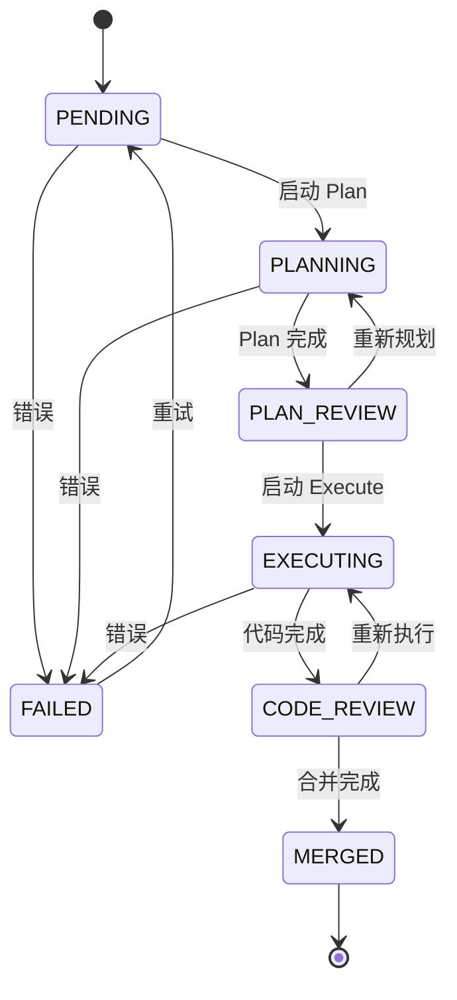

## Context
Friday AI 是一个 AI 驱动的敏捷开发自动化系统，后端基于 FastAPI 构建，提供完整的项目管理、任务管理和 AI 执行能力。前端基于 Vue 3 + Vite + Tailwind CSS 构建，已配置 shadcn-vue 但尚未实现业务功能。
本设计文档描述前端如何完全接入后端 API，实现一个功能完整、界面优雅的管理控制台。
### 利益相关者
- **开发者**：使用 Friday AI 自动化编码任务
- **项目管理员**：配置项目和凭证
- **系统运维**：监控任务执行状态
### 约束条件
- 前端需与现有后端 API 完全兼容
- 使用 shadcn-vue 组件库保持 UI 一致性
- 需考虑任务执行的长时间轮询场景
## Goals / Non-Goals
### Goals
- 实现所有后端 API 的前端集成
- 提供直观的项目和任务管理界面
- 支持任务执行的实时日志查看
- 提供清晰的任务状态可视化
### Non-Goals
- 用户认证和权限管理（当前后端无此功能）
- 国际化实现（仅预留基础设施）
- 移动端优化（优先桌面体验）
- 单元测试（用户要求暂不实现）
## Decisions
### Decision 1: API 客户端选型 - 使用原生 fetch 封装
**选择**: 使用原生 fetch + 自定义封装，而非 axios 或 ofetch
**理由**:
- 减少依赖，fetch 已是浏览器标准
- 项目规模适中，不需要复杂的请求库
- 便于与 TypeScript 类型系统集成
**实现方案**:
```typescript
// web/src/api/client.ts
const API_BASE = import.meta.env.VITE_API_BASE || '/api'
interface RequestOptions extends RequestInit {
 params?: Record<string, string>
}
async function request<T>(
 endpoint: string,
 options: RequestOptions = {}
): Promise<T> {
 const { params, ...init } = options
 const url = new URL(endpoint, API_BASE)
 if (params) {
 Object.entries(params).forEach(([key, value]) =>
 url.searchParams.set(key, value)
 )
 }
 const response = await fetch(url.toString, {
 ...init,
 headers: {
 'Content-Type': 'application/json',
 ...init.headers,
 },
 })
 if (!response.ok) {
 const error = await response.json.catch( => ({}))
 throw new ApiError(response.status, error.detail || 'Request failed')
 }
 return response.json
}
```
### Decision 2: 状态管理策略 - Pinia + 组合式 Store
**选择**: 使用 Pinia 的 Composition API 风格定义 Store
**理由**:
- 与 Vue 3 Composition API 风格一致
- 类型推导更好
- 更容易拆分和组合逻辑
**实现方案**:
```typescript
// web/src/stores/projects.ts
export const useProjectsStore = defineStore('projects', => {
 const projects = ref<Project>
 const loading = ref(false)
 const error = ref<string | null>(null)
 async function fetchProjects {
 loading.value = true
 error.value = null
 try {
 projects.value = await projectsApi.list
 } catch (e) {
 error.value = e instanceof Error ? e.message: 'Unknown error'
 } finally {
 loading.value = false
 }
 }
 return { projects, loading, error, fetchProjects }
})
```
### Decision 3: 日志轮询策略 - VueUse useIntervalFn
**选择**: 使用 VueUse 的 useIntervalFn 实现轮询
**理由**:
- VueUse 已在项目依赖中
- 自动处理组件卸载时的清理
- 提供 pause/resume 控制
**实现方案**:
```typescript
// web/src/composables/useTaskLogs.ts
export function useTaskLogs(taskId: Ref<string>) {
 const logs = ref('')
 const isPolling = ref(false)
 const { pause, resume } = useIntervalFn(async => {
 if (!isPolling.value) return
 const result = await tasksApi.getLogs(taskId.value, 100)
 logs.value = result.logs
 }, 2000) // 每 2 秒轮询
 function startPolling {
 isPolling.value = true
 resume
 }
 function stopPolling {
 isPolling.value = false
 pause
 }
 return { logs, isPolling, startPolling, stopPolling }
}
```
### Decision 4: 任务状态可视化 - 状态机图示
**选择**: 使用横向步骤条展示任务状态流转
**理由**:
- 直观展示任务生命周期
- 用户可快速理解当前状态和可执行操作
- 符合常见的工作流展示模式
**状态流转图**:

### Decision 5: 表单验证 - VeeValidate + Zod
**选择**: 使用 VeeValidate 配合 Zod schema 验证
**理由**:
- shadcn-vue Form 组件基于 VeeValidate
- Zod 提供类型安全的 schema 定义
- 与 TypeScript 类型共享
**实现方案**:
```typescript
// 项目创建表单 schema
const projectSchema = z.object({
 name: z.string.min(1, '项目名称不能为空'),
 repo_url: z.string.url('请输入有效的仓库 URL'),
 git_platform: z.enum(['github', 'gitlab', 'gitea', 'bitbucket']),
 default_branch: z.string.default('main'),
})
```
### Decision 6: 组件目录结构
**选择**: 按功能模块组织组件
```
web/src/
├── api/ # API 服务层
│ ├── client.ts # 基础客户端
│ ├── projects.ts # 项目 API
│ ├── tasks.ts # 任务 API
│ └── index.ts # 统一导出
├── components/
│ ├── ui/ # shadcn-vue 组件
│ ├── project/ # 项目相关组件
│ │ ├── ProjectCard.vue
│ │ ├── ProjectForm.vue
│ │ └── CredentialForm.vue
│ ├── task/ # 任务相关组件
│ │ ├── TaskCard.vue
│ │ ├── TaskStatusBadge.vue
│ │ ├── TaskStatusStepper.vue
│ │ ├── TaskLogs.vue
│ │ └── TaskActions.vue
│ └── common/ # 通用组件
│ ├── ConfirmDialog.vue
│ ├── EmptyState.vue
│ └── LoadingState.vue
├── composables/
│ ├── useApi.ts # API 调用封装
│ ├── useTaskLogs.ts # 日志轮询
│ └── useToast.ts # 通知
├── stores/
│ ├── projects.ts # 项目状态
│ └── tasks.ts # 任务状态
├── pages/ # 页面组件（文件路由）
└── types/ # TypeScript 类型
```
## Risks / Trade-offs
### Risk 1: 日志轮询性能
- **风险**: 多个任务同时执行时，轮询可能导致大量请求
- **缓解**: 仅在任务详情页且任务正在执行时才启用轮询；使用节流
### Risk 2: 大型日志内容
- **风险**: 容器日志可能非常大，影响页面性能
- **缓解**: 后端 API 已支持 tail 参数限制；前端使用虚拟滚动或限制显示行数
### Risk 3: 状态同步
- **风险**: 任务状态可能被容器回调更新，前端状态可能过期
- **缓解**: 任务详情页定期刷新；执行中任务加快轮询频率
## Migration Plan
此变更为全新功能添加，无需迁移。
### 实施顺序
1. **Phase**: 基础设施（API 客户端、类型定义、shadcn 组件）
2. **Phase**: 状态管理（Projects Store、Tasks Store）
3. **Phase**: 项目管理页面
4. **Phase**: 任务管理页面
5. **Phase**: 仪表盘和优化
### 回滚方案
各阶段独立实现，可按阶段回滚。
## Open Questions
1. **是否需要 WebSocket 替代轮询？**
 - 当前后端无 WebSocket 支持
 - 可在后续迭代中添加
2. **是否需要缓存策略？**
 - 当前项目规模较小，可暂不实现
 - 后续可考虑 TanStack Query
3. **任务创建入口？**
 - 当前任务主要通过飞书 Webhook 创建
 - 前端是否需要手动创建任务功能？