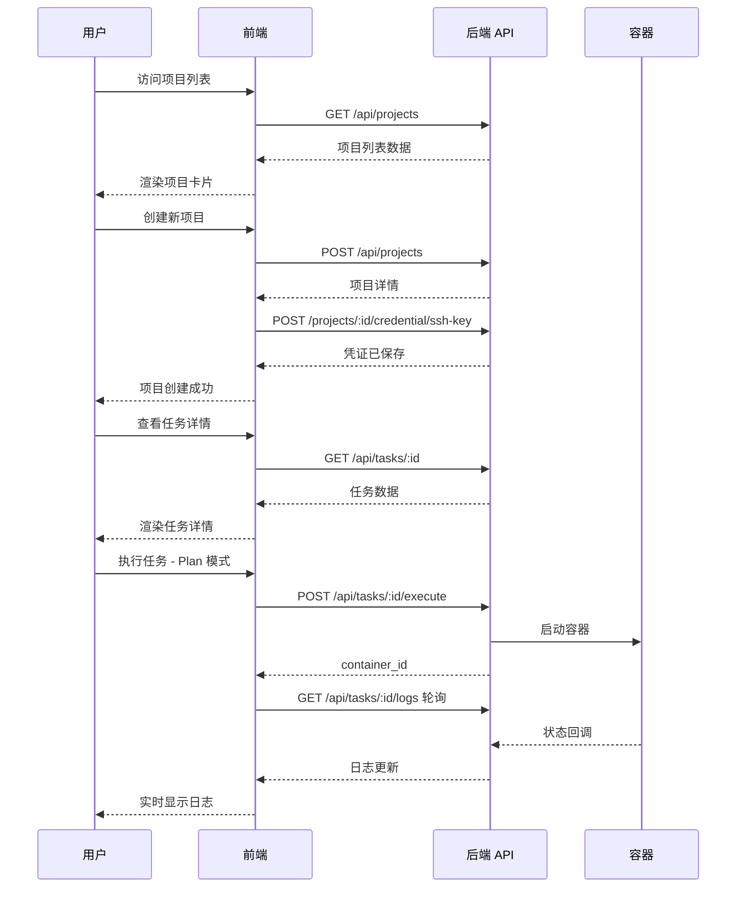

# Change: 前端完全接入后端 API 服务
## Why
当前前端仅有基础的页面骨架和模拟数据，尚未与后端 API 进行任何集成。为了让 Friday AI 成为可用的产品，需要将前端与后端的所有 API 端点完全对接，实现项目管理、任务管理、凭证管理和实时日志查看等核心功能。
## What Changes
### 1. API 服务层
- 创建统一的 API 客户端（基于 fetch/ofetch）
- 封装所有后端 API 端点
- 实现请求/响应拦截器和错误处理
### 2. 状态管理
- 创建 Projects Store - 管理项目列表和项目详情
- 创建 Tasks Store - 管理任务列表、状态和执行
- 实现数据缓存和乐观更新
### 3. 页面实现
- **项目管理页面**：项目列表、创建/编辑项目、凭证管理
- **任务管理页面**：任务列表（支持过滤）、任务详情、状态转换
- **任务执行控制**：启动/停止任务、实时日志查看
- **仪表盘**：概览统计和快速操作
### 4. UI 组件（使用 shadcn-vue）
- Button, Card, Dialog, Form, Input, Select, Table
- Badge（状态标签）, Toast（通知）, Skeleton（加载态）
- Tabs, Dropdown Menu, Alert Dialog
### 5. 类型定义
- 与后端模型对齐的 TypeScript 类型
- API 请求/响应类型
## Impact
- **Affected specs**: `frontend-architecture`
- **Affected code**:
 - `web/src/api/` - 新建 API 服务层
 - `web/src/stores/` - 新建/修改 Pinia stores
 - `web/src/pages/` - 新建/修改页面组件
 - `web/src/components/ui/` - 添加 shadcn-vue 组件
 - `web/src/types/` - 更新类型定义
 - `web/src/composables/` - 新建组合式函数
## 技术方案概览
### 后端 API 端点清单
#### Projects API (`/api/projects`)
| 方法 | 路径 | 功能 |
|------|------|------|
| GET | `/` | 列出所有项目 |
| POST | `/` | 创建项目 |
| GET | `/{project_id}` | 获取项目详情 |
| PATCH | `/{project_id}` | 更新项目 |
| DELETE | `/{project_id}` | 删除项目 |
| GET | `/{project_id}/credential` | 获取凭证信息 |
| POST | `/{project_id}/credential/ssh-key` | 上传 SSH 密钥 |
| POST | `/{project_id}/credential/access-token` | 设置访问令牌 |
| DELETE | `/{project_id}/credential` | 删除凭证 |
#### Tasks API (`/api/tasks`)
| 方法 | 路径 | 功能 |
|------|------|------|
| GET | `/` | 列出任务（支持过滤） |
| POST | `/` | 创建任务 |
| GET | `/{task_id}` | 获取任务详情 |
| PATCH | `/{task_id}` | 更新任务 |
| DELETE | `/{task_id}` | 删除任务 |
| POST | `/{task_id}/transition/{new_status}` | 任务状态转换 |
| POST | `/{task_id}/execute` | 执行任务 |
| POST | `/{task_id}/stop` | 停止任务 |
| GET | `/{task_id}/logs` | 获取任务日志 |
| GET | `/{task_id}/container-status` | 获取容器状态 |
### 页面路由结构
```
/ # 首页/仪表盘
/projects # 项目列表
/projects/new # 创建项目
/projects/:id # 项目详情
/projects/:id/edit # 编辑项目
/projects/:id/credential # 凭证管理
/tasks # 任务列表
/tasks/:id # 任务详情（含日志）
```
### 系统交互流程

## 不包含在此变更中
- 单元测试（用户要求暂不编写）
- 国际化实现（已预留基础设施）
- 暗色模式切换
- 用户认证/权限管理