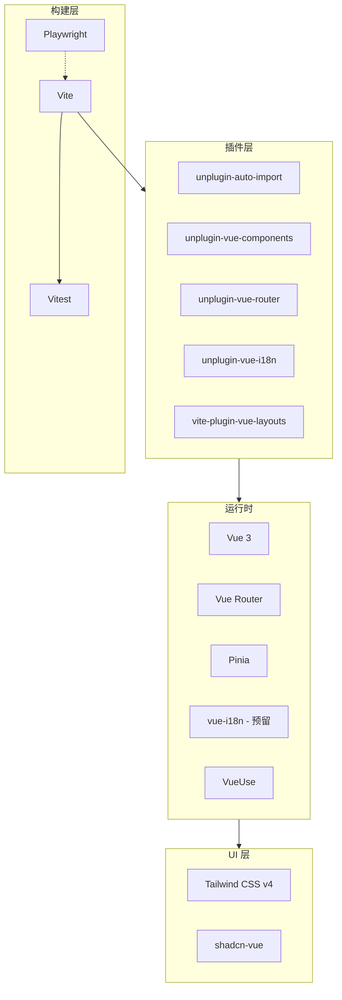

# 前端架构设计文档
## Context
Friday AI 开发自动化系统需要一个现代化的 Web 前端界面，用于：
- 展示任务列表和状态
- 配置项目和凭证
- 查看任务执行日志和结果
- 管理系统设置
当前前端项目仅有最基础的 Vue 3 + Vite 配置，需要建立完整的技术架构以支持上述功能。
### 约束条件
- 必须与现有的 Vue 3 + Vite 技术栈兼容
- 作为内部管理后台，不需要 SEO 优化
- 需要预留国际化能力，但暂不实现具体功能
- 使用 pnpm 和 catalog 统一管理依赖版本
## Goals / Non-Goals
### Goals
- 建立可扩展的前端项目结构
- 提供开箱即用的 UI 组件库
- 实现高效的开发体验（自动导入、类型安全）
- 预留国际化能力
- 建立完善的测试体系（单元测试 + E2E）
### Non-Goals
- 不实现 SSG/SSR（纯 SPA 应用）
- 不实现具体的多语言翻译内容
- 不实现移动端适配（当前阶段）
## Decisions
### 1. UI 框架选择：shadcn-vue + Tailwind CSS v4
**决策**：使用 shadcn-vue 作为 UI 组件库，Tailwind CSS v4 作为样式方案。
**理由**：
- shadcn-vue 是无头组件库，组件代码直接复制到项目中，完全可控
- Tailwind CSS v4 采用原生 CSS 变量，性能更好，配置更简洁
- 两者结合提供了高度可定制的 UI 体验
- 相比 Element Plus / Naive UI 等方案，更轻量且不与设计系统绑定
**备选方案**：
- Element Plus：过于重量级，设计风格固定
- Naive UI：功能完善但包体积较大
- Radix Vue：需要自己实现样式，工作量大
### 2. 状态管理：Pinia
**决策**：使用 Pinia 作为状态管理方案。
**理由**：
- Vue 官方推荐，与 Vue 3 深度集成
- API 简洁，TypeScript 支持优秀
- 支持 DevTools 调试
- 相比 Vuex 更轻量，开发体验更好
### 3. 路由方案：基于文件系统的路由
**决策**：使用 unplugin-vue-router 实现基于文件系统的路由。
**理由**：
- 减少路由配置的样板代码
- 自动生成类型安全的路由定义
- 与 Nuxt 的路由约定一致，降低学习成本
**目录结构约定**：
```
src/pages/
├── index.vue → /
├── tasks/
│ ├── index.vue → /tasks
│ └── [id].vue → /tasks/:id
├── projects/
│ ├── index.vue → /projects
│ └── [id].vue → /projects/:id
└── settings.vue → /settings
```
### 4. 路径别名：`~` 映射到 `src`
**决策**：使用 `~` 作为 `src` 目录的路径别名。
**理由**：
- 简洁的导入路径
- 与部分前端框架约定一致
- 便于重构时批量修改路径
**示例**：
```typescript
import { useTaskStore } from '~/stores/task'
import Button from '~/components/ui/button/Button.vue'
```
### 5. 依赖管理：pnpm catalog
**决策**：使用 pnpm catalog 统一管理依赖版本。
**理由**：
- 在 monorepo 中统一管理依赖版本
- 便于版本升级和依赖审计
- 减少版本冲突的可能性
**配置方式**：
```yaml
# pnpm-workspace.yaml
packages:
 - 'web'
catalogs:
 default:
 vue: ^3.5.24
 pinia: ^3.0.0
 vue-router: ^4.5.0
 # ... 其他依赖
```
### 6. 国际化方案：vue-i18n（仅预留能力）
**决策**：安装 vue-i18n 和 unplugin-vue-i18n，但暂不实现具体的多语言功能。
**理由**：
- 预留国际化能力，后续可快速启用
- 避免后期改造成本
- 基础设施先行，功能按需实现
**配置范围**：
- 安装依赖和配置插件
- 创建 locales 目录结构
- 不创建具体的翻译文件
### 7. 自动导入：unplugin-auto-import + unplugin-vue-components
**决策**：使用自动导入插件减少样板代码。
**理由**：
- 无需手动导入 Vue API（ref, computed 等）
- 无需手动导入组件
- 自动生成 TypeScript 类型声明
**配置范围**：
- Vue 核心 API
- VueUse 组合式函数
- Vue Router API
- Pinia API
- shadcn-vue 组件
### 8. 测试框架：Vitest + Playwright
**决策**：使用 Vitest 进行单元测试，Playwright 进行 E2E 测试。
**理由**：
- Vitest 与 Vite 深度集成，速度快，配置简单
- Playwright 跨浏览器支持好，API 现代化
- 两者都有优秀的 TypeScript 支持
**测试目录结构**：
```
web/
├── src/
│ └── components/
│ └── __tests__/ # 单元测试（与组件同级）
├── tests/
│ └── e2e/ # E2E 测试
├── vitest.config.ts
└── playwright.config.ts
```
## Architecture
### 目录结构
```
web/
├── public/ # 静态资源
├── src/
│ ├── assets/ # 需要处理的资源
│ ├── components/ # 全局组件
│ │ ├── ui/ # shadcn-vue 组件
│ │ └── __tests__/ # 组件单元测试
│ ├── composables/ # 组合式函数
│ ├── layouts/ # 布局组件
│ │ └── default.vue
│ ├── locales/ # 国际化文件（预留）
│ ├── pages/ # 页面（基于文件路由）
│ ├── stores/ # Pinia stores
│ ├── styles/ # 全局样式
│ │ └── main.css # Tailwind 入口
│ ├── types/ # TypeScript 类型
│ ├── App.vue # 根组件
│ └── main.ts # 应用入口
├── tests/
│ └── e2e/ # E2E 测试
├── components.json # shadcn-vue 配置
├── vitest.config.ts # 单元测试配置
├── playwright.config.ts # E2E 测试配置
├── vite.config.ts # Vite 配置
└── package.json
```
### 技术栈依赖图

## Risks / Trade-offs
### 风险 1：依赖版本兼容性
- **风险**：多个 unplugin 插件可能存在版本冲突
- **缓解**：参考 Vitesse 模板的版本组合，使用 pnpm catalog 统一管理
### 风险 2：构建产物体积
- **风险**：引入过多依赖可能导致包体积过大
- **缓解**：
 - 使用 Tree-shaking 消除未使用代码
 - shadcn-vue 按需引入组件
 - 定期进行 bundle 分析
### Trade-off：文件路由 vs 显式路由
- **选择**：采用文件路由
- **代价**：失去一些路由定义的灵活性
- **收益**：减少样板代码，类型安全
### Trade-off：预留 i18n vs 完整实现
- **选择**：仅预留能力
- **代价**：首次使用时需要额外配置
- **收益**：减少初始复杂度，按需启用
## Migration Plan
由于当前前端项目几乎是空白状态，无需考虑迁移策略，直接实施新架构即可。
### 实施步骤
1. 配置 pnpm catalog 管理依赖
2. 安装并配置 Tailwind CSS v4
3. 配置路径别名 `~`
4. 配置 unplugin 插件系列
5. 配置 Vue Router 和文件路由
6. 配置 Pinia
7. 预留 vue-i18n 能力
8. 初始化 shadcn-vue
9. 配置 Vitest 单元测试
10. 配置 Playwright E2E 测试
11. 创建基础目录结构和示例页面
12. 验证构建和测试
## Open Questions
1. **是否需要 PWA 支持？** - 当前暂不考虑，后续可扩展
2. **是否需要 Dark Mode？** - shadcn-vue + Tailwind 原生支持，可在初始化时启用
3. **API Mock 方案？** - 建议后续引入 MSW（Mock Service Worker）
## References
- [Vitesse](https://github.com/antfu-collective/vitesse) - 本架构的主要参考模板
- [shadcn-vue](https://www.shadcn-vue.com/) - UI 组件库文档
- [Tailwind CSS v4](https://tailwindcss.com/blog/tailwindcss-v4) - 样式框架
- [Vitest](https://vitest.dev/) - 单元测试框架
- [Playwright](https://playwright.dev/) - E2E 测试框架
- [pnpm catalog](https://pnpm.io/catalogs) - 依赖版本管理