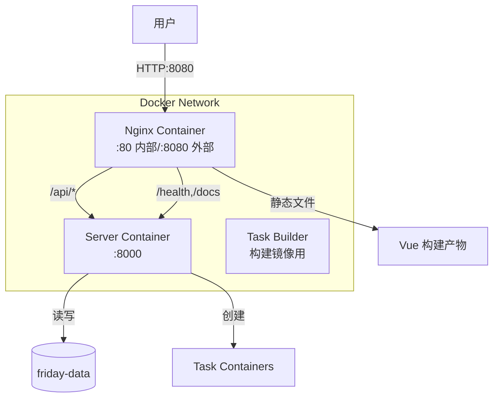

## Context
Friday 项目是一个前后端分离的应用，需要提供简单易用的 Docker 部署方案。当前配置存在生产环境下前端无法访问后端 API 的问题。
**约束条件**：
- 用户应能在克隆仓库后快速启动完整服务
- 保持开发环境和生产环境的一致性
- 最小化用户需要手动配置的内容
**利益相关者**：
- 开发者：需要快速搭建本地开发环境
- 运维人员：需要简单可靠的部署方案
- 终端用户：需要稳定的服务体验
## Goals / Non-Goals
### Goals
- 用户克隆项目后，只需配置 `.env` 文件即可通过 `docker-compose up -d` 启动完整服务
- Nginx 统一代理前后端，用户只需访问一个端口
- 提供清晰的部署文档
### Non-Goals
- 不实现 HTTPS/TLS 配置（生产环境通常由外部负载均衡器处理）
- 不实现自动化 CI/CD 流程
- 不涉及 Kubernetes 部署配置
## Decisions
### Decision 1: Nginx 作为统一网关
**选择**：使用 nginx 同时服务静态文件和反向代理 API
**原因**：
- 避免 CORS 跨域问题
- 用户只需记住一个端口
- nginx 性能优秀，适合生产环境
- 减少网络配置复杂度
**替代方案**：
1. **分离端口暴露**：前端:8080，后端:8000
 - 缺点：需要配置 CORS，用户需要管理两个端口
2. **前端直接访问后端**：通过环境变量配置 API URL
 - 缺点：需要 CORS，配置复杂
### Decision 2: API 路径代理规则
**选择**：代理 `/api/*`、`/health`、`/docs`、`/openapi.json` 到后端
**原因**：
- 后端所有业务 API 都在 `/api/` 前缀下
- `/health` 用于健康检查
- `/docs` 和 `/openapi.json` 提供 API 文档
### Decision 3: 服务端口配置
**选择**：
- Web (nginx) 对外暴露 `:8080` (可通过 `FRIDAY_WEB_PORT` 配置)
- Server 对外暴露 `:8000` (可通过 `FRIDAY_PORT` 配置，可选关闭)
**原因**：
- 保持灵活性，用户可根据需要选择是否直接访问后端
- 便于调试和开发
## Implementation Details
### Nginx 配置 (`web/nginx.conf`)
```nginx
server {
 listen 80;
 server_name _;
 # Gzip 压缩
 gzip on;
 gzip_types text/plain text/css application/json application/javascript text/xml;
 # 静态文件
 root /usr/share/nginx/html;
 index index.html;
 # SPA 路由支持
 location / {
 try_files $uri $uri/ /index.html;
 }
 # API 反向代理
 location /api/ {
 proxy_pass http://server:8000;
 proxy_set_header Host $host;
 proxy_set_header X-Real-IP $remote_addr;
 proxy_set_header X-Forwarded-For $proxy_add_x_forwarded_for;
 proxy_set_header X-Forwarded-Proto $scheme;
 }
 # 后端其他端点代理
 location ~ ^/(health|docs|openapi.json|redoc)$ {
 proxy_pass http://server:8000;
 proxy_set_header Host $host;
 proxy_set_header X-Real-IP $remote_addr;
 }
}
```
### 服务架构

## Risks / Trade-offs
| 风险 | 影响 | 缓解措施 |
|------|------|----------|
| Nginx 配置错误导致服务不可用 | 高 | 提供详细的配置说明和验证步骤 |
| Docker 构建缓存失效导致构建慢 | 中 | 优化 Dockerfile 层顺序 |
| 用户忘记配置环境变量 | 中 | 在 .env.example 中提供详细注释 |
## Migration Plan. 创建 nginx 配置文件
2. 更新 Dockerfile
3. 更新 docker-compose.yml
4. 更新文档
5. 本地测试验证
**回滚**：如果出现问题，可以回退到之前的配置
## Open Questions
1. 是否需要在 docker-compose.yml 中保留后端端口的直接暴露？
 - 建议：保留，便于调试，但可以在文档中说明生产环境可以移除
2. 是否需要添加 nginx 访问日志配置？
 - 建议：使用 docker logs 查看，暂不额外配置
