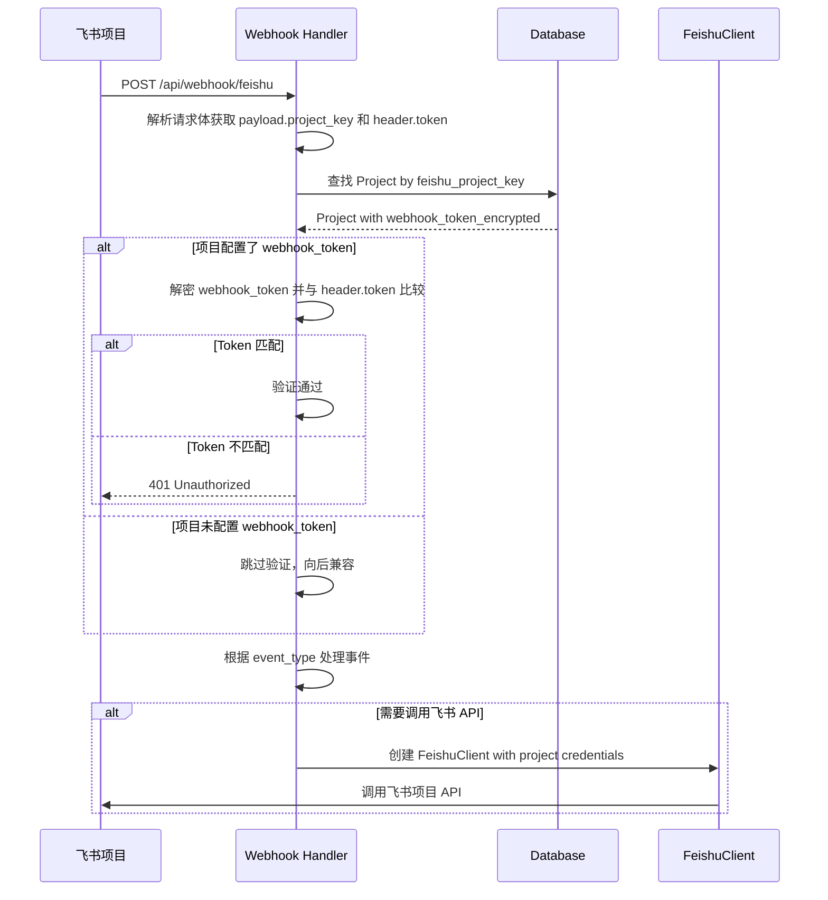
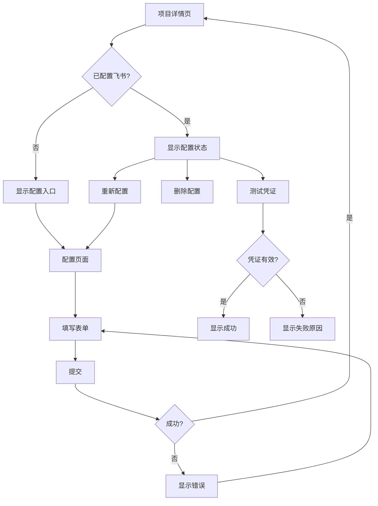

# 技术设计：多飞书项目集成支持
## Context
### 背景
Friday 系统需要与飞书项目（Meego）集成，实现工作项状态变更触发自动化开发流程。用户可能管理多个飞书项目空间，每个空间有独立的项目插件凭证。
### 飞书项目 API 要点
#### 1. 获取工作项详情接口
- **请求方式**：POST `/open_api/:project_key/work_item/:work_item_type_key/query`
- **认证方式**：Bearer Token（tenant_access_token）
- **请求体**：
 ```json
 {
 "work_item_ids": [id1, id2, ...], // 最多 50 个
 "fields": ["字段标识列表"], // 可选，默认返回全部
 "expand": {} // 可选，额外参数
 }
 ```
- **响应结构**：
 ```json
 {
 "err_code": 0,
 "err_msg": "",
 "data": [{
 "id": 643711xxxx,
 "name": "工作项名称",
 "project_key": "空间ID",
 "work_item_type_key": "story",
 "pattern": "Node|State",
 "work_item_status": {
 "state_key": "doing",
 "is_init_state": false,
 "is_archived_state": false
 },
 "fields": [
 {"field_key": "description", "field_value": "...", "field_type_key": "multi_text"},
 {"field_key": "owner", "field_value": "user_key", "field_type_key": "user"}
 ],
 "current_nodes": [{"id": "state_0", "name": "进行中", "owners": [...]}]
 }]
 }
 ```
#### 2. Webhook 事件格式
所有 Webhook 事件使用统一结构：
```json
{
 "header": {
 "operator": "操作者userkey",
 "event_type": "WorkitemStatusEvent",
 "token": "注册时填入的token",
 "uuid": "幂等串"
 },
 "payload": {
 "id": 111,
 "name": "工作项名称",
 "project_key": "空间ID",
 "work_item_type_key": "story",
 ...
 }
}
```
### 约束
- 飞书项目插件是空间级别的，每个空间需要单独配置插件
- Webhook 回调携带的验证 Token 在 `header.token` 字段中
- 插件凭证包含敏感信息，需要加密存储
- Webhook 推送后 6s 超时，超时会重试，最大重试 3 次
- 需要使用 `header.uuid` 实现幂等处理
### 利益相关者
- 开发团队：需要在多个飞书项目中使用 Friday
- 运维人员：需要配置和管理多个项目的凭证
## Goals / Non-Goals
### Goals
- 支持在单个 Friday 实例中管理多个飞书项目
- 每个项目独立配置飞书插件凭证
- 根据 Webhook 请求中的 project_key 动态选择对应项目的凭证
- 凭证安全存储，敏感信息加密
- 正确解析飞书 Webhook 新版格式
### Non-Goals
- 不支持跨租户的飞书项目
- 不实现凭证轮换功能
- 不支持批量导入项目配置
- 不支持飞书老版 Webhook 格式
## Decisions
### 1. 凭证存储方案
**决定**：将飞书插件凭证存储在 Project 模型中，使用现有的 `encrypt_value` 函数加密敏感字段。
**替代方案考虑**：
- 方案A：独立的凭证表（类似 GitCredential）
 - 优点：关注点分离
 - 缺点：增加复杂度，飞书凭证与项目是一对一关系
- 方案B：直接存储在 Project 模型中（选择）
 - 优点：简单直接，与 feishu_project_key 在一起
 - 缺点：Project 模型稍显臃肿
**理由**：飞书凭证与项目是强绑定关系，且字段数量不多，直接存储更简洁。
### 2. Webhook 验证流程
**决定**：使用基于 project_key 的两阶段验证流程

**关键点**：
- 飞书新版 Webhook 使用 `header.token` 进行验证，不是签名验证
- 老代码中的 `X-Lark-Signature` 验证是飞书开放平台事件订阅的方式，不适用于飞书项目 Webhook
- 应直接比较 `header.token` 与配置的 `webhook_token`
### 3. FeishuClient 实例管理
**决定**：改为工厂函数模式，按需创建 Client 实例
```python
# 新增工厂函数
def create_feishu_client_for_project(project: Project) -> FeishuClient:
 """根据项目配置创建飞书客户端。"""
 if not project.feishu_plugin_id or not project.feishu_plugin_secret_encrypted:
 raise FeishuConfigurationError(
 f"Project {project.id} missing Feishu plugin credentials"
 )
 plugin_secret = decrypt_value(project.feishu_plugin_secret_encrypted)
 return FeishuClient(
 app_id=project.feishu_plugin_id,
 app_secret=plugin_secret,
 )
# 保留全局函数作为向后兼容（标记 deprecated）
@deprecated("Use create_feishu_client_for_project instead")
def get_feishu_client -> FeishuClient:
 global _feishu_client
 if _feishu_client is None:
 _feishu_client = FeishuClient
 return _feishu_client
```
### 4. 数据模型设计
```python
class Project(ProjectBase, table=True):
 # ... 现有字段 ...
 # 飞书项目配置
 feishu_project_key: Optional[str] # 现有，空间 ID
 feishu_space_id: Optional[str] # 新增：空间 ID 别名
 feishu_plugin_id: Optional[str] # 新增：插件 ID
 feishu_plugin_secret_encrypted: Optional[str] # 新增：加密的插件 Secret
 feishu_webhook_token_encrypted: Optional[str] # 新增：加密的 Webhook Token
class ProjectRead(ProjectBase):
 # ... 现有字段 ...
 has_feishu_config: bool = False # 新增：是否已配置飞书凭证
```
### 5. Webhook 事件处理改造
```python
@router.post("/feishu")
async def handle_feishu_webhook(request: Request, background_tasks: BackgroundTasks):
 body = await request.body
 data = json.loads(body)
 # 处理 URL 验证挑战
 if data.get("type") == "url_verification":
 return {"challenge": data.get("challenge")}
 # 解析新版 Webhook 格式
 header = data.get("header", {})
 payload = data.get("payload", {})
 event_type = header.get("event_type", "")
 project_key = payload.get("project_key", "")
 webhook_token = header.get("token", "")
 uuid = header.get("uuid", "")
 # 查找项目并验证
 project = await get_project_by_feishu_key(project_key)
 if not project:
 return {"status": "ignored", "reason": "project not found"}
 # 验证 token
 if project.feishu_webhook_token_encrypted:
 expected_token = decrypt_value(project.feishu_webhook_token_encrypted)
 if webhook_token != expected_token:
 raise HTTPException(status_code=401, detail="Invalid token")
 # TODO: 幂等检查 using uuid
 # 路由到具体处理器
 if event_type == "WorkitemCreateEvent":
 background_tasks.add_task(handle_workitem_create, project, payload)
 elif event_type == "WorkitemStatusEvent":
 background_tasks.add_task(handle_workitem_status, project, payload)
 # ... 其他事件类型
 return {"status": "accepted", "event_type": event_type}
```
### 6. 获取工作项详情 API 调整
根据飞书文档，修正 API 调用方式：
```python
async def get_work_item(
 self,
 project_key: str,
 work_item_id: str | int,
 work_item_type: str = "story",
) -> WorkItemInfo:
 """获取工作项详情。使用正确的 query API。"""
 token = await self.get_tenant_token
 async with httpx.AsyncClient as client:
 response = await client.post(
 f"https://project.feishu.cn/open_api/{project_key}/work_item/{work_item_type}/query",
 headers={
 "Authorization": f"Bearer {token}",
 "Content-Type": "application/json",
 },
 json={
 "work_item_ids": [int(work_item_id)],
 },
 )
 data = response.json
 if data.get("err_code") != 0:
 raise FeishuAPIError(f"Failed to get work item: {data}")
 items = data.get("data", )
 if not items:
 raise WorkItemNotFoundError(f"Work item {work_item_id} not found")
 item = items[0]
 return self._parse_work_item(item)
def _parse_work_item(self, item: dict) -> WorkItemInfo:
 """解析飞书工作项数据。"""
 # 解析 fields 字段
 fields = {f["field_key"]: f["field_value"] for f in item.get("fields", )}
 # 获取描述字段
 description = ""
 if "description" in fields:
 description = self._parse_rich_text(fields["description"])
 # 获取状态
 status_info = item.get("work_item_status", {})
 status = status_info.get("state_key", "")
 return WorkItemInfo(
 id=str(item.get("id", "")),
 name=item.get("name", ""),
 description=description,
 status=status,
 project_key=item.get("project_key", ""),
 work_item_type=item.get("work_item_type_key", ""),
 )
```
## Risks / Trade-offs
### 风险1：历史项目迁移
- **风险**：现有项目没有飞书凭证配置，Webhook 会验证失败
- **缓解**：如果项目没有配置 webhook_token，跳过 Token 验证（向后兼容）
### 风险2：凭证泄露
- **风险**：API 返回数据可能包含敏感信息
- **缓解**：使用 `ProjectRead` schema 过滤敏感字段，仅返回是否已配置
### 风险3：Webhook 重复处理
- **风险**：飞书会在超时时重试，可能导致重复处理
- **缓解**：使用 `header.uuid` 实现幂等处理（可使用 Redis 或数据库记录）
### Trade-off：性能 vs 安全
- 每次请求都需要解密凭证，有一定性能开销
- 可考虑增加内存缓存，但需要权衡安全性
## Migration Plan
### 步骤
1. 添加新的数据库字段（可选字段，不影响现有数据）
2. 部署新代码
3. 用户通过 API 配置各项目的飞书凭证
4. 逐步启用 Webhook Token 验证
### 回滚
- 新字段都是可选的，回滚不影响现有功能
- 如需完全回滚，可恢复全局配置方式
## API 设计
### 飞书配置 API
#### POST /api/projects/{project_id}/feishu-config
设置飞书插件凭证
请求体：
```json
{
 "plugin_id": "cli_xxxx",
 "plugin_secret": "xxxxx",
 "webhook_token": "xxxxx",
 "space_id": "可选，空间ID"
}
```
响应：
```json
{
 "configured": true,
 "has_plugin_id": true,
 "has_plugin_secret": true,
 "has_webhook_token": true
}
```
#### GET /api/projects/{project_id}/feishu-config
获取飞书配置状态
响应：
```json
{
 "configured": true,
 "has_plugin_id": true,
 "has_plugin_secret": true,
 "has_webhook_token": true,
 "space_id": "xxx",
 "project_key": "xxx"
}
```
#### DELETE /api/projects/{project_id}/feishu-config
删除飞书配置
响应：204 No Content
#### POST /api/projects/{project_id}/feishu-config/test
测试飞书凭证有效性
响应：
```json
{
 "valid": true,
 "message": "Successfully obtained tenant access token"
}
```
## 前端设计
### 类型定义
```typescript
// web/src/types/index.ts
/**
 * 飞书配置状态响应
 */
interface FeishuConfig {
 configured: boolean
 has_plugin_id: boolean
 has_plugin_secret: boolean
 has_webhook_token: boolean
 space_id: string | null
 project_key: string | null
}
/**
 * 飞书配置创建请求
 */
interface FeishuConfigCreate {
 plugin_id: string
 plugin_secret: string
 webhook_token: string
 space_id?: string
}
/**
 * 飞书凭证测试结果
 */
interface FeishuConfigTestResult {
 valid: boolean
 message: string
}
```
### API 服务层
```typescript
// web/src/api/projects.ts
/**
 * 获取飞书配置状态
 */
export async function getFeishuConfig(projectId: string): Promise<FeishuConfig> {
 return get<FeishuConfig>(`/projects/${projectId}/feishu-config`)
}
/**
 * 设置飞书配置
 */
export async function setFeishuConfig(
 projectId: string,
 data: FeishuConfigCreate
): Promise<FeishuConfig> {
 return post<FeishuConfig>(`/projects/${projectId}/feishu-config`, data)
}
/**
 * 删除飞书配置
 */
export async function deleteFeishuConfig(projectId: string): Promise<void> {
 return del(`/projects/${projectId}/feishu-config`)
}
/**
 * 测试飞书凭证有效性
 */
export async function testFeishuConfig(projectId: string): Promise<FeishuConfigTestResult> {
 return post<FeishuConfigTestResult>(`/projects/${projectId}/feishu-config/test`)
}
```
### 组件设计
#### FeishuConfigForm.vue
配置表单组件，用于输入飞书插件凭证：
```vue
<script setup lang="ts">
interface Props {
 projectId: string
 initialData?: Partial<FeishuConfigCreate>
}
const emit = defineEmits<{
 success: [config: FeishuConfig]
 cancel:
}>
// 表单字段
const form = reactive({
 plugin_id: '',
 plugin_secret: '',
 webhook_token: '',
 space_id: ''
})
// 提交逻辑
async function handleSubmit {
 // 验证必填字段
 // 调用 API
 // 触发 success 事件
}
</script>
```
#### FeishuConfigStatus.vue
配置状态展示组件：
```vue
<script setup lang="ts">
interface Props {
 config: FeishuConfig | null
 loading?: boolean
}
const emit = defineEmits<{
 configure:
 delete:
 test:
}>
</script>
<template>
 <Card>
 <CardHeader>
 <CardTitle>飞书项目集成</CardTitle>
 </CardHeader>
 <CardContent>
 <!-- 配置状态指示器 -->
 <!-- 操作按钮 -->
 </CardContent>
 </Card>
</template>
```
### 页面结构
```
web/src/pages/projects/
├── [id].vue # 项目详情页（添加飞书配置卡片）
├── [id]/
│ └── feishu-config.vue # 飞书配置页面
```
### UI 流程

## Open Questions
1. ~~是否需要支持凭证的批量导入/导出？~~ - 暂不支持
2. ~~是否需要凭证有效性测试接口？~~ - 需要，已添加
3. ~~前端是否需要配置界面？~~ - 需要，已添加设计
4. 是否需要实现幂等处理？如何存储已处理的 uuid？
