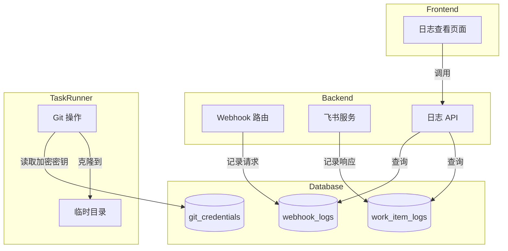

# 技术设计文档
## Context
### 背景
当前系统在任务执行和数据管理方面存在以下问题：
1. **仓库缓存管理复杂**：
 - `data/repos/` 目录下缓存克隆的仓库
 - 需要处理缓存失效、分支冲突、远程变更同步等问题
 - 增加了 Docker 容器的状态复杂度
2. **凭证文件管理风险**：
 - SSH 密钥存储在 `data/credentials/` 目录
 - 文件系统权限管理复杂
 - 难以在容器化环境中安全传递
3. **飞书数据不可追溯**：
 - Webhook 请求处理后即丢失原始数据
 - 工作项详情仅在内存中处理
 - 无法调试、审计或排查问题
### 约束
- 必须保持与现有 API 的向后兼容
- 敏感数据必须加密存储
- 日志数据需要有清理策略，防止无限增长
## Goals / Non-Goals
### Goals
- 简化任务执行的 Git 操作流程，消除缓存相关的复杂性
- 统一凭证存储方式，全部使用数据库加密存储
- 持久化飞书 Webhook 和工作项数据，支持查看和调试
- 提供前端界面查看原始数据
### Non-Goals
- 不改变现有的任务状态机逻辑
- 不改变飞书 API 的调用方式
- 不实现复杂的日志分析功能（仅提供原始数据查看）
## Decisions
### 决策 1：移除仓库缓存，使用临时目录
**决定**：每次任务执行时克隆仓库到临时目录，完成后立即清理。
**原因**：
- 简化状态管理，无需处理缓存过期
- 容器更轻量，启动更快
- 避免分支冲突和远程变更同步问题
**替代方案**：
- 保留缓存但增加版本控制 - 增加复杂度
- 使用 Git shallow clone - 不支持所有场景
### 决策 2：SSH 密钥加密存储到数据库
**决定**：将 SSH 私钥使用 Fernet 加密后存储到 `GitCredential` 表的 `ssh_key_encrypted` 字段。
**原因**：
- 统一凭证管理方式（与 access_token 一致）
- 便于容器化部署，无需挂载凭证目录
- 更容易备份和恢复
**替代方案**：
- 使用 Vault 等秘密管理服务 - 增加部署复杂度
- 环境变量传递 - 不适合多项目场景
### 决策 3：使用独立的日志表
**决定**：创建 `WebhookLog` 和 `WorkItemLog` 两个独立的日志表。
**原因**：
- 日志数据可能增长很快，独立存储便于管理
- 可以独立设置保留策略
- 不影响核心业务表的性能
**替代方案**：
- 嵌入到 Task 表 - 会导致 Task 表膨胀
- 使用外部日志服务 - 增加依赖
## 数据模型
### GitCredential 模型变更
```python
class GitCredentialBase(SQLModel):
 auth_type: AuthType
 # 移除: ssh_key_path: Optional[str]
 # 新增: SSH 密钥加密存储
 ssh_key_encrypted: Optional[str] = Field(
 default=None,
 description="加密的 SSH 私钥内容",
 )
 encrypted_token: Optional[str]
 git_user_name: str
 git_user_email: str
```
### WebhookLog 模型
```python
class WebhookLog(SQLModel, table=True):
 __tablename__ = "webhook_logs"
 id: str = Field(primary_key=True)
 project_id: Optional[str] = Field(foreign_key="projects.id", index=True)
 # 事件信息
 event_uuid: Optional[str] = Field(index=True) # 幂等标识
 event_type: str = Field(index=True) # WorkitemCreateEvent 等
 # 原始数据
 raw_request: str # JSON 字符串
 # 处理结果
 status: str # accepted, ignored, error
 error_message: Optional[str]
 created_at: datetime = Field(index=True)
```
### WorkItemLog 模型
```python
class WorkItemLog(SQLModel, table=True):
 __tablename__ = "work_item_logs"
 id: str = Field(primary_key=True)
 project_id: str = Field(foreign_key="projects.id", index=True)
 task_id: Optional[str] = Field(foreign_key="tasks.id", index=True)
 # 工作项信息
 work_item_id: str = Field(index=True)
 work_item_type: str
 project_key: str
 # 原始数据
 raw_response: str # JSON 字符串
 created_at: datetime = Field(index=True)
```
## API 设计
### 日志查看 API
```
GET /api/logs/webhooks
 Query: project_id, event_type, status, start_date, end_date, limit, offset
 Response: { items: WebhookLog, total: number }
GET /api/logs/webhooks/{id}
 Response: WebhookLog with raw_request parsed as JSON
GET /api/logs/work-items
 Query: project_id, task_id, work_item_id, start_date, end_date, limit, offset
 Response: { items: WorkItemLog, total: number }
GET /api/logs/work-items/{id}
 Response: WorkItemLog with raw_response parsed as JSON
```
## 架构图

## Risks / Trade-offs
### 风险 1：每次克隆增加任务启动时间
**风险**：大型仓库的克隆可能需要较长时间。
**缓解**：
- 使用 shallow clone（`--depth 1`）加速
- 仅克隆必要的分支
- 考虑使用 Git sparse checkout
### 风险 2：日志数据增长
**风险**：频繁的 Webhook 请求会导致日志表快速增长。
**缓解**：
- 实现自动清理策略（如保留 30 天）
- 添加数据库索引优化查询
- 可选压缩存储原始 JSON
## Migration Plan
### 阶段 1：数据库迁移
1. 添加新字段到 `git_credentials` 表
2. 创建 `webhook_logs` 和 `work_item_logs` 表
3. 迁移现有 SSH 密钥文件到数据库
### 阶段 2：后端代码更新
1. 更新凭证相关 API
2. 更新 Task Runner Git 操作
3. 添加日志记录逻辑
### 阶段 3：前端界面
1. 添加日志查看页面
2. 集成到项目详情页
### 回滚计划
- 数据库变更：保留旧字段一段时间，可以快速回滚
- 文件存储：暂时保留 `data/credentials/` 目录
## Open Questions
1. 日志保留时间应该是多久？建议 30 天，可配置。
2. 是否需要在 Task 详情页直接关联显示相关的 Webhook 日志？
3. shallow clone 的深度设置为多少合适？建议 depth=1，但某些场景可能需要更多历史。
